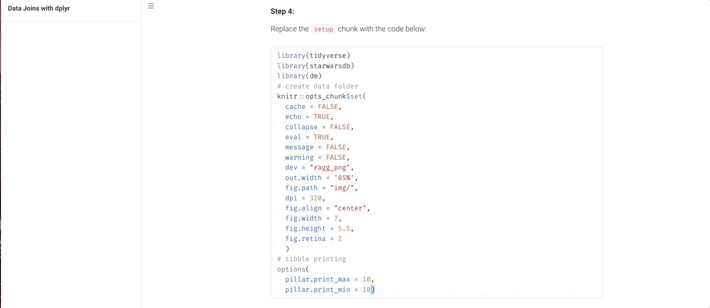
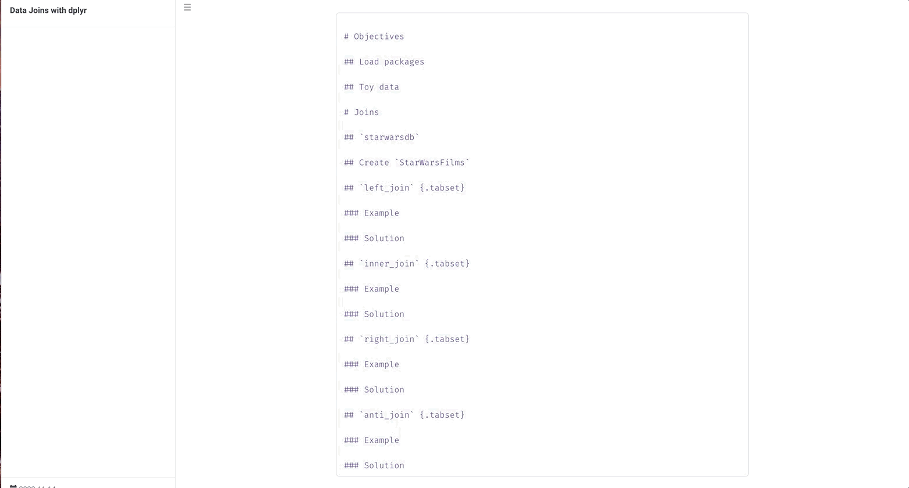
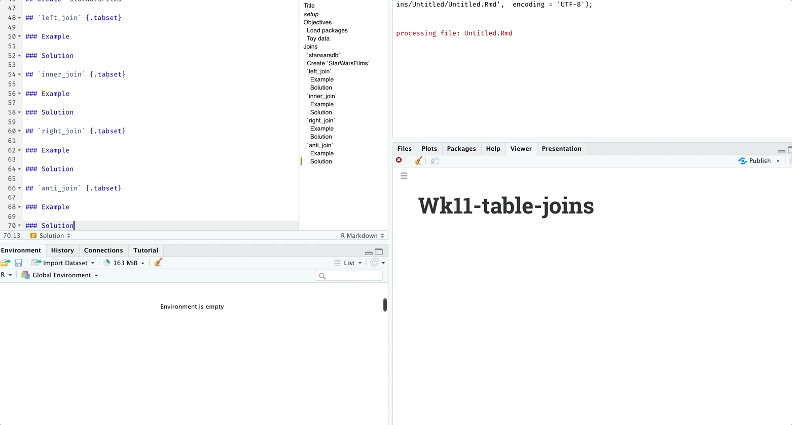

---
#############################################################
#                                                           #
#   Click on "Knit" in RStudio to render this worksheet.    #
#                                                           #
#############################################################
title: "Data Joins with dplyr"
date: "`r Sys.Date()`"
output:
  rmdformats::robobook:
    highlight: kate
---

```{r setup, include=FALSE}
library(tidyverse)
library(starwarsdb)
library(dm)
# create data folder
knitr::opts_chunk$set(
  cache = FALSE,
  echo = TRUE,
  collapse = FALSE,
  eval = TRUE,
  message = FALSE,
  warning = FALSE,
  dev = "ragg_png",
  out.width = '85%',
  fig.path = "img/",
  dpi = 320,
  fig.align = "center",
  fig.width = 7,
  fig.height = 5.5,
  fig.retina = 2
  )
# tibble printing
options(
  pillar.print_max = 10, 
  pillar.print_min = 10)
```

For this assignment, you're going to re-create this .html file and use some of the data joining functions from the `dplyr` package. 

You can review the slides for this assignment  [here](https://mjfrigaard.github.io/FA22-JOUR301/slides/data-joins.html#1), and the exercises are [here](https://mjfrigaard.github.io/FA22-JOUR301/exercises/table-joins.html)

**Step 1:**

Create the project using the `goodenuffR::goodenuff_project()` function:

```{r, eval=FALSE}
goodenuffR::goodenuff_project(
  project_name = "wk11-table-joins", 
  folder_path = "path/to/hw/folder")
```

Replace `path/to/hw/folder` with the path to **your** folder. 

```{r wk11-new-proj}
knitr::include_graphics(path = "../img/wk11-new-proj.gif")
```


**Step 2:**

Install the following packages by running this in the **Console**

```{r, eval=FALSE}
install.packages(c("tidyverse", "starwarsdb", "dm"))
```

Install `rmdformats` package by running this in the **Console**

```{r, eval=FALSE}
install.packages(remotes)  # if necessary
remotes::install_github("juba/rmdformats")
```

Load `rmdformats` package by running this in the **Console**

```{r, eval=FALSE}
library(rmdformats)
```

**Step 3:**

Create a new R Markdown file using **FIle** > **New File** > **R Markdown...** > **From Template** > Then give this file a name

```{r wk11-new-rmd, echo=FALSE}
knitr::include_graphics("../img/wk11-new-rmd.gif")
```

**Step 4:**

Replace the `setup` chunk with the code below: 

```{r new-setup, eval=FALSE}
library(tidyverse)
library(starwarsdb)
library(dm)
# create data folder
knitr::opts_chunk$set(
  cache = FALSE,
  echo = TRUE,
  collapse = FALSE,
  eval = TRUE,
  message = FALSE,
  warning = FALSE,
  dev = "ragg_png",
  out.width = '85%',
  fig.path = "img/",
  dpi = 320,
  fig.align = "center",
  fig.width = 7,
  fig.height = 5.5,
  fig.retina = 2
  )
# tibble printing
options(
  pillar.print_max = 10, 
  pillar.print_min = 10)
```

```{r wk11-copy-setup, echo=FALSE}

```

**Step 5:**

Create outline using Markdown syntax 

```markdown

# Objectives 

## Load packages 

## Toy data 

# Joins

## `starwarsdb` 

## Create `StarWarsFilms`

## `left_join` {.tabset}

### Example

### Solution

## `inner_join` {.tabset}

### Example

### Solution

## `right_join` {.tabset}

### Example

### Solution

## `anti_join` {.tabset}

### Example

### Solution

```

```{r wk11-copy-outline, echo=FALSE}

```

Knit the document 

```{r wk11-knit-outline, echo=FALSE}

```


**Step 6 Exercises:**

+ Copy and paste the necessary sections from the [exercises](https://mjfrigaard.github.io/FA22-JOUR301/exercises/table-joins.html) to get the **Example** and **Solution** to work (I've included the first two below to get you started)


````{verbatim}
```{r StarWarsDataModel, message=FALSE, warning=FALSE}
StarWarsDataModel <- dm::dm_draw(dm = starwars_dm(), 
                                 view_type = "all",
                                 graph_name = "StarWarsDataModel")
StarWarsDataModel
```
````

````{verbatim}
```{r StarWarsFilms}
StarWarsFilms <- starwarsdb::films %>% 
                    select(-c(opening_crawl, director, producer)) %>% 
                    filter(episode_id >= 4 & episode_id <= 6)
StarWarsFilms
```
````


+ All of the exercises should have the code chunks set to `eval=TRUE`

+ You can set the `setup` chunk to `error=TRUE`, so if a code chunk doesn't render and look like the example in the exercises, read the error and try to de-bug (this is a huge part of coding)

**Knit, and knit often:**

+ Every time you change an `eval` argument, click on the "Knit" icon in R Studio and review the output. This will prevent errors from building up (and you get to see your handy work!)


**When you're finished:**

Email me the final knitted .html file with the **Examples** and **Solutions**