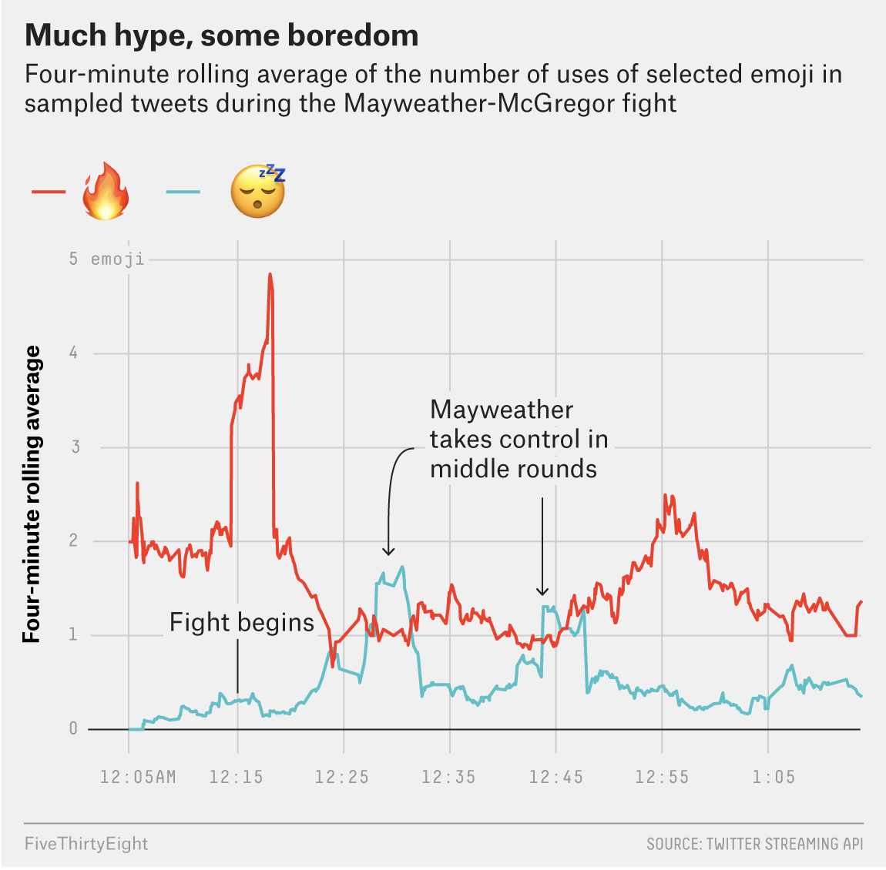

```{r setup, include=FALSE}
library(fs)
library(tidyr)
library(dplyr)
library(ggplot2)
library(tidytuesdayR)
library(zipcodeR)
library(tigris)
library(readr)
library(stringr)
library(lubridate)
library(patchwork)
library(grid)
## Global options
knitr::opts_chunk$set(
  cache = FALSE,
  echo = TRUE,
  collapse = FALSE,
  eval = TRUE,
  message = FALSE,
  warning = FALSE,
  dev = "ragg_png",
  out.width = '85%',
  dpi = 320,
  fig.align = "center",
  fig.width = 7.5,
  fig.height = 5,
  fig.retina = 2
  )
fs::dir_create("data")
knitr::opts_knit$set(root.dir = '/Users/mjfrigaard/Dropbox/@projects/high-priority/@data-journalism/course-website/FA22-JOUR301/drafts/line-graphs')
```

# The Article

These data come from ["The Mayweather-McGregor Fight As Told Through Emojis"](https://fivethirtyeight.com/features/the-mayweather-mcgregor-fight-as-told-through-emojis/)


# The original graph

```{r much-hype-more-boredom, echo=FALSE}

```

# The Data (and packages)

The `mayweather_mcgregor_tweets` data come from the  [`fivethirtyeightdata` package](https://cran.r-project.org/web/packages/fivethirtyeight/vignettes/fivethirtyeight.html). You can install it (and the `fivethirtyeight` package) using the code below.

```{r pkgs}
# install.packages('fivethirtyeightdata', 
#   repos = 'https://fivethirtyeightdata.github.io/drat/', 
#   type = 'source')
library(fivethirtyeight)
library(fivethirtyeightdata)
library(emoji)
mayweather_mcgregor_tweets_raw <- fivethirtyeightdata::mayweather_mcgregor_tweets
# export raw data
write_csv(
  x = mayweather_mcgregor_tweets_raw,
  file = paste0(
    "data/raw/",
    base::noquote(lubridate::today()),
    "-mayweather_mcgregor_tweets_raw.csv"
  )
)
# rename this to something smaller
may_mcg_twts <- mayweather_mcgregor_tweets_raw
glimpse(may_mcg_twts)
```

## `emoji` package

### `emoji_detect()`

```{r}
may_mcg_twts %>% 
  filter(emoji::emoji_detect(string = text)) %>% 
  count(emojis)
```

### `emoji_extract_all()`

```{r may_mcg_all_emojis}
may_mcg_all_emojis <- may_mcg_twts %>% 
  mutate(all_emojis = 
      emoji::emoji_extract_all(string = text))
glimpse(may_mcg_all_emojis)
```


```{r emojis_used}
tidy_may_mcg_emojis <-
  tidyr::unnest_wider(data = may_mcg_all_emojis,
    col = all_emojis,
    names_sep = "_") %>%
  tidyr::unite(
    col = "emojis_used",
    contains("all_emojis_"),
    sep = " ",
    na.rm = TRUE,
    remove = TRUE
  )
glimpse(tidy_may_mcg_emojis)
```

## Find 'Much hype, some boredom' 

```{r emoji_find}
emoji_find("flame") %>% str()
emoji_find("sleep") %>% str()
```

```{r detect-flame-sleep}
tidy_may_mcg_emojis <- tidy_may_mcg_emojis %>% 
  mutate(
    flame_emoji = str_detect(emojis_used, "🔥"),
    sleep_emoji = str_detect(emojis_used, "😴")
    ) 
tidy_may_mcg_emojis %>% glimpse()
```

### Create `hyped_bored`

```{r hyped_bored}
hyped_bored <- tidy_may_mcg_emojis %>% 
  filter(flame_emoji == TRUE | sleep_emoji == TRUE)
glimpse(hyped_bored)
```

### Extract `all_flames` 

```{r extract-all_flames}
hyped_bored <- hyped_bored %>% 
  mutate(
    flames = str_extract_all(string = emojis_used, pattern = "🔥")
  ) %>% 
  tidyr::unnest_wider(data = .,
    col = flames,
    names_sep = "_") %>%
  tidyr::unite(
    col = "all_flames",
    contains("flames_"),
    sep = " ",
    na.rm = TRUE,
    remove = TRUE
  )
```

```{r check-all_flames}
select(hyped_bored, emojis_used, all_flames)
```

### Extract `all_sleeps` 

```{r extract-all_sleeps}
hyped_bored <- hyped_bored %>% 
  mutate(
    sleeps = str_extract_all(string = emojis_used, pattern = "😴")
  ) %>% 
  tidyr::unnest_wider(data = .,
    col = sleeps,
    names_sep = "_") %>%
  tidyr::unite(
    col = "all_sleeps",
    contains("sleeps_"),
    sep = " ",
    na.rm = TRUE,
    remove = TRUE
  )
```

```{r check-all_sleeps}
select(hyped_bored, emojis_used, all_sleeps)
```

## Four minute rolling average

First we need a four-minute interval, which requires some knowledge of 

https://bookdown.org/hneth/ds4psy/10-3-time-lubridate.html#intervals

```{r}
lubridate::interval()
```


### `emoji_count()`

```{r hyped_bored-emoji_count}
library(zoo)
hyped_bored %>% 
  mutate(
    flame_count = emoji_count(all_flames),
    sleep_count = emoji_count(all_sleeps)
  ) %>% 
  mutate(
    flame_4m_avg = zoo::rollmean(flame_count, k = 4, fill = NA))
```


# Line graph

```{r}
hyped_bored %>% 
  ggplot(aes(x = created_at, y = ))
```


