```{r, echo = FALSE}
# don't name this setup!
knitr::opts_chunk$set(collapse = TRUE,
                      comment = "#>",
                      message = FALSE,
                      warning = FALSE)
```

# Objective

- Download, install, and set up R and RStudio on your local machine

# Learning R

When people decide to begin using R, it can be confusing to know where to start. Googling "how can I learn R?" will return a lot of results, and it can quickly feel like you're drinking water from a fire-hose. Like most things, knowing the correct terminology will help sift through the information and find what you're looking for. 

# Terms & Definitions 

We're going to clear up some of the terms and definitions so the R programming landscape is a little less overwhelming:

1. R - an [open-source software](https://en.wikipedia.org/wiki/Open-source_software) programming language for statistical analysis and graphics (compared to [proprietary software](https://en.wikipedia.org/wiki/Proprietary_software) like [SPSS](https://en.wikipedia.org/wiki/SPSS) or [SAS](https://en.wikipedia.org/wiki/SAS_(software)))
2. the R console - a command line interface for entering and executing R code.  
3. .R script files - plain text files containing R code that computers can run.   
4. RStudio - an [Integrated Development Environment](https://en.wikipedia.org/wiki/Integrated_development_environment), or IDE for writing R code, connecting to databases, building graphics, websites, software packages, and applications.  

# Installation

Depending on what kind of computer you have, these instructions will be a little different. The two sections below describe how to install R and RStudio on Mac and Windows machines. An alternative to downloading and installing R and RStudio is using [RStudio.Cloud](https://rstudio.cloud/), which operates entirely in your browser. You'll need to sign up for a free RStudio.Cloud account using a [Github](https://github.com/) account (also free!).

## Installing R on Mac 

These steps cover how to install R and RStudio on a Mac. The technical details on the operating system and machine are listed below,

```
MacBook Pro (13-inch, 2017, Four Thunderbolt 3 Ports)
macOS Big Sur
  Version: 11.2.3 (20D91)
Model Name:	MacBook Pro
  Model Identifier:	MacBookPro14,2
  Graphics: Intel Iris Plus Graphics 650 1536 MB
  Processor Name:	Dual-Core Intel Core i5
  Processor Speed:	3.1 GHz
  Number of Processors:	1
  Total Number of Cores:	2
  L2 Cache (per Core):	256 KB
  L3 Cache:	4 MB
  Hyper-Threading Technology:	Enabled
  Memory:	16 GB
  System Firmware Version:	429.80.1.0.0
  SMC Version (system):	2.44f6
```

### Download R

Navigate to [CRAN](https://cran.r-project.org/), the The Comprehensive R Archive Network.

```{r 01-cran.png, echo=FALSE}
knitr::include_graphics("../img/01-cran.png")
```

Click on the [Download R for (Mac) OS X](https://cran.r-project.org/).

```{r 02-mac-download, echo=FALSE}
knitr::include_graphics("../img/02-mac-download.png")
```

Download the R package:

```{r 03-mac-r-pkg, echo=FALSE}
knitr::include_graphics("../img/03-mac-r-pkg.png")
```

Download the R installer package into your Applications folder.

```{r 05-mac-r-app-folder, echo=FALSE}
knitr::include_graphics("../img/05-mac-r-app-folder.png")
```

### Download RStudio

Navigate to [RStudio downloads](https://www.rstudio.com/products/rstudio/download/#download) for Macs

```{r 04-mac-rstudio-download, echo=FALSE}
knitr::include_graphics("../img/04-mac-rstudio-download.png")
```

Download the RStudio .dmg into your Applications folder.

```{r 06-mac-rstudio-app-folder, echo=FALSE}
knitr::include_graphics("../img/06-mac-rstudio-app-folder.png")
```


### Install Xcode

You'll need to install Xcode to compile R packages, which you can find in the [Mac App Store](https://apps.apple.com/us/app/xcode/id497799835?mt=12).

```{r 07-mac-xcode-app-store, echo=FALSE}
knitr::include_graphics("../img/07-mac-xcode-app-store.png")
```

Open the App Store on your local machine and click on the 'Develop' tab. Click on the 'Get' icon (*mine says 'open' because I already Xcode installed*).

Follow the instructions to install Xcode just like you would any other application on your Mac.

```{r 08-mac-xcode-app-get, echo=FALSE}
knitr::include_graphics("../img/08-mac-xcode-app-get.png")
```


### Install R

Open your Applications folder and click on the R package installer.

```{r 09-r-install-01, echo=FALSE}
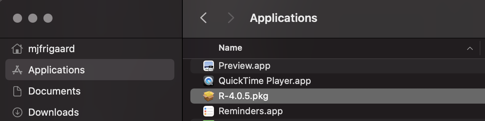
```

This will open the installer package, click on 'Continue' until you're asked to 'Agree'

```{r 09-r-install-02, echo=FALSE}
knitr::include_graphics("../img/09-r-install-02.png")
```

Click 'Agree'

```{r 09-r-install-03, echo=FALSE}
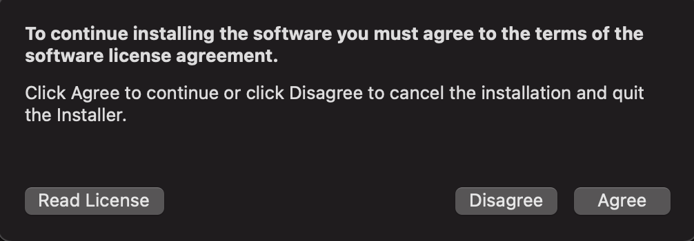
```

All the package installer to install R on your machine. 

```{r 09-r-install-04, echo=FALSE}
knitr::include_graphics("../img/09-r-install-04.png")
```

Wait for R to finishing installing...

```{r 09-r-install-05, echo=FALSE}
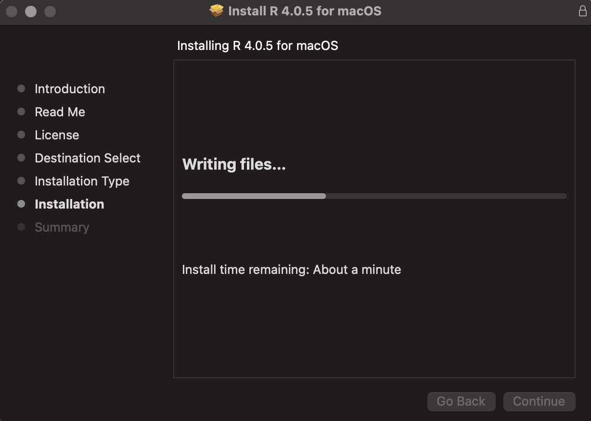
```

Click 'Close' when the application is installed. 

```{r 09-r-install-06, echo=FALSE}
knitr::include_graphics("../img/09-r-install-06.png")
```

### Install RStudio

Open your Applications folder and click on the RStudio .dmg installer.

```{r 09-rstudio-install-01, echo=FALSE}
knitr::include_graphics("../img/09-rstudio-install-01.png")
```

Drag and drop the 'RStudio.app' icon into the 'Applications' folder. 

```{r 09-rstudio-install-02, echo=FALSE}
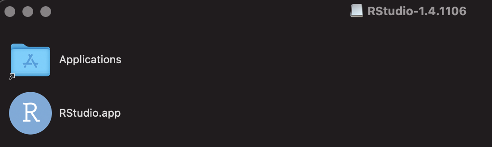
```

Wait for the application to finishing copying...

```{r 09-rstudio-install-03, echo=FALSE}
knitr::include_graphics("../img/09-rstudio-install-03.png")
```

Double-click on the new 'RStudio.App' icon.

```{r 09-rstudio-install-04, echo=FALSE}
knitr::include_graphics("../img/09-rstudio-install-04.png")
```

We're sure--click 'Open'

```{r 09-rstudio-install-05, echo=FALSE}
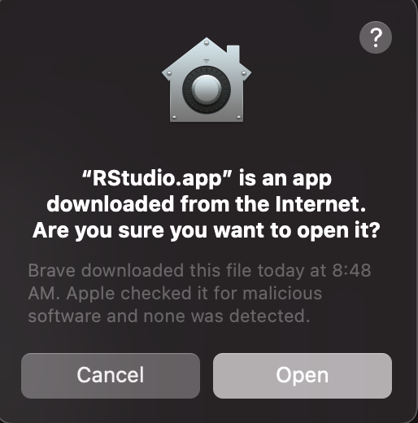
```

Take a look at the RStudio IDE!

```{r 09-rstudio-install-06, echo=FALSE}
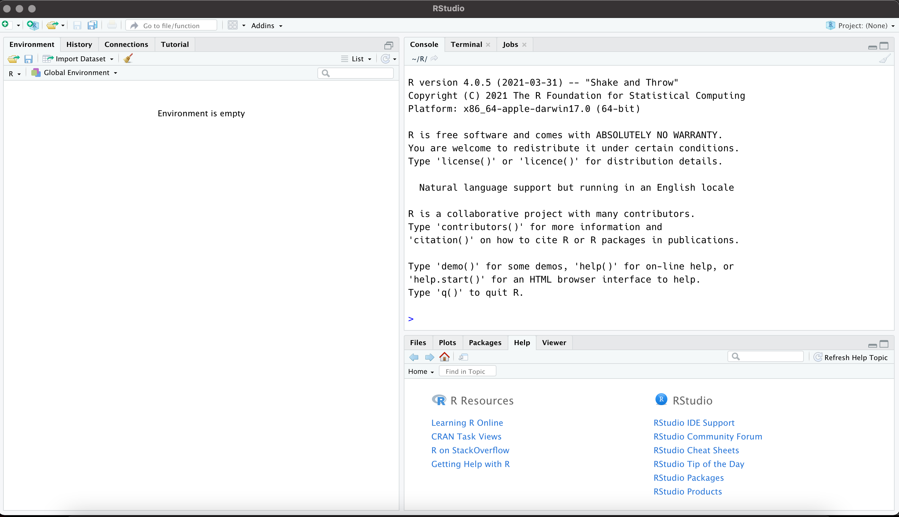
```

## Installing R on Windows 

These steps cover how to install R and RStudio on a Windows machine. The technical details on the operating system and machine are listed below.

### Download R

Head to [CRAN](https://cran.r-project.org/). 

```{r 01-cran.png-2, echo=FALSE}
knitr::include_graphics("../img/01-cran.png")
```

[Click on download R for Windows](https://cran.r-project.org/bin/windows/). 

```{r 10-cran, echo=FALSE}
knitr::include_graphics("../img/10-win-cran.png")
```

### Download RStudio

Navigate to [RStudio downloads](https://www.rstudio.com/products/rstudio/download/#download) for Windows

```{r rtudio-win-download.png, echo=FALSE}
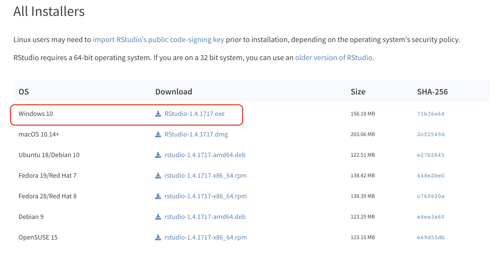
```

Download the RStudio .exe file

### Download Rtools

Head over to [Rtools](https://cran.r-project.org/bin/windows/Rtools/) 

Download the [`rtools40v2-x86_64.exe` file](https://cran.r-project.org/bin/windows/Rtools/rtools40v2-x86_64.exe). 

```{r rtools-win-download.png, echo=FALSE}
knitr::include_graphics("../img/rtools-win-download.png")
```


### Install R

The steps below outline installing R version 4.1.0 on Windows. The installation steps might look *sightly* different on your machine. Ask me if you get stuck. 

```{r r-win-install-01.png, echo=FALSE}
knitr::include_graphics("../img/r-win-install-01.png")
```

```{r r-win-install-02.png, echo=FALSE}
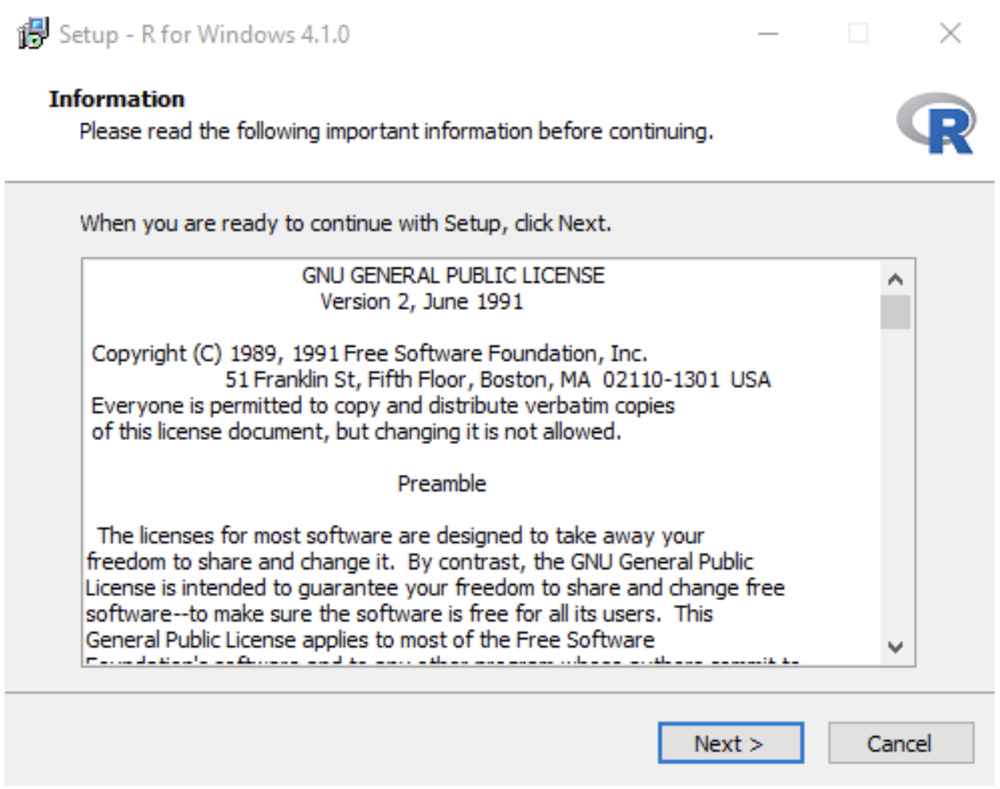
```

```{r r-win-install-03.png, echo=FALSE}
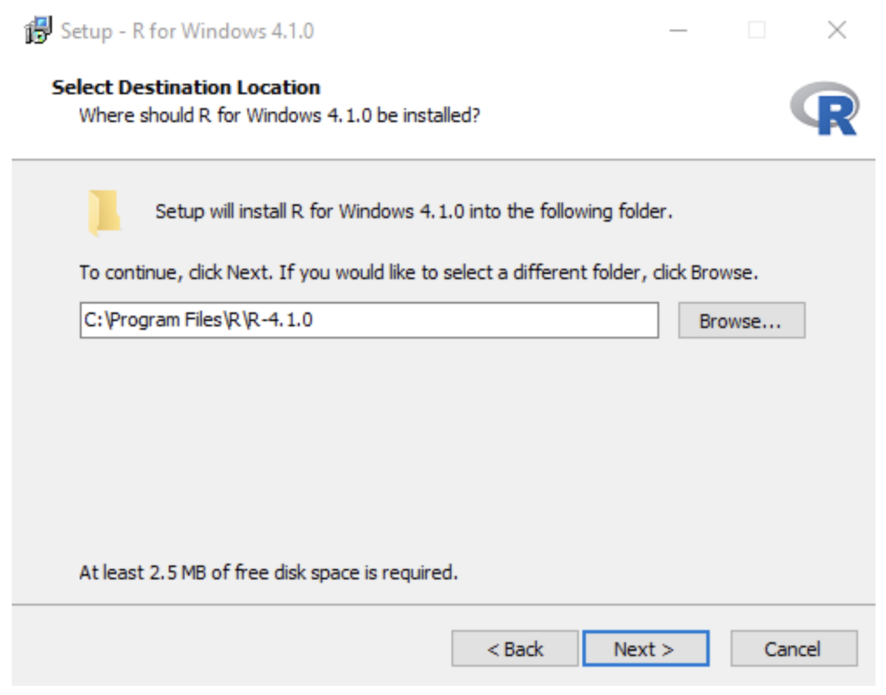
```


```{r r-win-install-04.png, echo=FALSE}
knitr::include_graphics("../img/r-win-install-04.png")
```


```{r r-win-install-05.png, echo=FALSE}
knitr::include_graphics("../img/r-win-install-05.png")
```


```{r r-win-install-06.png, echo=FALSE}
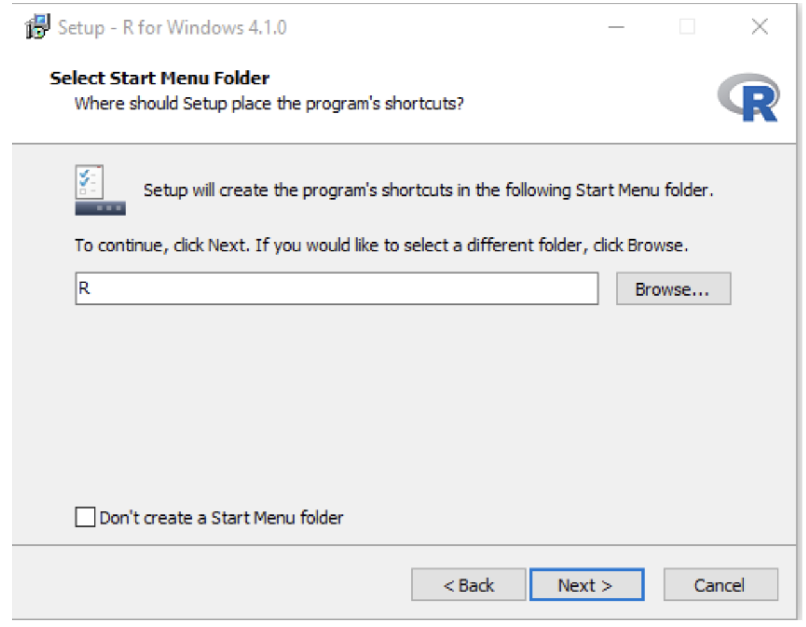
```


```{r r-win-install-07.png, echo=FALSE}
knitr::include_graphics("../img/r-win-install-07.png")
```


```{r r-win-install-08.png, echo=FALSE}
knitr::include_graphics("../img/r-win-install-08.png")
```


```{r r-win-install-09.png, echo=FALSE}
knitr::include_graphics("../img/r-win-install-09.png")
```

### Install Rtools

```{r rtools-install-01.png, echo=FALSE}
knitr::include_graphics("../img/rtools-install-01.png")
```

```{r rtools-install-02.png, echo=FALSE}
knitr::include_graphics("../img/rtools-install-02.png")
```

```{r rtools-install-03.png, echo=FALSE}
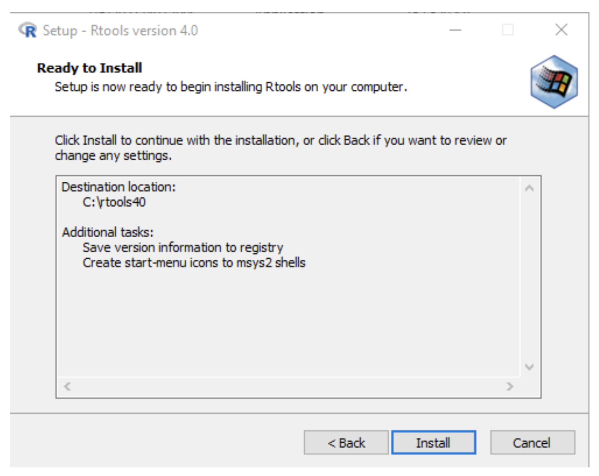
```

```{r rtools-install-04.png, echo=FALSE}
knitr::include_graphics("../img/rtools-install-04.png")
```

```{r rtools-install-05.png, echo=FALSE}
knitr::include_graphics("../img/rtools-install-05.png")
```

### Install RStudio (windows)

These steps walk you through how to install RStudio on your windows machine.

#### Download .exe file

Download the windows version of RStudio [here](https://www.rstudio.com/products/rstudio/). You should see the .exe file in your downloads folder (or wherever you downloaded it).

```{r win-rstudio-setup-00.png, echo=FALSE}

```

#### Launch Wizard

Double click on the .exe file and launch the install Wizard:

```{r win-rstudio-setup-01.png, echo=FALSE}
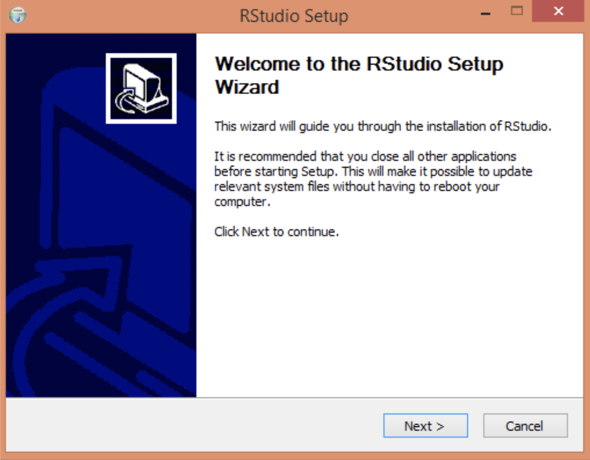
```

#### Choose install location

This should be your `C:\Program Files` folder:

```{r win-rstudio-setup-02.png, echo=FALSE}
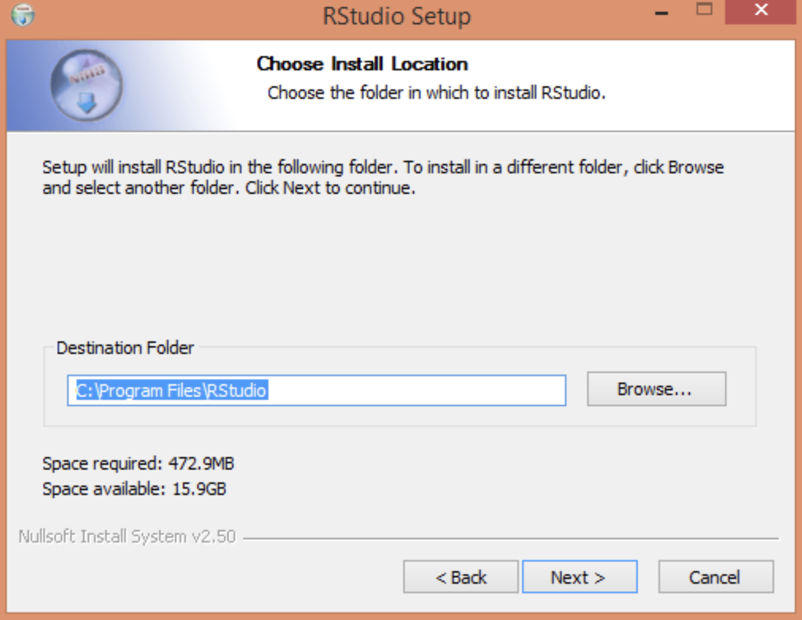
```

#### Choose start menu folder 

The default is fine here:

```{r win-rstudio-setup-03.png, echo=FALSE}
knitr::include_graphics("../img/win-rstudio-setup-03.png")
```


#### Installation (process)

You should see the progress bar running:

```{r win-rstudio-setup-04.png, echo=FALSE}
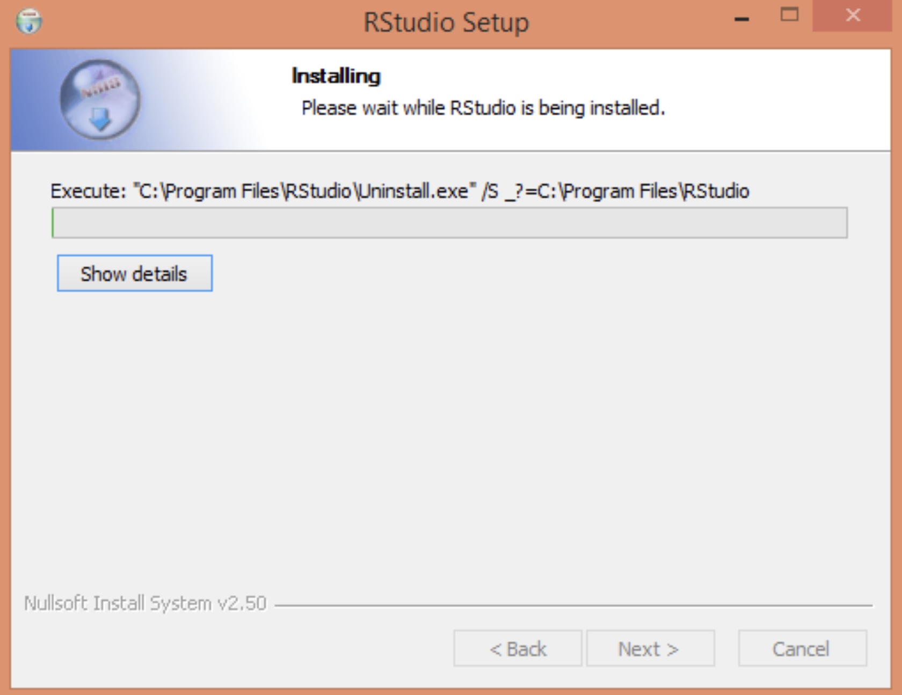
```

#### Finish

Click Finish to exit the installation Wizard:

```{r win-rstudio-setup-05.png, echo=FALSE}
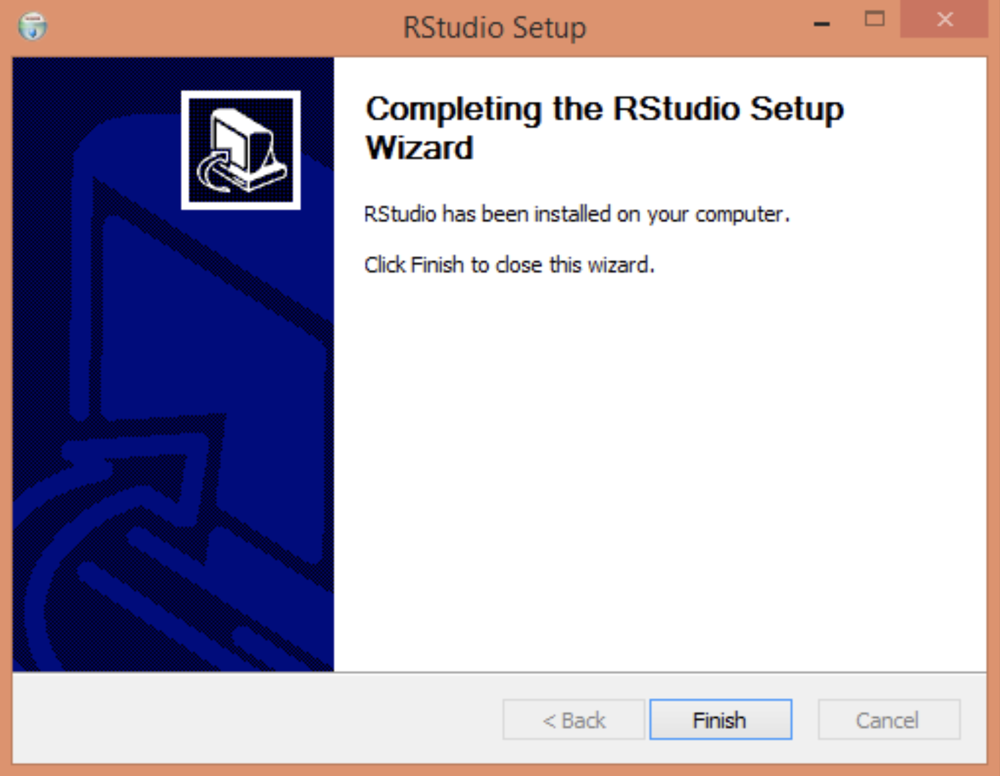
```

#### Verify

Check if there is an RStudio icon on your desktop. Double-click the icon to open it. If you don't see the icon, click on the 'Start' button at the bottom left of the screen and search for 'RStudio' (then click on the RStudio icon to open it). 
