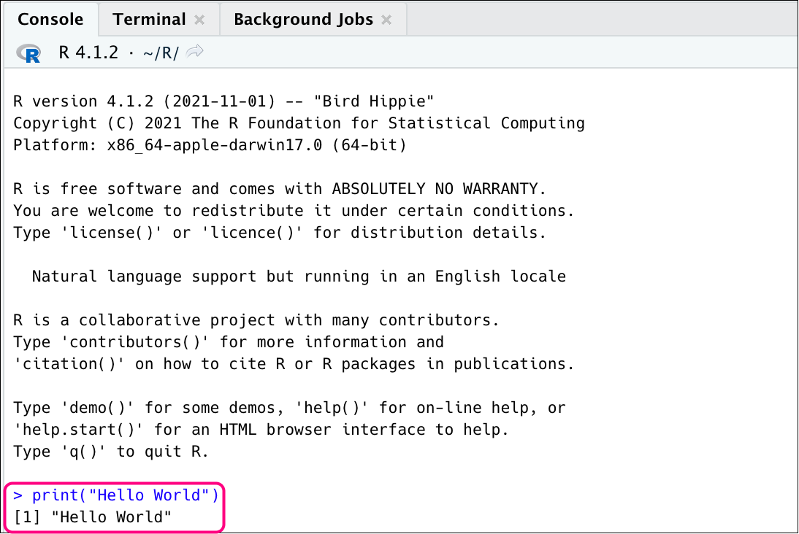
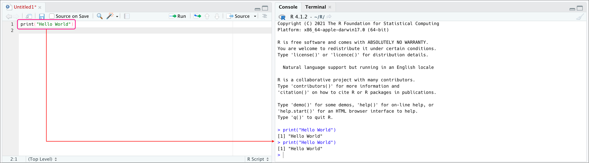
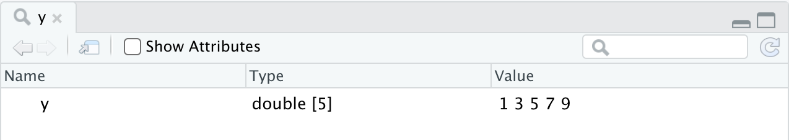
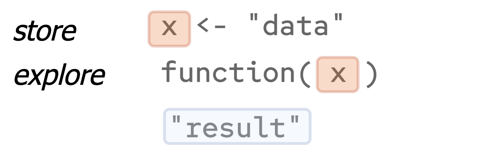
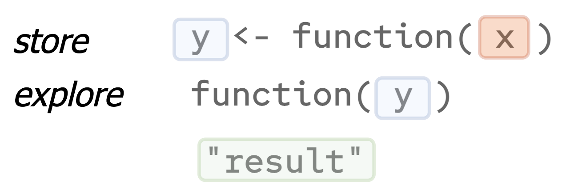
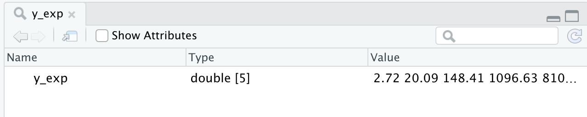
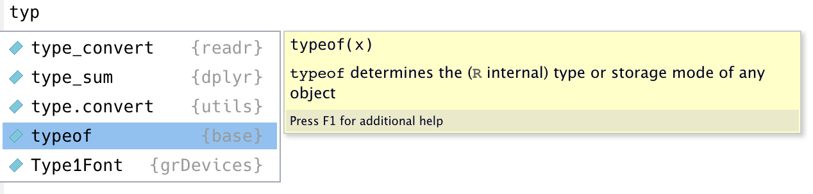
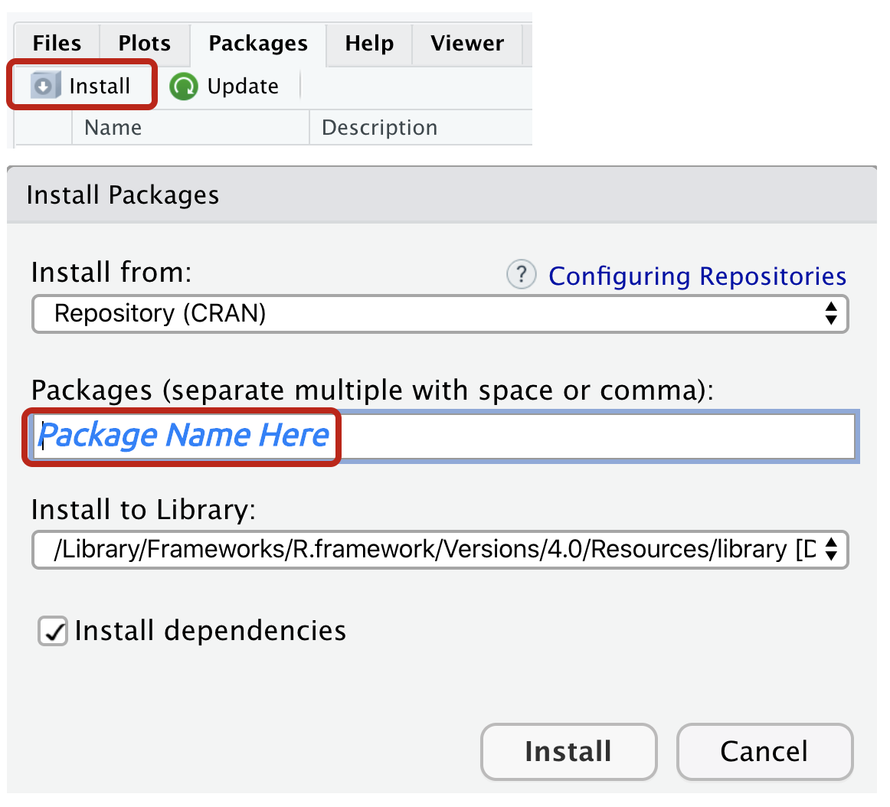
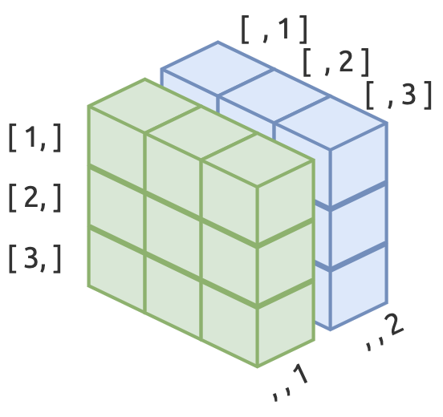

```{r meta, echo=FALSE}
library(metathis)
meta() %>%
  meta_general(
    description = "Introduction To R Programming",
    generator = "xaringan and remark.js"
  ) %>%
  meta_name("github-repo" = "mjfrigaard/CSUC-JOUR301-FA22") %>%
  meta_social(
    title = "Introduction To R Programming",
    url = "https://mjfrigaard.github.io/CSUC-JOUR301-FA22/",
    og_type = "website",
    og_author = "Martin Frigaard",
    twitter_card_type = "summary",
    twitter_creator = "@mjfrigaard"
  )
```

```{r setup, include=FALSE}
dateWritten <- format(as.Date('2021-09-30'), format = "%B %d %Y")
today <- format(Sys.Date(), format = "%B %d %Y")
library(knitr)
library(tidyverse)
library(fontawesome)
options(
    htmltools.dir.version = FALSE,
    knitr.table.format = "html",
    knitr.kable.NA = ''
)
knitr::opts_chunk$set(
    warning = FALSE,
    message = FALSE,
    fig.path = "img/",
    fig.width = 7.252,
    fig.height = 4,
    comment = " ",
    fig.retina = 3 # Better figure resolution
)
# Enables the ability to show all slides in a tile overview by pressing "o"
xaringanExtra::use_tile_view()
xaringanExtra::use_panelset()
xaringanExtra::use_clipboard()
xaringanExtra::use_share_again()
xaringanExtra::style_share_again(share_buttons = "all")
xaringanExtra::use_extra_styles(
  hover_code_line = TRUE,
  mute_unhighlighted_code = FALSE
)
```

layout: true

<!-- this adds the link footer to all slides, depends on footer-small class in css-->

<div class="footer-small"><span>https://mjfrigaard.github.io/CSUC-JOUR301-FA22/</div>

---
name: title-slide
class: title-slide, center, middle, inverse

# `r rmarkdown::metadata$title`
#.fancy[`r rmarkdown::metadata$subtitle`]

<br>

.large[by Martin Frigaard]

Written: `r dateWritten`

Updated: `r today`

.footer-large[.right[.fira[
<br><br><br><br><br>[Created using the "λέξις" theme](https://jhelvy.github.io/lexis/index.html#what-does-%CE%BB%CE%AD%CE%BE%CE%B9%CF%82-mean)
]]]


---
class: center, middle
background-image: url("img/Rlogo.png")
background-position: 93% 10%
background-size: 7%

# R Programming

### R is a versatile language for data wrangling, visualization, and modeling

---
class: left, top
background-image: url("img/Rlogo.png")
background-position: 93% 10%
background-size: 7%

# Extra Exercises 

## Links 

- [Atomic vectors](https://mjfrigaard.shinyapps.io/atomic-vectors/): *Provides a brief introduction to R’s most common object: the vector.*

- [S3 vectors](https://mjfrigaard.shinyapps.io/S3-vectors/): *Introduces more complex vectors (factors, dates, date-times and difftimes*

- [data.frames](https://mjfrigaard.shinyapps.io/dataframes/) (*An introduction to rectangular (spreadsheet) data in R.*)


---
background-image: url("https://www.r-project.org/logo/Rlogo.png")
background-size: contain
class: inverse, center, middle

# Getting Started


.rightcol[Image credit: [R Project](https://www.r-project.org)]


---
background-image: url("img/rstudio-launch.png")
background-size: contain
class: left, top

<br>

# .red[The RStudio IDE]


---
class: left, top
background-image: url("img/Rlogo.png")
background-position: 93% 10%
background-size: 7%

# Running R Commands

You can run R commands in the Console by entering them after the `>` operator (see example in R below)

.leftcol[

```{r hello-world}
print("Hello World")
```

]

--

.rightcol[


```{r commands-console, eval=TRUE, echo=FALSE, out.height="90%", out.width="90%", fig.align='center'}
# copy_slide_images(slide_img = "commands-console.png")

```

]

---
class: left

# Running R Commands

You can also run them in R scripts (see example in RStudio below)

--

```{r script-rstudio, eval=TRUE, echo=FALSE, out.height='110%', out.width='110%', fig.align='center'}
# copy_slide_images(slide_img = "script-rstudio.png")

```

---
class: left, middle
background-image: url("img/Rlogo.png")
background-position: 93% 10%
background-size: 7%

# R Basics: Syntax Elements

--

### The R syntax is comprised of two major elements:

--

.leftcol[

## Functions

#### *Functions perform operations: calculate a mean, build a table, create a graph, etc.*

]


--

.rightcol[

## Objects

#### *Objects hold values: a collection of numbers, dates, words, models results, etc.* 

]

---
class: inverse, center, middle

# *R uses .yellow[functions] to perform operations on .yellow[objects]*

---
class: left, top
background-image: url("img/Rlogo.png")
background-position: 93% 10%
background-size: 7%

# R Basics: The assignment operator 

### A **.red[variable]** is an object that holds a value (or values)

### Create variables using the assignment operator: `<-` 

--

.leftcol55[

#### .font80[*Use `<-` to create variable `x`, an object which contains the following text:*]

### `"hello world"`

]

--

.rightcol45[

<br>

.code80[

```{r c-highlight, eval=TRUE}
# create variable x
x <- "hello world" #<<
```

]

.small[
*NOTE: We can also use the `=` and move `->` to the end of the expression, but this is not recommended*
]

]

---
class: left, top
background-image: url("img/Rlogo.png")
background-position: 93% 10%
background-size: 7%

# R Basics: combining values 

<br>

### Use the `c()` function to combine values into a variable 

--

.leftcol55[

#### .font80[*Assign the following values to variable `y` using the assignment operator and `c()`*]

#### `1`, `3`, `5`, `7`, `9`

]

--

.rightcol45[

<br>

.code70[

```{r c-numbers, eval=TRUE}
# create variable y
y <- c(1, 3, 5, 7, 9) #<<
```

]
]

---
class: left, top
background-image: url("img/Rlogo.png")
background-position: 93% 10%
background-size: 7%

# R Basics: Viewing objects

## We can view object using .orange[print(].blue[object].orange[)] or .orange[View(].blue[object].orange[)]

--

.leftcol[

.font70[***Place `x` inside `print()` to view it in the console***]

.code70[
```{r print-vector-x, eval=TRUE}
print(x) 
```
]


.font70[***This is the same as placing `x` in the console and hitting enter/return***]

.code70[
```{r}
x
```
]

]

--

.rightcol[

.font70[***Place `y` inside `View()` to view it in the data viewer***]

.code70[
```{r print-vector-y, eval=FALSE}
View(y) #<<
```
]

```{r view-y, eval=TRUE, echo=FALSE, out.height='100%', out.width='100%', fig.align='center'}

```

]

---
class: inverse, center, middle

# *The .yellow[store] and .yellow[explore] workflow*

---
class: left, top
background-image: url("img/Rlogo.png")
background-position: 93% 10%
background-size: 7%

# R Basics: Store and explore (workflow)

--

1) Place **.black[data]** in variable **.red[x]** 

#### .center[.font120[ .red[x] <- 'data' ]]

--

2) Perform an operation on **.red[x]** with a **.darkblue[function()]** and store the output in variable **.darkgreen[y]**

#### .center[.font120[ .darkgreen[y] <- .darkblue[function(].red[x].darkblue[)] ]]

--

3) Perform another operation or view the contents of **.darkgreen[y]** with another **.purple[function()]**

#### .center[.font120[ .purple[function(].darkgreen[y].purple[)] ]]


---
class: left, top
background-image: url("img/Rlogo.png")
background-position: 93% 10%
background-size: 7%

# R Basics: Store and explore (workflow)

### Most R functions assume the 'store and explore' workflow

.leftcol[

> Store values in variable, explore variable values with function

.border[
```{r store-explore-01, eval=TRUE, echo=FALSE, out.height='70%', out.width='70%', fig.align='center'}

```
]

]

--

.rightcol[

> Store function output in variable, explore output with function

.border[
```{r store-explore-02, eval=TRUE, echo=FALSE, out.height='70%', out.width='70%', fig.align='center'}

```
]


]


---
class: left, top
background-image: url("img/Rlogo.png")
background-position: 93% 10%
background-size: 7%

# R Basics: Store and explore (example 1)

--

.leftcol[

### .darkblue[We've already seen this above!]

.font70[*1) .red[Store] data in variable `x` with `<-` and `c()`*]

.code70[
```{r}
# store x
x <- "hello world" 
```
]

.font70[*2) .red[Explore] variable `x` using `print()`*]

.code70[
```{r}
# explore x
print(x)
```
]
]

--

.rightcol[

### .darkblue[Add another function and variable]

.font70[***3) Apply `toupper()` to `x` and .red[*store*] the results in `x_caps`***]

.code70[
```{r}
# perform operation and store in new object
x_caps <- toupper(x) #<<
```
]


.font70[***4) Use `print()` to .red[*explore*] `x_caps` in the console***]

.code70[
```{r x_caps}
# explore new object 
print(x_caps) #<<
```
]
]

---
class: left, top
background-image: url("img/Rlogo.png")
background-position: 93% 10%
background-size: 7%

# R Basics: Store and explore (example 2)

--

.leftcol45[

.font70[*1) .red[Store] data in variable `y` with `<-` and `c()`*]

.code70[
```{r}
# store 
y <- c(1, 3, 5, 7, 9) 
```
]

.font70[*2) .red[Explore] `y` using `print()`*]

.code70[
```{r}
# explore y
print(y) 
```
]
]

--

.rightcol55[

.font70[***3) Apply `exp()` to `y` (exponential) and .red[*store*] the results in `y_exp`***]
.code70[
```{r}
# perform operation and store in new object
y_exp <- exp(y) #<<
```
]

.font70[***4) Use `View()` to .red[*explore*] `y_exp` in the viewer***]
.code70[
```{r y_exp, eval=FALSE}
# explore 
View(y_exp) #<<
```
]

.border[

```{r view-y_exp, eval=TRUE, echo=FALSE, out.height='100%', out.width='100%', fig.align='center'}

```

]
]

---
class: left
background-image: url("img/Rlogo.png")
background-position: 93% 10%
background-size: 7%

# Recap: Functions and objects in R

> ***Functions*** perform operations (calculate, model, graph, etc.)

> - The assignment operator (`<-`) and `c()` are both functions for creating objects

--

<br>

> ***Objects*** hold information (blood pressures, sales, political party affiliation, etc.)

> - Variables are objects that contain values (numbers, dates, words, etc.)

---
class: left
background-image: url("img/Rlogo.png")
background-position: 93% 10%
background-size: 7%

# Recap: Functions and objects in R

.cols3[

Objects are similar to **nouns**: they hold information

.code80[
```{r nouns-objects, eval=FALSE}
sally <- "Sally"
dog <- "dog"
road <- "road"
```
]

]

.cols3[

Functions are similar to **verbs**: they perform actions on nouns

.code80[
```{r verbs-functions, eval=FALSE}
work()
bark()
build()
```
]
]

.cols3[

Together, these two create a complete statement (or expression)

.code80[
```{r verbs-01, eval=FALSE}
# Sally works
work(sally) 
# A dog barks
bark(dog) 
# Build a road
build(road) 
```
]

]

---
class: inverse, center, middle

# *Handy R .yellow[functions] for exploring .yellow[objects]*

---
class: left 
background-image: url("img/Rlogo.png")
background-position: 93% 10%
background-size: 7%

# R Basics: What is this?

### How can we tell if something is a variable or a function?

--

.leftcol[

.small[Check using `class()` or `mode()`]

.code60[

```{r check-class-x}
class(x)
```

```{r check-mode-y}
mode(y)
```

]

]

--

.rightcol[

.small[*Check `<-` and `c()` by wrapping them in backticks*]

.code60[

```{r check-function-class}
class(`<-`)
```

```{r check-function-class-2}
mode(`c`)
```

]
]

---
class: left 
background-image: url("img/Rlogo.png")
background-position: 93% 10%
background-size: 7%

# R Basics: How can I re-create this?

If you come across an object in R and want to see the code used to create it, use `dput()`

.leftcol[

```{r dput-x}
dput(x)
dput(x_caps)
```

]

--

.rightcol[

```{r dput-y}
dput(y)
dput(y_exp)
```

]

---
class: inverse, center, middle

# *R .yellow[functions] come from .yellow[packages]*

---
class: left, top
background-image: url("img/Rlogo.png")
background-position: 93% 10%
background-size: 7%

# R Basics: Packages and functions in R 


Functions are stored in R packages.

Fortunately, R comes 'out-of-the-box' with a set of functions for basic data management and statistical calculations.

To access the functions in a package, use the following syntax:

```{r package-function-object, eval=FALSE}
package::function(object)
```


---
class: left, top
background-image: url("img/Rlogo.png")
background-position: 93% 10%
background-size: 7%

## Packages and functions in R 


.leftcol[

The `median()` function comes from the `stats` package.

```{r example-median}
stats::median(y)
stats::median(y_exp)
```

]

.rightcol[

The `typeof()` function comes from the `base` package.

```{r example-max}
base::typeof(x)
base::typeof(x_caps)
```

]


---
class: left
background-image: url("img/Rlogo.png")
background-position: 93% 10%
background-size: 7%

# Packages and functions

Use tab-completion and the arrow keys in RStudio to explore a packages functions.

--

.border[

```{r tab-completion, out.height='80%', out.width='80%', fig.align='center', echo=FALSE}

```

]

--

.font80[

> *We can take advantage of tab-completion by using names that allow us to look up common objects. For example, naming plot objects with a `plot_` prefix will allow us to use tab-completion to scroll through each object without having to remember the specific name.*

]


---
class: left
background-image: url("img/Rlogo.png")
background-position: 93% 10%
background-size: 7%

# Installing packages from CRAN

To install packages from CRAN, we can use the `install.packages()` function:

--

```{r install.packages, eval=FALSE}
install.packages("package name")
```

--

.font80[

> **NOTE:** *if this is the first time installing packages, you'll probably be presented with a list of CRAN “mirrors” to use--choose the mirror closest to you.*

]


--

To load the package into your environment, use `library(package name)`

```{r library, eval=FALSE}
library(package name)
```


---
class: left, top
background-image: url("img/Rlogo.png")
background-position: 93% 10%
background-size: 7%

# Installing packages from CRAN in RStudio

You can also use the **Packages** pane in RStudio

```{r install-package, echo=FALSE, fig.align='center', out.height="40%", out.width="40%"}
# copy_slide_images(slide_img = "install-package.png")

```


---
class: left
background-image: url("img/Rlogo.png")
background-position: 93% 10%
background-size: 7%

# Installing user-written packages

The code for user-written packages are typically stored in code repository, like [Github.](https://github.com/) 


.font80[

To access user-written packages, you'll need to install the `devtools` or `remotes` packages.

]
 

.code70[

```{r devtools-remotes, eval=FALSE}
install.packages("devtools")
install.packages("remotes")
```

]

--


.font80[

Use `devtools::install_github()` or `remotes::install_github()` (with the author's username and package repository name)

]

.code70[

```{r install_github, eval=FALSE}
devtools::install_github(<username>/<package>)
remotes::install_github(<username>/<package>)
```

]

---
class: inverse, center, middle

# *Rectangular data*

# *(.yellow[data.frame]s and .yellow[tibble]s)*

---
class: left, top
background-image: url("img/Rlogo.png")
background-position: 93% 10%
background-size: 7%

# Data frames and tibbles 


If you're importing spreadsheet data, you'll be working with rectangular data objects (i.e. `data.frame`s and `tibble`s).

--

.leftcol[.border[

```{r data-frame-tibble, echo=FALSE, out.width='60%', out.height='60%', fig.align='center'}
# copy_slide_images(slide_img = "data-frame-tibble.png")
knitr::include_graphics(path = "img/data-frame-tibble.png")
```

]
]


.rightcol[

.font90[

> *These are the common rectangular data storage object for tabular data in R*

]


]


---
class: left, top
background-image: url("img/Rlogo.png")
background-position: 93% 10%
background-size: 7%

# Data Frames

.leftcol[

Data frames are rectangular data with rows and columns (or observations and variables).


.code70[

```{r create-DataFrame}
DataFrame <- data.frame(
             character = c("A", "B", "C"), 
             integer = c(0.1, 1.0, 10.01), 
             logical = c(TRUE, FALSE, TRUE))
```

]
]

--

.rightcol[

Print the `DataFrame` object to the console:

.code80[

```{r print-DataFrame}
DataFrame
```

]

.font80[

> NOTE: the `stringsAsFactors = FALSE`  
> argument is not required as of R 
>  version 4.0.0.

]
]


---
class: left
background-image: url("img/Rlogo.png")
background-position: 93% 10%
background-size: 7%

# Data Frame structure 

.leftcol[

Check the structure of the `data.frame` with `str()`

.code80[

```{r str-DataFrame}
str(DataFrame)
```

]
]

--

.rightcol[

`str()` gives us a transposed view of the `DataFrame` object, and tells us the dimensions of the object.

.font90[

> "`3 obs. of  3 variables`"

]

]


---
class: left
background-image: url("img/Rlogo.png")
background-position: 93% 10%
background-size: 7%

# Tibbles 

.leftcol[

Tibbles are a special kind of `data.frame` (*they print better to the console and character vectors are never coerced into factors*). 

.code80[
```{r create-Tibble}
Tibble <- tibble::tribble(
       ~character, ~integer,  ~logical, #<<
              "A",      0.1,      TRUE,
              "B",        1,     FALSE,
              "C",    10.01,      TRUE)
```
]


]

.rightcol[

The syntax to build them is slightly different, too.

.code80[
```{r print-Tibble}
Tibble
```
]


]


---
class: left
background-image: url("img/Rlogo.png")
background-position: 93% 10%
background-size: 7%

# Tibble structure

.leftcol[

Check the structure of `Tibble`.

.code70[
```{r str-tibble}
str(Tibble)
```
]
]

.rightcol[

`str()` tells us the dimensions of a tibble, and some additional information: 

.font90[

> `tibbles` are `S3` objects, with types  `tbl_df`, `tbl`, and `data.frame`.

]


]


---
class: left, top
background-image: url("img/Rlogo.png")
background-position: 93% 10%
background-size: 7%

# Data frames and tibbles 

Both `DataFrame` and `Tibble` contain the same information, but with a slightly different display: 

.leftcol[

```{r compare-DataFrame-Tibble}
DataFrame
```

]

.rightcol[

```{r compare-Tibble-DataFrame}
Tibble
```

]


---
class: left
background-image: url("img/Rlogo.png")
background-position: 93% 10%
background-size: 7%

# Data frames & tibbles 

.leftcol[

```{r compare-DataFrame}
DataFrame
```

.font70[
> the `data.frame` prints the column names and contents

]]

.rightcol[

```{r compare-Tibble}
Tibble
```

.font70[
> the `tibble` prints the column names, dimensions, formats, and contents

]]

---
class: left
background-image: url("img/Rlogo.png")
background-position: 93% 10%
background-size: 7%

# Data frames & tibbles 


If we check the `type` of the `DataFrame` and `Tibble`...

.leftcol[

```{r typeof-DataFrame}
typeof(DataFrame)
```

]

.rightcol[

```{r typeof-Tibble}
typeof(Tibble)
```

]

--

<br><br><br><br>

> ...we see they are `lists`


---
class: left
background-image: url("img/Rlogo.png")
background-position: 93% 10%
background-size: 7%

# Data Frames & Tibbles 

Both `data.frame`s and `tibble`s are their own class, 

.leftcol40[

```{r class-DataFrame}
class(DataFrame)
```

]

.rightcol60[

```{r class-Tibble}
class(Tibble)
```

]

<br><br><br><br><br>

> So we can think of `data.frame`s and `tibble`s as special kinds of *rectangular* lists, made with different types of vectors, with each vector being of equal length.


---
class: inverse, left, middle

# object-oriented programming

--

### *R is typically referred to as an .yellow["object-oriented programming"] language*

--

### *In this course, we're going to focus on rectangular data objects (like spreadsheets)*

--

### *The next slides cover some other common R objects*


---
class: left, top
background-image: url("img/Rlogo.png")
background-position: 93% 10%
background-size: 7%

# Types of objects in R 

.leftcol[

- **Vectors**

 - atomic (logical, integer, double, and character)
 
 - S3 (factors, dates, date-times, durations)
 
 ]
 
 .rightcol[
 
 - **Matrices**

 - two dimensional objects

- **Arrays**

 - multidimensional objects

- **Lists** 

 - recursive objects
 
 ]

---
class: left, top
background-image: url("img/Rlogo.png")
background-position: 93% 10%
background-size: 7%

# Atomic vectors

Vectors are the fundamental data type in R. 

--

Most R's functions are *vectorised*, which means they're designed for performing operations on vectors.

--

The "atomic" in atomic vectors means, "*of or forming a single irreducible unit or component in a larger system.*"

--

Atomic vectors can be logical, integer, double, or character (strings). 

--

We will build each of these vectors using the previously covered assignment operator (`<-`) and `c()` function (*which stands for 'combine'*).

---
class: left, top
background-image: url("img/Rlogo.png")
background-position: 93% 10%
background-size: 7%

# Atomic vectors: numeric

The two atomic numeric vectors are integer and double. 

--

Integer vectors are created with a number and capital letter `L` (i.e. `1L`, `10L`)

```{r create-vec_integer}
vec_integer <- c(1L, 10L, 100L)
```

--

Double vectors can be entered as decimals, but they can also be created in scientific notation (`2.46e8`), or values determined by the floating point standard (`Inf`, `-Inf` and `NaN`).

```{r create-vec_double}
vec_double <- c(0.1, 1.0, 10.01)
```

---
class: left, top
background-image: url("img/Rlogo.png")
background-position: 93% 10%
background-size: 7%

# Atomic vectors: numeric

We will use the `typeof()` and `is.numeric()` functions to explore the contents of `vec_integer` and `vec_double`.

```{r explore-numeric-vectors}
typeof(vec_integer)
```

--

```{r is.numeric-vec_integer}
is.numeric(vec_integer)
```

--

`typeof()` tells us that this is an `"integer"` vector, and `is.numeric()` tests to see if it is numeric (which is `TRUE`).


---
class: left, top
background-image: url("img/Rlogo.png")
background-position: 93% 10%
background-size: 7%

# Atomic vectors: logical vectors

Logical vectors can be `TRUE` or `FALSE` (or `T` or `F` for short). Below we use `typeof()` and `is.logical()` to explore the contents of `vec_logical`.

--

```{r logical-vectors}
vec_logical <- c(TRUE, FALSE)
typeof(vec_logical)
```

--

```{r is.logical}
is.logical(vec_logical)
```

---
class: left, top
background-image: url("img/Rlogo.png")
background-position: 93% 10%
background-size: 7%

# Atomic vectors: logical vectors


Logical vectors are handy because when we add them together, and the total number tells us how many `TRUE` values there are. 

```{r logical-addition}
TRUE + TRUE + FALSE + TRUE
```

--

Logical vectors can be useful for subsetting (a way of extracting certain elements from a particular object) based on a set of conditions. 

--

*How many elements in `vec_integer` are greater than `5`?*

```{r vec_integer-gt-5}
vec_integer > 5
```


---
class: left, top
background-image: url("img/Rlogo.png")
background-position: 93% 10%
background-size: 7%

# Atomic vectors: character vectors

Character vectors store text data (note the double quotes). We'll *store and explore* again.

--

```{r character-vectors}
vec_character <- c("A", "B", "C")
typeof(vec_character)
```

--

```{r is.character-vec_character}
is.character(vec_character)
```

--

Character vectors typically store text information that we need to include in a calculation, visualization, or model. In these cases, we'll need to convert them into `factor`s. We'll cover those next. 

---
class: inverse, center, middle

# S3 vectors

### *S3 vectors can be factors, dates, date-times, and difftimes.*

---
class: left, top
background-image: url("img/Rlogo.png")
background-position: 93% 10%
background-size: 7%

# S3 vectors: factors

Factors are categorical vectors with a given set of responses. Below we create a factor with three levels: `low`, `medium`, and `high`

--

```{r vec_factor}
vec_factor <- factor(x = c("low", "medium", "high"))
class(vec_factor)
```

--

Factors are not character variables, though. They get stored with an integer indicator for each character level. 

```{r typeof-vec_factor}
typeof(vec_factor)
```

---
class: left, top
background-image: url("img/Rlogo.png")
background-position: 93% 10%
background-size: 7%

# S3 vectors: factor attributes

Factors are integer vectors with two additional attributes: `class` is set to `factor`, and `levels` for each unique response.

--

We can check this with `unique()` and `attributes()` functions. 

```{r unique-vec_factor}
unique(vec_factor)
```

--

```{r attributes-vec_factor}
attributes(vec_factor)
```

---
class: left, top
background-image: url("img/Rlogo.png")
background-position: 93% 10%
background-size: 7%

# S3 vectors: factor attributes 


.leftcol[

.small[Levels are assigned alphabetically, but we can manually assign the order of factor levels with the `levels` argument in `factor()`.]

```{r levels}
vec_factor <- factor(
      x = c("medium", "high", "low"), 
      levels = c("low", "medium", "high"))
```

]

.rightcol[

.small[We can check the levels with `levels()` or `unclass()`]

```{r levels-vec_factor}
levels(vec_factor)
```

```{r unclass-vec_factor}
unclass(vec_factor)
```

]

---
class: left, top
background-image: url("img/Rlogo.png")
background-position: 93% 10%
background-size: 7%

# S3 vectors: date

Dates are stored as `double` vectors with a `class` attribute set to `Date`.  

.leftcol60[

.small[
R has a function for getting today's date, `Sys.Date()`. We'll create a `vec_date` using `Sys.Date()` and adding `1` and `2` to this value.
]

```{r vec_date}
vec_date <- c(Sys.Date(), 
              Sys.Date() + 1, 
              Sys.Date() + 2)
vec_date
```

]


.rightcol40[
.small[
We can see adding units to the `Sys.Date()` added days to today's date. The `attributes()` function tells us this vector has it's own class.
]

```{r attributes-vec_date}
attributes(vec_date)
```

]

---
class: left, top
background-image: url("img/Rlogo.png")
background-position: 93% 10%
background-size: 7%

# S3 vectors: date calculations

Dates are stored as a number because they represent the amount of days since January 1, 1970, which is referred to as the [UNIX Epoch](https://en.wikipedia.org/wiki/Unix_time).

--

`unclass()` tells us what the actual number is.

```{r unclass-vec_date}
unclass(vec_date)
```


---
class: left, top
background-image: url("img/Rlogo.png")
background-position: 93% 10%
background-size: 7%

# S3 vectors: date-time

Date-times contain a bit more information than dates. The function to create a datetime vector is `as.POSIXct()`. 

We'll convert `vec_date` to a date-time and store it in `vec_datetime_ct`. View the results below.

--

```{r view-vec_date}
vec_date
```

--

```{r vec_datetime_ct}
vec_datetime_ct <- as.POSIXct(x = vec_date)
vec_datetime_ct
```

We can see `vec_datetime_ct` stores some additional information. 

---
class: left, top
background-image: url("img/Rlogo.png")
background-position: 93% 10%
background-size: 7%

# S3 vectors: date-time attributes

`vec_datetime_ct` is a `double` vector with an additional attribute of `class` set to `"POSIXct" "POSIXt"`.

```{r typeof-vec_datetime_ct}
typeof(vec_datetime_ct)
```

--

```{r attributes-vec_datetime_ct}
attributes(vec_datetime_ct)
```

---
class: left, top
background-image: url("img/Rlogo.png")
background-position: 93% 10%
background-size: 7%

# S3 vectors: date-time help

.leftcol[

Read more about date-times by entering the `as.POSIXct` function into the console preceded by a question mark. 

```{r help-as.POSIXct-console, eval=FALSE}
?as.POSIXct
```

]

--

.rightcol[

```{r help-date-time, echo=FALSE, out.height="70%", out.width="70%", fig.align='center'}
# copy_slide_images(slide_img = "help-date-time.png")
knitr::include_graphics(path = "img/help-date-time.png")
```

]

---
class: left, top
background-image: url("img/Rlogo.png")
background-position: 93% 10%
background-size: 7%

# S3 vectors: difftime


.leftcol[

Difftimes are durations, so we to create them with `time_01` and `time_02`:

```{r time_01-time_02}
time_01 <- Sys.Date()
time_02 <- Sys.Date() + 10
time_01
time_02
```

]


.rightcol[

Difftimes are stored as a `double` vector. 

```{r vec_difftime}
vec_difftime <- difftime(time_01, 
                         time_02, 
                         units = "days")
vec_difftime
```


```{r typeof-vec_difftime}
typeof(vec_difftime)
```

]


---
class: left, top
background-image: url("img/Rlogo.png")
background-position: 93% 10%
background-size: 7%

# S3 vectors: difftime attributes

.leftcol[

Difftimes are their own `class` and have a `units` attribute set to whatever we've specified in the `units` argument.


```{r attributes-vec_difftime}
attributes(vec_difftime)
```

]

.rightcol[

We can see the actual number stored in the vector with `unclass()`

```{r unclass-vec_difftime}
unclass(vec_difftime)
```

]


---
class: left, top
background-image: url("img/Rlogo.png")
background-position: 93% 10%
background-size: 7%

# Matrices 

.leftcol[

A matrix is several vectors stored together into two a two-dimensional object. 

```{r mat_data}
mat_data <- matrix(
              data = c(vec_double, vec_integer), 
                     nrow = 3, ncol = 2, 
                     byrow = FALSE)
mat_data
```

]

.rightcol[

We can check the dimensions of `mat_data` with `dim()`.

```{r dim-mat_data}
dim(mat_data)
```

This is a three-column, two-row matrix. 

]


---
class: left, top
background-image: url("img/Rlogo.png")
background-position: 93% 10%
background-size: 7%

# Matrix positions

The output in the console tells us where each element is located in `mat_data`. 


.leftcol[

For example, if I want to get the `10` that's stored in `vec_integer`, I can use look at the output and use the indexes. 

```{r mat_data-subset}
mat_data
```

]

.rightcol[

By placing the index (`[2, 2]`) next to the object, I am telling R, "*only return the value in this position*".

```{r subset-10}
mat_data[2, 2]
```

]


---
class: left, top
background-image: url("img/Rlogo.png")
background-position: 93% 10%
background-size: 7%

# Arrays


.leftcol[

Arrays are like matrices, but they can have more dimensions. 

```{r dat_array}
dat_array <- array(
                data = c(1, 2, 3, 4, 5,
                        6, 7, 8, 9, 10,
                        11, 12, 13, 14, 
                        15, 16, 17, 18), 
                   dim = c(3, 3, 2))
```

]

.rightcol[

```{r print-dat_array}
dat_array
```

]


---
class: left, top
background-image: url("img/Rlogo.png")
background-position: 93% 10%
background-size: 7%

# Array layers

.leftcol[.border[

`dat_array` contains numbers 1 through 18 in three columns and three rows, stacked in two *layers*. 

<!--  -->

```{r array-png, eval=TRUE, out.height='55%', out.width='55%', fig.align='center', echo=FALSE}
# copy_slide_images(slide_img = "array.png")
knitr::include_graphics(path = "img/array.png")
```

]]


.rightcol[ 

```{r class-array-matrix}
class(dat_array)
class(mat_data)
```

> Matrices are arrays, but arrays 
> are not matrices

]

---
class: left
background-image: url("img/Rlogo.png")
background-position: 93% 10%
background-size: 7%

# Lists 

.leftcol55[

Lists are special objects because they can contain all other objects (including other lists).

.small[

```{r dat_list}
dat_list <- list(
             "integer" = vec_integer, 
             "array" = dat_array,
             "matrix data" = mat_data, 
             "data frame" = DataFrame, 
             "tibble" = Tibble)
```

]]

.rightcol45[

Lists have a `names` attribute, which we've defined above in double quotes.

.small[

```{r attributes-list}
attributes(dat_list)
```

]]


---
class: left
background-image: url("img/Rlogo.png")
background-position: 93% 10%
background-size: 7%

# List structure

If we check the structure of the `dat_list`, we see the structure of list, and the structure of the elements in the list.

```{r str-dat_list}
str(dat_list)
```

---
class: left, top
background-image: url("img/Rlogo.png")
background-position: 93% 10%
background-size: 7%

# Recap

**In R, two major elements: functions and objects.** 

 - *functions are verbs, objects are nouns*
 
--

**Packages: use `install.packages()` and `library()` to load functions from packages**  

 - *or `devtools::install_github(<username>/<package>)` or `remotes::install_github(<username>/<package>)`*

--

**The most common R object is a vector**

 - Atomic vectors: *logical, integer, double, or character (strings)*  
 - S3 vectors: *factors, dates, date-times, and difftimes*  
 
---
class: left, top

# Recap, cont.

**More complicated data structures: matrices and arrays**  

  - Matrix: *two-dimensional object*   
  - Array: *multidimensional object*  

--

**Rectangular data structures:**

  - *`data.frame`s & `tibble`s are special kinds of rectangular lists, which can hold different types of vectors, with each vector being of equal length* 
--


**Catch-all data structures:**

  - *lists can contain all other objects (including other lists)*

---
class: left, top
background-image: url("img/Rlogo.png")
background-position: 93% 10%
background-size: 7%

# More resources

Learn more about R objects in the help files or the following online texts: 

1. [R for Data Science](https://r4ds.had.co.nz/) 

2. [Advanced R](https://adv-r.hadley.nz/)  

3. [Hands on Programming with R](https://rstudio-education.github.io/hopr/r-objects.html)

4. [R Language Definition](https://cran.r-project.org/doc/manuals/r-release/R-lang.html#Objects)

---
class: center, top
background-image: url("img/Rlogo.png")
background-position: 93% 10%
background-size: 7%

# THANK YOU!

## Feedback

@mjfrigaard on Twitter and Github

mjfrigaard@gmail.com 


```{r chrome_print, echo=FALSE, results='hide', eval=FALSE}
html_slides <- list.files(".", pattern = ".html")
pdf_slides <- str_replace(html_slides, 
  pattern = ".html", 
  replacement = ".pdf")
pdf_slides <- paste0("pdfs/", pdf_slides)
print_files <- tibble("pdfs" = pdf_slides,
  "htmls" = html_slides)
# print_files$pdfs[5]
pagedown::chrome_print(input = print_files$htmls[5], output = print_files$pdfs[5], timeout = 120)
```

