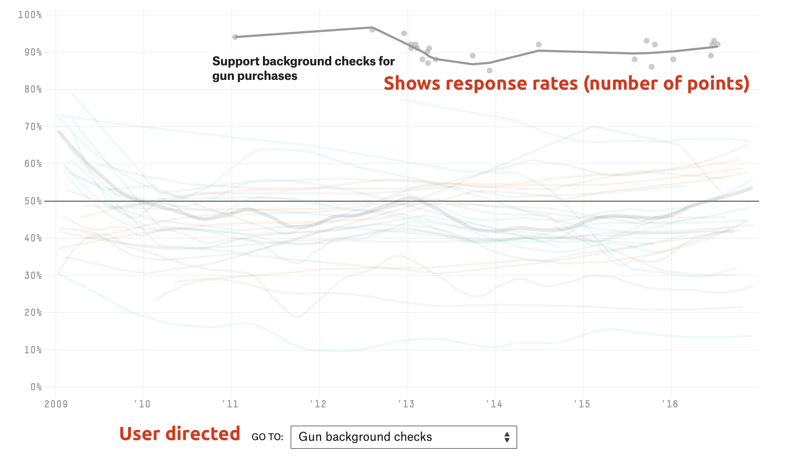

```{r meta, echo=FALSE}
library(metathis)
meta() %>%
  meta_general(
    description = "Intro to Data Journalism (folders, files, and software)",
    generator = "xaringan and remark.js"
  ) %>%
  meta_name("github-repo" = "mjfrigaard/CSUC-JOUR301-FA22") %>%
  meta_social(
    title = "Introduction to folders, files, and software",
    url = "https://mjfrigaard.github.io/CSUC-JOUR301-FA22/",
    og_type = "website",
    og_author = "Martin Frigaard",
    twitter_card_type = "summary",
    twitter_creator = "@mjfrigaard"
  )
```

```{r setup, include=FALSE}
dateWritten <- format(as.Date('2021-09-21'), format = "%B %d %Y")
today <- format(Sys.Date(), format = "%B %d %Y")
library(knitr)
library(tidyverse)
library(fontawesome)
options(
    htmltools.dir.version = FALSE,
    knitr.table.format = "html",
    knitr.kable.NA = ''
)
knitr::opts_chunk$set(
    warning = FALSE,
    message = FALSE,
    fig.path = "img/",
    fig.width = 7.252,
    fig.height = 4,
    comment = " ",
    fig.retina = 3 # Better figure resolution
)
# Enables the ability to show all slides in a tile overview by pressing "o"
xaringanExtra::use_tile_view()
xaringanExtra::use_panelset()
xaringanExtra::use_clipboard()
xaringanExtra::use_share_again()
xaringanExtra::style_share_again(share_buttons = "all")
xaringanExtra::use_extra_styles(
  hover_code_line = TRUE,
  mute_unhighlighted_code = FALSE
)
```

layout: true

<!-- this adds the link footer to all slides, depends on footer-small class in css-->

<div class="footer-small"><span>https://mjfrigaard.github.io/CSUC-JOUR301-FA22/</div>

---
name: title-slide
class: title-slide, center, middle, inverse

# `r rmarkdown::metadata$title`
#.fancy[`r rmarkdown::metadata$subtitle`]

<br>

.large[by Martin Frigaard]

Written: `r dateWritten`

Updated: `r today`

.footer-large[.right[.fira[
<br><br><br><br><br>[Created using the "λέξις" theme](https://jhelvy.github.io/lexis/index.html#what-does-%CE%BB%CE%AD%CE%BE%CE%B9%CF%82-mean)
]]]

---

# .center[Outline]

.leftcol[

## What is data journalism? 

### *Definitions & Examples*

## Software 

### *Open source & Proprietary*

]

.rightcol[

## Code files 

### *R Code, HTML & CSS*

## Data files

### *.CSV, .XML & .JSON*

]

---

## .center[What is data journalism?]

.cols3[

#### [Wikipedia](https://en.wikipedia.org/wiki/Data_journalism): 

> a journalistic process based on analyzing and filtering large data sets for the purpose of creating or elevating a news story  

]

--

#### [fivethirtyeight](https://twitter.com/FiveThirtyEight): 

.cols3[

> Data-driven news and analysis  

]

--

#### [the upshot (NYT)](https://twitter.com/UpshotNYT):

.cols3[

> Analytical journalism   
> in words and graphics  

]

---
class: left, top

### Example 1: FiveThirtyEight's *["How America’s Thinking Changed Under Obama: Public opinion on 32 big issues over the past eight years"](https://projects.fivethirtyeight.com/obama-polling-trends/)*

.leftcol60[.border[


]]

--

.rightcol40[

<br>

.red[Interactive graphs]

<br>

.red[Color highlights trend-lines]

]


---
class: left, top

### Example 1: FiveThirtyEight's *["How America’s Thinking Changed Under Obama: Public opinion on 32 big issues over the past eight years"](https://projects.fivethirtyeight.com/obama-polling-trends/)*

.leftcol60[.border[



]]

--

.rightcol40[

<br>

.red[Top plot shows changes over time]

<br>

.red[Selector on bottom allows user to change graph]

]


---
class: left, top

### Example 2: Washington Post's *[Why outbreaks like coronavirus spread exponentially, and how to "flatten the curve"](https://www.washingtonpost.com/graphics/2020/world/corona-simulator/)*

.leftcol45[.border[


]]

--

.rightcol55[

.red[interactive graphs]

.red[sparklines in text]

]

---
class: left, top

### Example 2: Washington Post's *[Why outbreaks like coronavirus spread exponentially, and how to "flatten the curve"](https://www.washingtonpost.com/graphics/2020/world/corona-simulator/)*


.leftcol55[.border[


<!--  -->

]]

--

.rightcol45[

<br>

.red[Animated area chart]

<br>

.red[Scatter-plot changes color in relation to area chart]

]

---
class: left, top

### Example 3: The Pudding's [*‘The Office’ Dialogue in Five Charts: A breakdown of how every character contributed to the show.*](https://pudding.cool/2017/08/the-office/)

.leftcol55[.border[

<!--00-pudding-office-01.png-->


]]

--

.rightcol45[.border[


]]

---
class: center, middle, inverse

# Code for Data Journalists

---
class: left, top

# `Code` file formats and extensions

.leftcol45[

<br>

### We can determine the language of code by it's .orange[file extension] 

]

--

.rightcol55[

<br>

#### file.orange[.R] = R code file (or script)  
#### file.orange[.html] = HTML code file (or webpage)  
#### file.orange[.css] = CSS code file (or stylesheet)

]

---
class: left, top

# `Code` file formats and extensions

.leftcol45[

#### Text editors (*like Notepad or TextEdit*) can be used to view code files

]

--

.rightcol55[.border[

```{r , eval=FALSE}
'Below is the plot.R code file in TextEdit'
```


]]


---
class: center, middle, inverse

# Code for Data Journalists

## `R` 


---
class: left, top

# Why write code?

.leftcol55[
#### R is a ***language***, which means it gives us the ability to express our ideas with precision

#### R code is text, so we can use copy + paste and Google (especially for errors!)
]

--

.rightcol45[

```{r , error=TRUE}
library(ggplot2)
mtcars %>% ggplot(aes(mpg, disp)) %>% 
  geom_point() +  
  geom_smooth()    
```

> copy + paste error message and Google it!

]

---
class: left, top

# `R Code` - grammar & syntax

--

.leftcol[

#### A code's *syntax* defines the rules for it's grammar and punctuation 

```{r print-add_stuff, eval=FALSE}
add_stuff <- function(a, b) {
    c <- sum(a, b)
    return(c)
}
```

> `a` plus `b` equals `c`

]

--

.rightcol[

#### The characters and words have specific meanings (just like in English)

```{r define-add_stuff, echo=FALSE}
add_stuff <- function(a, b) {
    c <- sum(a, b)
    return(c)
}
```

```{r add_stuff}
add_stuff(2, 2)
```

> `2` plus `2` equals `4`

]

---
class: left, top

# `R Code` - grammar & syntax

### Characters and words have to be written in a particular order for R code work

.leftcol[

```{r, eval=FALSE}
add_stuff <- function(a, b) {
    c <- sum(a, b)
    return(z) #<<
}
```

> `a` plus `b` equals `z`?

]

--

.rightcol[

```{r, error=TRUE, echo=FALSE}
add_stuff <- function(a, b) {
    c <- sum(a, b)
    return(z) #<<
}
```

```{r add_stuff-error, error=TRUE}
add_stuff(2, 2)
```

> `2` plus `2` equals `???`

]

---
class: left, top

# `R Code` - the basics

<br>

.leftcol55[

## `objects` are like *nouns*

<br />

## `functions` are like *verbs* 

]

--

.rightcol45[

```{r, eval=FALSE}
verb(noun)
```

<br>

*is like...* 

```{r, eval=FALSE}
function(object)
```

]

---
class: left, top

# `R Code` - A quick example  

<br>

.leftcol35[

```{r, eval=FALSE}
qplot(data = diamonds, 
         x = carat, 
         y = price, 
     color = cut, 
      geom = "point")
```

]

--

.rightcol65[

<br>

> The `qplot()` function **does things** to 
> the objects (*the `carat` and `price` columns*
> *from the `diamonds` dataset*)

]

---
class: left, top

# `R Code` - A quick example  

<br>

.leftcol35[

```{r, eval=FALSE}
qplot(data = diamonds, 
         x = carat, 
         y = price, 
     color = cut, 
      geom = "point")
```

]

--

.rightcol65[

<br>

> We're telling R we want to use the `diamonds` data to plot the `carat` column on the `x` axis, and the `price` column on the `y` 

]

---
class: left, top

# `R Code` - A quick example 

<br>

.leftcol35[

```{r, eval=FALSE}
qplot(data = diamonds, 
         x = carat, 
         y = price, 
     color = cut, 
      geom = "point")
```

]

--

.rightcol65[

<br>

> We want the graph to have 'points' (or dots), and we want these points colored by the `cut` column (we use the `"point"` geometric object for points).

]

---
class: left, top

# `R Code` - A quick example 

.panelset[
.panel[.panel-name[R Code]

```{r qplot-diamonds, eval=FALSE}
qplot(data = diamonds, 
         x = carat, y = price, color = cut, geom = "point")
```
]

.panel[.panel-name[Plot]

```{r qplot-show, echo=FALSE, fig.align='center', out.width='60%', out.height='60%'}
qplot(data = diamonds, 
         x = carat, y = price, color = cut, geom = "point")
```

]
]

---
class: center, middle, inverse

# Code for Data Journalists

## `HTML` 

---
class: left, top

# `HTML`

## HTML stands for 'HyperText Markup Language' and is a computer language used to create web pages

--

## HTML code can be run by opening the file containing the code with any web browser (Chrome, Safari, Firefox, etc.)

--

## HTML5 is the current standard 

---
class: left, top

# `HTML`

.leftcol45[.border[


]
]

--

.rightcol55[

#### Head over to the [fivethirtyeight landing page](https://fivethirtyeight.com/)

#### Right click on the page and click 'view source'

]

---
class: left, top

## `HTML`

> We're looking at the HTML code used to build the fivethirtyeight website (note the `<!DOCTYPE html>` at the top of the page)

--

<br>

.border[


]

---
class: left, top

# `HTML`: structure

### HTML consists of `elements` and `tags`

--

.border[


]

--

>  Elements have a start tag, followed by the element content, followed by an end tag


---
class: left, top

## `HTML` - `elements` and `tags`

--

#### Start tag: 

```html
<title>
```

--

#### Content: 

```html
<title>FiveThirtyEight | Nate Silver’s FiveThirtyEight uses statisti...
```

--

#### End tag: 

```html
<title>FiveThirtyEight | Nate Silver’s FiveThirtyEight uses...</title>
```

---
class: left, top

# `HTML` - attributes

--

#### Attributes appear in the start tag  `<tag>` 
#### Inside tags are `attribute(s)="attribute value(s)"` 
#### End with `</tag>`  

--

```html

```

--

> The code above shows the start tag for an `img` element, with an attribute called `src` with a value `"image.png"`


---
class: left, top

# `HTML` - tags to know 

.leftcol55[.code60[

<br>

```html
<!-- html comments (not read/displayed by browser) -->
<!DOCTYPE html> <!-- document type declaration -->
<html lang="en-US"> <!-- describes the web page -->
  <head> <!-- header of the HTML document -->
    <title></title> <!-- title of the HTML document -->
  </head> 
  <body> <!-- visible page content -->
    <h1> <!-- level 1 header (others include h2-h6) -->
    <!-- href is url, followed by displayed text -->
      <a 
      href="https://www.website.com">link
      </a>
      <!-- src the path to an image file -->
        
    <h1/>
  </body>
</html>
```

]]

--

.rightcol45[.small[

> *starts with* .red[`<!DOCTYPE html>`]

<br>

> *most of the code is in the* .red[`<body>`]

<br>

> *website:* .red[`<a href="url>text</a>`]

<br>

> *image* .red[``]

]
]


---
class: center, middle, inverse

# Code for Data Journalists

## `CSS` 

---
class: left, top

## `CSS`

<br />

### `CSS` stands for 'Cascading Style Sheets' 

--

<br />

### `CSS` is used for describing the layout, colors, and fonts of a HTML document 


---
class: left, top

# `CSS` - structure

.leftcol55[

```css
    <style>
        h1 {
            color: blue;
        }
    </style>
```

]

--

.rightcol45[

1. `<style>` .green[start tag]   
2. .yellow[a selector] (`h1`)     
3. .yellow[an open bracket] (`{`)   
4. .blue[property name] (`color`)    
5. .blue[colon] (`:`)    
6. .blue[property value] (`blue`)    
7. .blue[semi-colon] (`;`)     
8. .yellow[a closed bracket] (`}`)    
9. `</style>` .green[end tag] 

]


---
class: left, top

# `CSS` - use 

--

<br>

#### `CSS` is most useful when included in an external CSS file (i.e., `my_style_sheet.css`)


--

```html
<link href="my_style_sheet.css" rel="stylesheet" 
      type="text/css">
```

--

> We can then reference the `my_style_sheet.css` style sheet using the `<link>` tag


---
class: center, middle, inverse

# Data file formats

---
class: left, top

# `Data` file types

--

#### Data comes in a variety of formats, but this course will focus on 'plain text formats'

--

### Why 'plain text'?

--

#### Text editors can read and write plain text files  

--

#### Plain text files are portable across different computer operating systems

---
class: left, top

# `CSV` - 'comma-separated values' files

--

#### The first line is a "header" and contains column (or variable) names in each of the fields (using letters, digits, and underscores)

--

#### Each following line represents a new row (or observation)

--

#### Any field *may be* quoted, but fields with embedded commas or double-quote characters *must be* quoted

---
class: left, top

# `CSV` - 'comma-separated values' files

.leftcol[

#### How .csv files look in text editors:

```
name, city, state
Sally, Commack, NY
Fred, Fort Dodge, IA
Deb, Phillipsburg, NJ
```

]

--

.rightcol[

#### How .csv files look in a spreadsheet:

```{r csv, echo=FALSE, warning=FALSE, message=FALSE}
knitr::kable(
readr::read_csv("name, city, state
Sally, Commack, NY
Fred, Fort Dodge, IA
Deb, Phillipsburg, NJ"))
```

]

---
class: left, top

# `XML` - Extensible Markup Language

<br>

--

#### `XML` consists of of XML elements with a start tag and an end tag (with plain text content or other XML elements in-between)

--

#### The start tag may include attributes of the form `attribute="value"` (case-sensitive)

--

#### All attribute values must be enclosed within double-quotes

---
class: left, top

# `XML` - structure


.cols3[

<br>

```xml
<?xml version="2.0"?>
<heights>
<filename>ht.txt</filename>
<case date="24-JAN-2019"
      height="78.9"/>
</heights>
```

]

--

.cols3[

<br>

.right[
.small[
.blue[root element] = `<heights>`  
.blue[start tag] = `<filename>`  
content = `ht.txt`  
.blue[end tag] = `</filename>`    
.blue[element name] = `case`  
.green[attribute name] = `date`  
.red[attribute value] = `"24-JAN-2019"`   
.green[attribute name] = `height`   
.red[attribute value] = `"78.9"` 
]
]

]

--

.cols3[

> *The root element is the `heights` element with `filename` and `case` elements nested within the `heights`*

]


---
class: left, top

# `JSON` - JavaScript Object Notation

<br>

--

### `JSON` is a lightweight data storage format similar in structure to `XML` but different syntax/format

--

<br>

### Common format for data from application programming interfaces (APls)


---
class: left, top

# `JSON` - structure

### Data are stored as:

.leftcol[

#### - Numbers (double)  
#### - Strings (double quoted)  
#### - Boolean ( true or false)  

]

.rightcol[

#### - Array (ordered, comma separated enclosed in square brackets`[]`)  
#### - Object (unorderd, comma-separated collection of key:value pairs in curley brackets `{}`)  

]


---
class: left, top

# `JSON` - structure

.pull-left[

#### CSV vs. JSON formats

```markdown
name, city, state
Sally, Commack, NY
Fred, Fort Dodge, IA
Deb, Phillipsburg, NJ
```

]

.pull-right[

```{r , echo=FALSE}
library(jsonlite)
x <- readr::read_csv("name, city, state
Sally, Commack, NY
Fred, Fort Dodge, IA
Deb, Phillipsburg, NJ")
jsonlite::toJSON(x = x, pretty = TRUE)
```

]


---
class: left, top, inverse

# Recap

#### Data journalists use programming languages as a tool to process, store, and display data

#### Code is the preferred technology because it's a language and allows us to be precise and expressive

#### Plain text files are simple, lowest-common-denominator storage formats


```{r chrome_print, echo=FALSE, results='hide', eval=FALSE}
html_slides <- list.files(".", pattern = ".html")
pdf_slides <- str_replace(html_slides, 
  pattern = ".html", 
  replacement = ".pdf")
pdf_slides <- paste0("pdfs/", pdf_slides)
print_files <- tibble("pdfs" = pdf_slides,
  "htmls" = html_slides)
print_files$pdfs[2]
print_files$htmls[2]
pagedown::chrome_print(input = print_files$htmls[2], output = print_files$pdfs[2], timeout = 120)
```
