```{r meta, echo=FALSE}
library(metathis)
meta() %>%
  meta_general(
    description = "Introduction to R Markdown",
    generator = "xaringan and remark.js"
  ) %>%
  meta_name("github-repo" = "mjfrigaard/CSUC-JOUR301-FA22") %>%
  meta_social(
    title = "Introduction to R Markdown",
    url = "https://mjfrigaard.github.io/CSUC-JOUR301-FA22/",
    og_type = "website",
    og_author = "Martin Frigaard",
    twitter_card_type = "summary",
    twitter_creator = "@mjfrigaard"
  )
```

```{r setup, include=FALSE}
dateWritten <- format(as.Date('2021-10-03'), format = "%B %d %Y")
today <- format(Sys.Date(), format = "%B %d %Y")
library(knitr)
library(tidyverse)
library(fontawesome)
options(
    htmltools.dir.version = FALSE,
    knitr.table.format = "html",
    knitr.kable.NA = ''
)
knitr::opts_chunk$set(
    warning = FALSE,
    message = FALSE,
    fig.path = "img/",
    fig.width = 7.252,
    fig.height = 4,
    comment = " ",
    fig.retina = 3 # Better figure resolution
)
# Enables the ability to show all slides in a tile overview by pressing "o"
xaringanExtra::use_tile_view()
xaringanExtra::use_panelset()
xaringanExtra::use_clipboard()
xaringanExtra::use_share_again()
xaringanExtra::style_share_again(share_buttons = "all")
xaringanExtra::use_extra_styles(
  hover_code_line = TRUE,
  mute_unhighlighted_code = FALSE
)
```

layout: true

<!-- this adds the link footer to all slides, depends on footer-small class in css-->

<div class="footer-small"><span>https://mjfrigaard.github.io/CSUC-JOUR301-FA22/</div>

---
name: title-slide
class: title-slide, center, middle, inverse

# `r rmarkdown::metadata$title`
#.fancy[`r rmarkdown::metadata$subtitle`]

<br>

.large[by Martin Frigaard]

Written: `r dateWritten`

Updated: `r today`

.footer-large[.right[.fira[
<br><br><br><br><br>[Created using the "λέξις" theme](https://jhelvy.github.io/lexis/index.html#what-does-%CE%BB%CE%AD%CE%BE%CE%B9%CF%82-mean)
]]]

---

```{r rmarkdown_wizards, echo=FALSE, out.width="70%", out.height="70%"}
# copy_slide_images("rmarkdown_wizards.png")
knitr::include_graphics("img/rmarkdown_wizards.png")
```

.footer-large[.right[Artwork by @allison_horst]]

---
class: inverse, center
background-image: url(img/rmarkdown.png)
background-position: 93% 10%
background-size: 7%

# *What is RMarkdown?*

--

## Three technologies:

--

### 1) Markdown is a plain text markup language for capturing .blue[human-readable prose]

--

### 2) Computational language engines for executing .blue[machine-readable code]

--

### 3) Multiple .blue[output options] for creating PDFs, Word docs, PowerPoints, HTML, etc.

---
class: center, top

# How R Markdown works 

## `rmarkdown` works directly with `knitr`

.leftcol[

`rmarkdown` combines YAML, markdown, and R code into a markdown document and passes it to `knitr`

```{r rmarkdown, echo=FALSE, fig.align='center', out.width="20%", out.height="20%"}
knitr::include_graphics("img/rmarkdown.png")
```

]

--

.rightcol[

`knitr` uses `pandoc` (a universal document conversion tool) to generate the specified document format

```{r knitr, echo=FALSE, echo=FALSE, fig.align='center', out.width="20%", out.height="20%"}
# copy_slide_images("knitr.png")
knitr::include_graphics("img/knitr.png")
```

]

---
background-image: url(img/rmarkdown.png)
background-position: 95% 8%
background-size: 7%
class: inverse, middle, center

# Exercises

### We will create an example HTML report using the R Markdown template provided by RStudio

---
background-image: url(img/rmarkdown.png)
background-position: 95% 12%
background-size: 7%
class: left, top

# Exercise 1: create a new RMarkdown file

.leftcol[

### Click on .red[File] >

### then .red[New File] >

### then .red[R Markdown] 

]


.rightcol[

***Or use the drop-down menu***

```{r new-rmarkdown, echo = FALSE, out.height="30%", out.width="30%", fig.align='center'}
# copy_slide_images("new-rmarkdown.png")

```

]

---
background-image: url(img/rmarkdown.png)
background-position: 93% 7%
background-size: 7%
class: left, top

# Install required packages 

.leftcol[

You *might* be asked to install the required packages for R Markdown, Click **Yes**

.border[

```{r install-req-packages, echo = FALSE, out.height="80%", out.width="80%"}
# copy_slide_images("install-req-packages.png")
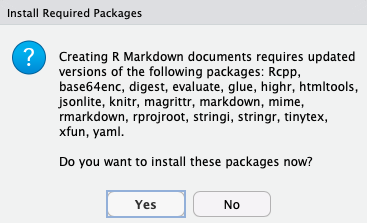
```

]]

--

.rightcol[

You will see RStudio installing the packages in the **Jobs** pane

.border[

```{r rmd-pckgs-jobs, echo = FALSE, out.height="180%", out.width="180%"}
# copy_slide_images("rmd-pckgs-jobs.png")
knitr::include_graphics("img/rmd-pckgs-jobs.png")
```

]]


---
background-image: url(img/rmarkdown.png)
background-position: 93% 7%
background-size: 7%
class: middle

# New R Markdown File

### Enter ***'Title'*** and ***'Author'*** of your report and click ***OK***

.border[

```{r rmarkdown-defaults, echo = FALSE, out.height="40%", out.width="40%", fig.align='center'}
# copy_slide_images("rmarkdown-defaults.png")

```

]


---
background-image: url(img/rmarkdown.png)
background-position: 93% 7%
background-size: 7%
class: left, top

# Save your `.Rmd` file

### Click on the small floppy disk, enter a name (with .Rmd extension), and save your `.Rmd` file


.border[

```{r save-rmd-file, echo = FALSE, out.height="40%", out.width="40%", fig.align='center'}
# copy_slide_images("save-rmd-file.png")
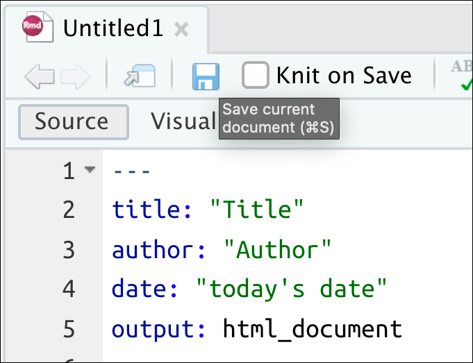
```

]

---
background-image: url(img/rmarkdown.png)
background-position: 93% 7%
background-size: 7%
class: left, top

# Knit your .Rmd file

### Click on the small gear, select .blue[Preview in Viewer Pane]

### Click on the knit icon (ball of yarn)

.border[

```{r knit-rmd-file, echo = FALSE, out.height="60%", out.width="60%", fig.align='center'}
# copy_slide_images("knit-rmd-file.png")

```

]

---
background-image: url(img/rmarkdown.png)
background-position: 93% 7%
background-size: 7%
class: left, center

## Our First R Markdown Report!

.border[

```{r rmarkdown-in-action, echo = FALSE, out.height="75%", out.width="75%", fig.align='center'}
# copy_slide_images("rmarkdown-in-action.png")

```

]


---
background-image: url(img/rmarkdown.png)
background-position: 95% 8%
background-size: 7%
class: inverse, middle, center

# How R Markdown Works 

## (under the hood)

---
background-image: url(img/rmarkdown.png)
background-position: 7% 93%
background-size: 7%
class: left, center

# R Markdown is made up of three elements

## 1) [YAML](https://en.wikipedia.org/wiki/YAML) 

--

```{r rmd-yaml, echo = FALSE, out.height="90%", out.width="90%", fig.align='center'}
# copy_slide_images("r-plus-md.png")
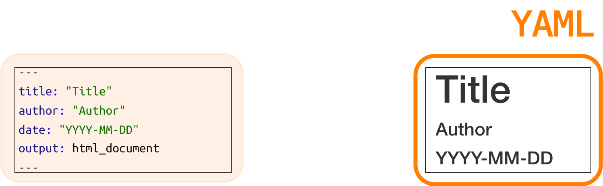
```

---
background-image: url(img/rmarkdown.png)
background-position: 7% 93%
background-size: 7%
class: left, center

# R Markdown is made up of three elements

## 2) [Markdown](https://en.wikipedia.org/wiki/Markdown) 

--

```{r rmd-markdown, echo = FALSE, out.height="95%", out.width="95%", fig.align='center'}
# copy_slide_images("r-plus-md.png")

```

---
background-image: url(img/rmarkdown.png)
background-position: 7% 93%
background-size: 7%
class: left, center

# R Markdown is made up of three elements

## 3) R Code Chunks

--

```{r rmd-r-code, echo = FALSE, out.height="80%", out.width="80%", fig.align='center'}
# copy_slide_images("r-plus-md.png")
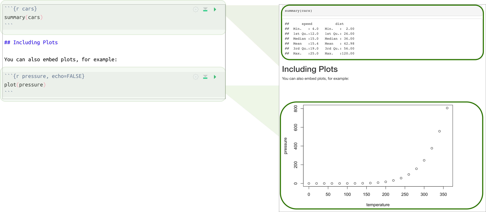
```

---
class: left, top

# Rmarkdown combines metadata, markdown, *and* R code 

.leftcol[

```{r r-plus-md, echo = FALSE, out.height="90%", out.width="90%", fig.align='center'}
# copy_slide_images("r-plus-md.png")
knitr::include_graphics("img/r-plus-md.png")
```

]

.rightcol[

`.yaml` = Metadata  
`.md` = Prose   
`.R` = Code 

]

<br><br><br><br>

> The result is a file framework for creating reproducible reports, slide decks, websites, dashboards, etc. 
    


---
background-image: url(img/rmarkdown.png)
background-position: 93% 10%
background-size: 7%

# R Markdown: YAML

## `.yaml` = Metadata
### ~~`.md` = Prose~~  
### ~~`.R` = Code~~

--

### YAML is a human friendly data serialization standard for all programming languages.

--

### YAML stands for *'YAML Ain't Markup Language'* (funny, huh?)


---
background-image: url(img/rmarkdown.png)
background-position: 93% 10%
background-size: 7%

# R Markdown: YAML

<br><br>

### YAML contains the information about the document we're going to create

```yaml
---
title: "My Report"
author: "Martin Frigaard"
date: "2022-08-14"
output: html_document
---
```

---
background-image: url(img/rmarkdown.png)
background-position: 93% 10%
background-size: 7%

# R Markdown: YAML format

```{r yaml-formatting-01, echo = FALSE, out.height="50%", out.width="50%", fig.align='center'}
# copy_slide_images("yaml-formatting-01.png")

```

---
background-image: url(img/rmarkdown.png)
background-position: 93% 10%
background-size: 7%

# R Markdown: YAML format

<br>

```{r yaml-formatting-02, echo = FALSE, out.height="60%", out.width="60%", fig.align='center'}
# copy_slide_images("yaml-formatting-02.png")
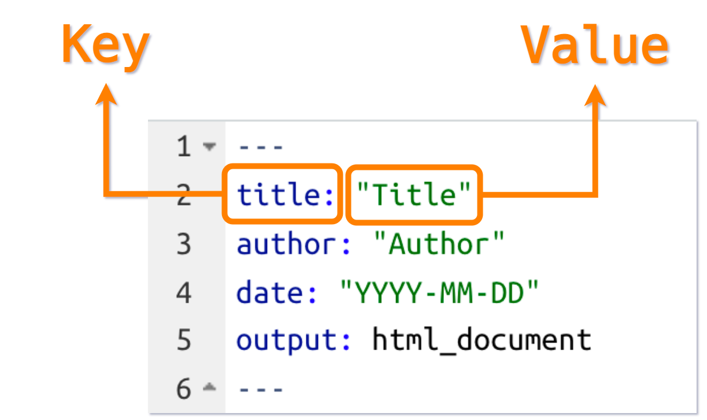
```

---
background-image: url(img/rmarkdown.png)
background-position: 93% 10%
background-size: 7%

# R Markdown: YAML

<br><br>

### There are many YAML arguments and options

### _Indentation matters in YAML!!_

--

> Check out the [YAML Fieldguide](https://cran.r-project.org/web/packages/ymlthis/vignettes/yaml-fieldguide.html) for a comprehensive list


---
background-image: url(img/rmarkdown.png)
background-position: 93% 7%
background-size: 7%

# Example YAML output options

## Table of contents: 

### `toc:` binary (`yes` or `no`)

### `toc_float:` logical (`true` or `false`)

### `toc_depth:` set numerically `0` - `6`

---
background-image: url(img/rmarkdown.png)
background-position: 7% 93%
background-size: 7%

# Exercise 2: create a floating table of contents

### Change the `output` in the YAML header to the following:

.leftcol40[

```yaml
output: 
  html_document: 
    toc: yes
    toc_float: true
```

]

--

.rightcol60[.center[

#### *Knit the document again*

]]


---
background-image: url(img/rmarkdown.png)
background-position: 7% 96%
background-size: 7%

# YAML output options: table of contents 

### Floating table of contents (rendered)

```{r yaml-toc-settings, fig.align='center', echo = FALSE, out.height="65%", out.width="65%"}
# copy_slide_images("yaml-toc-settings.png")

```

---
background-image: url(img/rmarkdown.png)
background-position: 7% 96%
background-size: 7%

# Exercise 3: text highlighting and themes

### Add the following two options to your YAML header

.leftcol40[

```yaml
output: 
  html_document: 
    toc: yes
    toc_float: yes
    highlight: zenburn
    theme: united

```

]

--

.rightcol60[.center[

#### *Knit the document again*

]]


---
background-image: url(img/rmarkdown.png)
background-position: 7% 96%
background-size: 7%

# YAML: text highlighting and theme options 

### Text highlighting and theme options (rendered)

```{r yaml-highlight-theme, echo = FALSE, out.height="75%", out.width="75%", fig.align='center'}
# copy_slide_images("yaml-highlight-theme.png")
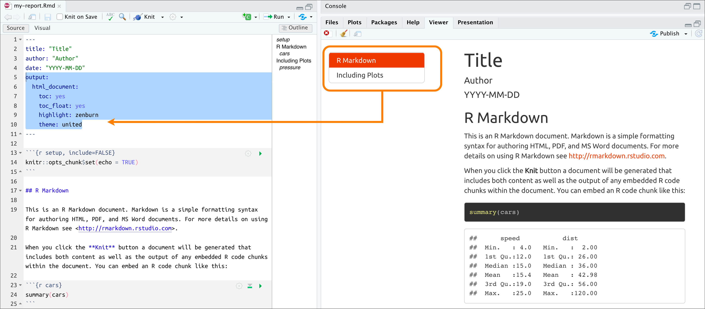
```

---
background-image: url(img/rmarkdown.png)
background-position: 4% 93%
background-size: 7%

# More YAML options

### You can change the YAML contents using the settings (small gear)


```{r knitr-settings, echo = FALSE, out.height="25%", out.width="25%", fig.align='center'}
# copy_slide_images("knitr-settings.png")

```


---
background-image: url(img/rmarkdown.png)
background-position: 7% 96%
background-size: 7%

# Edit R Markdown Document Options

.leftcol[

#### This window gives us the ability to manually change some of the YAML settings (but not all of them!)

]

--

.rightcol[

```{r edit-rmd-output-options, echo = FALSE, out.height="80%", out.width="80%", fig.align='left'}
# copy_slide_images("edit-rmd-output-options.png")

```

]

---
background-image: url(img/rmarkdown.png)
background-position: 7% 96%
background-size: 7%

# YAML Parameters

### YAML parameters can be referred to throughout the document

.leftcol[

***Create `params` in YAML header***

```yaml
params: 
  param1: x
  param2: y
  data: df
```
]

--

.rightcol[

***Refer to `params` in .Rmd document***

```{r params, eval = FALSE}
params$param1
params$param2
params$data
```
]

---
background-image: url(img/rmarkdown.png)
background-position: 7% 96%
background-size: 7%

# Exercise 4: Using YAML parameters

.leftcol40[

#### *Add the following `params` option in the YAML header*

.small[

```yaml
params: 
  small_pressure: !r head(pressure)
```

]]


--

.rightcol60[

#### *Add this code to the end of the document*

<br>

.border[

```{r small-pressure, echo = FALSE, out.height="100%", out.width="100%", fig.align='left'}
# copy_slide_images("small-pressure.png")
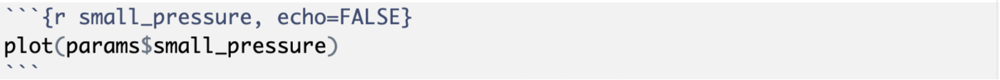
```

<br><br>

#### *Knit the document again!*

]]


 


---
background-image: url(img/rmarkdown.png)
background-position: 7% 96%
background-size: 7%

## See our new plot with the `params`

We can see the new plot with the reduced sample size


```{r params-plot, echo = FALSE, out.height="60%", out.width="60%", fig.align='center'}
# copy_slide_images("params-plot.png")
knitr::include_graphics("img/params-plot.png")
```


---
background-image: url(img/rmarkdown.png)
background-position: 93% 10%
background-size: 7%

# YAML output formats

Function       | Outputs
-------------- | --------------------------
`html_document()`   | HTML document
`pdf_document()`  | PDF document
`word_document()` | Word document
`odt_document()`   | ODT document
`rtf_document()`   | RTF document
`md_document()`   | Markdown document
`slidy_presentation()`   | Slidy Slides (HTML)
`beamer_presentation()`   | Beamer Slides (PDF)
`ioslides_presentation()`   | ioslides (HTML)
`powerpoint_presentation()`   | PowerPoint (pptx)

---
background-image: url(img/rmarkdown.png)
background-position: 93% 10%
background-size: 15%


# R Markdown

### ~~`.yaml` = Metadata~~
## `.md` = Prose
### ~~`.R` = Code~~


---
background-image: url(img/markdown.png)
background-position: 93% 10%
background-size: 7%
class: left, top

# Basic Markdown Syntax


.leftcol30[.large[

#### Italics & Bold

```md
 *italic*   **bold**
 _italic_   __bold__
```

]]

--

.rightcol70[.center[.large[

 *italic*   **bold**  
 _italic_   __bold__

]]]

---
background-image: url(img/markdown.png)
background-position: 93% 10%
background-size: 7%
class: left, top

# Basic Markdown Syntax

.leftcol[.large[

#### Headers

```md
# Header 1
## Header 2
### Header 3
```

]]

--

.rightcol[.large[.center[

# Header 1  
## Header 2  
### Header 3 

]]]

---
background-image: url(img/markdown.png)
background-position: 93% 10%
background-size: 7%
class: left, top

# Basic Markdown Syntax

.leftcol40[

#### Bullets & Numeric Lists

```md
 * Item 1
 * Item 2
    + Item 2a
    + Item 2b
    
 1. Item 1
 2. Item 2
```

]

--

.rightcol60[.medium[

* Item 1  
* Item 2
    + Item 2a
    + Item 2b


 1. Item 1
 2. Item 2
 
]]


---
background-image: url(img/markdown.png)
background-position: 93% 10%
background-size: 7%
class: left, top

# Basic Markdown Syntax


.leftcol55[

#### Hyperlinks 

```md
https://www.rstudio.com/

[linked phrase](https://www.rstudio.com/)
```


]


--

.rightcol45[

#### *becomes...*

.center[.large[

[linked phrase](https://www.rstudio.com/)

]]]


---
background-image: url(img/markdown.png)
background-position: 93% 10%
background-size: 7%
class: left, top


# Basic Markdown Syntax

.leftcol55[

#### Images 

.small[

```md


```

]]

--

.rightcol45[

#### *becomes...*

```{r Rlogo.png, echo = FALSE, out.height="30%", out.width="30%", fig.align='center'}
knitr::include_graphics("https://www.r-project.org/logo/Rlogo.png")
```

]


---
background-image: url(img/markdown.png)
background-position: 93% 10%
background-size: 7%
class: left, top

# Basic Markdown Syntax


.leftcol[

#### Math Equations

```md
$equation$

$$ equation $$
```

]

--

<br>

.rightcol[.large[

$equation$

$$ equation $$

]]


---
background-image: url(img/markdown.png)
background-position: 93% 10%
background-size: 7%
class: left, top

# Basic Markdown Syntax

 

.leftcol45[

#### Super scripts & Strike-through

```md
superscript^2^
~~strikethrough~~
```

]

--

.rightcol55[.center[

 superscript^2^

 ~~strikethrough~~

]]

---
background-image: url(img/rmarkdown.png)
background-position: 7% 96%
background-size: 7%

# Exercise 5: Markdown Formatting

Delete the top portion of the markdown in `my-report.Rmd`. 

```{r delete-rmarkdown, echo = FALSE, out.height="60%", out.width="60%", fig.align='center'}
# copy_slide_images("delete-rmarkdown.png")

```

---
background-image: url(img/rmarkdown.png)
background-position: 7% 96%
background-size: 7%

# Exercise 5: Markdown Formatting

.leftcol[

### Add the text below to your report 

> *This is a monthly report generated with RMarkdown, a literate programming tool for combining text and code.*

]

--

.rightcol[

### Include the following formatting:

1. make `monthly report` italic  
2. include this hyperlink for `Rmarkdown`: https://rmarkdown.rstudio.com/
3. format `code` as code. 

]


--

#### *Knit the document when you're finished*


---
background-image: url(img/rmarkdown.png)
background-position: 7% 96%
background-size: 7%

# Exercise 5: Markdown Formatting (rendered)

<br>

```{r rmarkdown-exercise, echo = FALSE, out.height="90%", out.width="90%", fig.align='center'}
# copy_slide_images("rmarkdown-exercise.png")
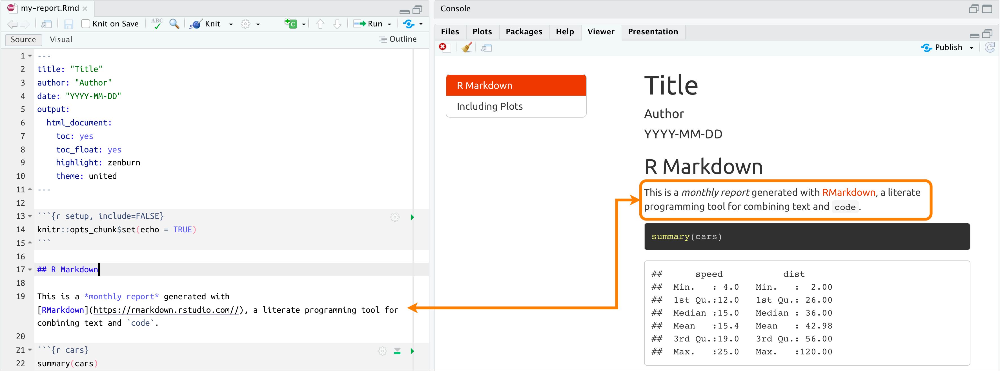
```

---
background-image: url(img/rmarkdown.png)
background-position: 93% 10%
background-size: 7%

# Exercise 6: Tabsets 

Remove the `toc` and `toc_float` options from your YAML header

```yaml
output: 
  html_document: 
    highlight: zenburn
    theme: united
params: 
  small_pressure: !r head(pressure)
```

---
background-image: url(img/rmarkdown.png)
background-position: 93% 10%
background-size: 7%

# Exercise 6: Tabsets 

Make the following changes to the `R Markdown` header sections


```{r tabset-markdown, fig.align='center', echo = FALSE, out.height="55%", out.width="55%"}
# copy_slide_images("tabset-markdown.png")

```

### Knit the document again

---
background-image: url(img/rmarkdown.png)
background-position: 93% 10%
background-size: 7%

# Exercise 6: Tabsets (rendered)

<br>

```{r tabset-1-render, echo = FALSE, out.height="100%", out.width="100%", fig.align='center'}
# copy_slide_images("tabset-1-render.png")
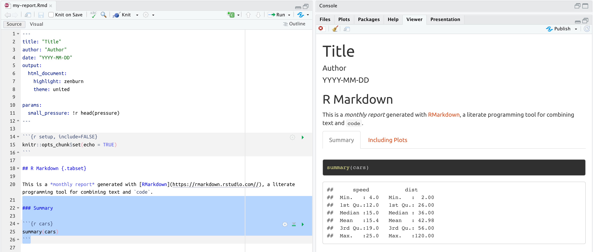
```

---
background-image: url(img/rmarkdown.png)
background-position: 93% 10%
background-size: 7%

# Exercise 6: Tabsets (rendered)

```{r tabset-2-render, echo = FALSE, out.height="95%", out.width="95%", fig.align='center'}
# copy_slide_images("tabset-2-render.png")
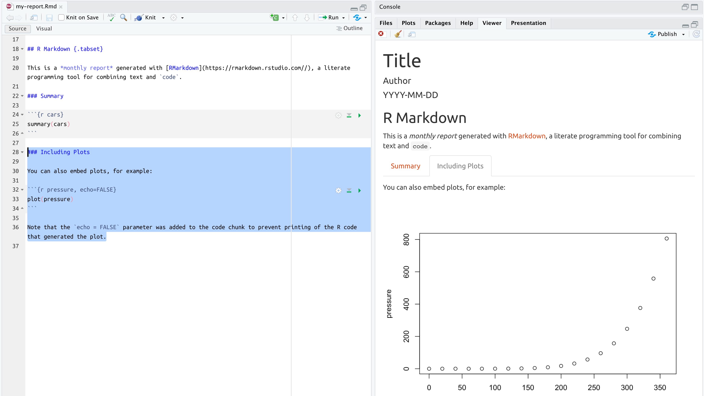
```

---
background-image: url(img/rmarkdown.png)
background-position: 93% 10%
background-size: 12%

# R Markdown

### ~~`.yaml` = Metadata~~
### ~~`.md` = Prose~~
## `.R` = Code


---
background-image: url(img/rmarkdown.png)
background-position: 93% 10%
background-size: 7%

# Code chunks (`setup`)

### The first bit of R code in our RMarkdown file is the `setup` chunk

```{r setup-code-chunk, echo = FALSE, out.height="100%", out.width="100%"}
# copy_slide_images("setup-code-chunk.png")
knitr::include_graphics("img/setup-code-chunk.png")
```

--

### Chunks named '`setup`' are special because they can set global options

--

### '`include=FALSE`' means this code is run, but not displayed

---
background-image: url(img/rmarkdown.png)
background-position: 93% 10%
background-size: 7%

# Code chunks (`setup`)

### R Markdown document options come from the `knitr` package

### We can access both the with sytnax below:

```{r knitr-opts-set, echo = FALSE, out.height="100%", out.width="100%", fig.align='center'}
# copy_slide_images("knitr-opts-set.png")

```

---
background-image: url(img/rmarkdown.png)
background-position: 93% 10%
background-size: 7%

# Code chunks (`setup`)

### The `echo=TRUE` option controls whether we want to display the code in the code chunk 

--

### Other common options regarding code are `eval`, `tidy`, `error`, `message`, and `warning`

--

### Advanced options can control language engines (`engine`), caching (`cache`, `dependson`), and plot animations (`fig.show`)


---
background-image: url(img/rmarkdown.png)
background-position: 93% 10%
background-size: 7%

# Code chunks (`setup`)

### Many options for code chunks 

|Option          | Document Effect                              |
|:-------------- |:-------------------------------------------- |
|`include`       | run code, but do/don't print code and results|
|`eval`          | do/don't evaluate the code                   |
|`echo`          | run code, but don't print code               |
|`message`       | do/don't print messages (e.g. from functions)|
|`warning`       | do/don't print warnings                      |

---
background-image: url(img/rmarkdown.png)
background-position: 93% 10%
background-size: 7%

# Code chunks

<br><br>

```{r code-chunks, echo = FALSE, out.height="70%", out.width="70%", fig.align='center'}
# copy_slide_images("code-chunks.png")

```


---
background-image: url(img/rmarkdown.png)
background-position: 93% 10%
background-size: 7%

# Code chunk fences

<br><br>

```{r code-chunk-fences, echo = FALSE, out.height="70%", out.width="70%", fig.align='center'}
# copy_slide_images("code-chunk-fences.png")

```

---
background-image: url(img/rmarkdown.png)
background-position: 93% 10%
background-size: 7%

# Code chunk names and arguments

```{r code-chunk-label-args, echo = FALSE, out.height="60%", out.width="60%", fig.align='center'}
# copy_slide_images("code-chunk-name-args.png")

```

> See the [knitr web page](https://yihui.name/knitr/options/) for complete list of options

---
background-image: url(img/rmarkdown.png)
background-position: 93% 10%
background-size: 7%

# Inserting code chunks

### Use keyboard shortcuts **CMD/CTRL + I** or **ALT/OPTION + I**


```{r insert-code-chunk, echo = FALSE, out.height="18%", out.width="18%", fig.align='center'}
# copy_slide_images("insert-code-chunk.png")
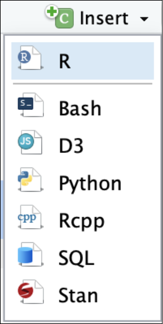
```

---
background-image: url(img/rmarkdown.png)
background-position: 93% 10%
background-size: 7%

# Edit code chunk options

### You can edit code chunk options using the icon (small gear)

```{r code-chunk-settings, echo = FALSE, out.height="40%", out.width="40%", fig.align='center'}
# copy_slide_images("code-chunk-settings.png")
knitr::include_graphics("img/code-chunk-settings.png")
```


---
background-image: url(img/rmarkdown.png)
background-position: 93% 10%
background-size: 7%

# Code Chunk Engines

## More and more code engines all the time 

.code50[

```{r knit_engines}
names(knitr::knit_engines$get())
```

]


---
background-image: url(img/rmarkdown.png)
background-position: 7% 96%
background-size: 7%

# Exercise 7: code chunks (kable)

.leftcol45[

#### Create a new `Tables` level three header under the `Summary` heading, 

.small[

```md
### Tables
```

]]


.rightcol55[

#### Insert the following code chunk under `Tables` 

<br>
```{r kable-code-chunk, echo = FALSE, out.height="85%", out.width="85%", fig.align='center'}
# copy_slide_images("kable-code-chunk.png")

```

]

<br><br><br><br><br><br><br><br>


> *insert the code block manually with the keyboard short-cut, or use the "Insert" button*


---
background-image: url(img/rmarkdown.png)
background-position: 93% 10%
background-size: 7%

# Exercise 7: code chunks (kable rendered)

We can see the `small_pressure` parameter from the YAML has been rendered in the new `Tables` tab. `kable` tables are great for presenting small, summary tables.

```{r kable-chunk-rendered, echo = FALSE, out.height="85%", out.width="85%", fig.align='center'}
# copy_slide_images("kable-chunk-rendered.png")

```

Read more about `kable` table options [here](https://bookdown.org/yihui/rmarkdown-cookbook/kable.html) 

---
background-image: url(img/rmarkdown.png)
background-position: 93% 7%
background-size: 6%

# Exercise 8: code chunks (paged)

#### We are going to repeat the process above, but with a larger table (`mtcars`)

Insert the following code chunk above the `knitr::kable()` output: 

.border[

```{r paged-code-chunk, echo = FALSE, out.height="80%", out.width="80%", fig.align='center'}
# copy_slide_images("paged-code-chunk.png")
knitr::include_graphics("img/paged-code-chunk.png")
```

]


#### Knit the document

---
background-image: url(img/rmarkdown.png)
background-position: 7% 96%
background-size: 7%

# Exercise 8: code chunk (paged rendered)

### Paged tables are great for larger datasets

```{r paged-chunk-render, echo = FALSE, out.height="95%", out.width="95%", fig.align='center'}
# copy_slide_images("paged-chunk-render.png")

```

---
background-image: url(img/rmarkdown.png)
background-position: 93% 10%
background-size: 7%

# Exercise 8: paged tables

```{r paged-chunk-render-gif, echo = FALSE, out.height="70%", out.width="70%", fig.align='center'}
knitr::include_graphics("img/paged-chunk-render.gif")
```

---
background-image: url(img/rmarkdown.png)
background-position: 93% 10%
background-size: 7%

# Inline R Code

### R Markdown also supports inline R code 

--


```{r inline-r-code-01, echo = FALSE, out.height="70%", out.width="70%", fig.align='center'}
# copy_slide_images("inline-r-code-01.png")
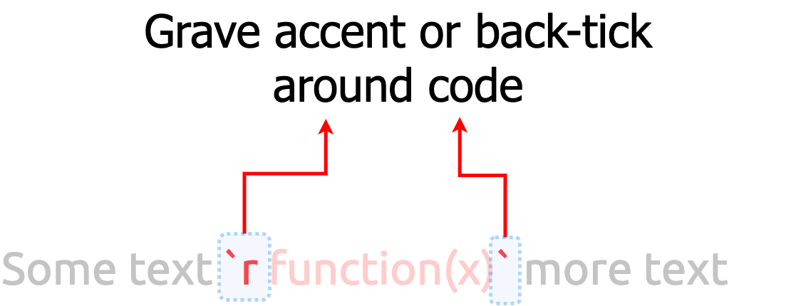
```

---
background-image: url(img/rmarkdown.png)
background-position: 93% 10%
background-size: 7%

# Inline R Code

### Inline R code allows us to include summaries of our analysis in the report

--

```{r inline-r-code-02, echo = FALSE, out.height="80%", out.width="80%", fig.align='center'}
# copy_slide_images("inline-r-code-02.png")
knitr::include_graphics("img/inline-r-code-02.png")
```


---
background-image: url(img/rmarkdown.png)
background-position: 93% 10%
background-size: 7%

# Exercise 9: Add Inline Code

<br>

### We're going to add a Pearson correlation between speed and stopping distance 

.leftcol[

#### Include the following code under the `Summary` level three header

]

--

.rightcol[

> The correlation between speed and 
> stopping distance is 
> `r cor(x = cars$speed, y = cars$dist)`

]

--

<br><br><br><br><br>

.center[

#### Knit the document again

]


---
background-image: url(img/rmarkdown.png)
background-position: 93% 10%
background-size: 7%

# Exercise 9: Add Inline Code (rendered)

<br><br>


```{r inline-code-rendered, echo = FALSE, out.height="100%", out.width="100%", fig.align='center'}
# copy_slide_images("inline-code-rendered.png")

```

---
background-image: url(img/rmarkdown.png)
background-position: 93% 10%
background-size: 7%
class: left, top

# More Resources

<br>

- **YAML**: check out the [`ymlthis` package](https://r-lib.github.io/ymlthis/) for tools and documentation for working with YAML

- **Markdown**: [Commonmark](https://commonmark.org/help/tutorial) has a quick ten-twenty minute tutorial on markdown.

- [R Markdown](https://bookdown.org/yihui/rmarkdown/): A comprehensive but friendly introduction to R Markdown and friends. Free online!

- [R for Data Science](http://r4ds.had.co.nz/): A comprehensive but friendly introduction to the tidyverse. Free online.

- [R Markdown for Scientists](https://rmd4sci.njtierney.com/): R Markdown for Scientists workshop material


```{r chrome_print, echo=FALSE, results='hide', eval=FALSE}
html_slides <- list.files(".", pattern = ".html")
pdf_slides <- str_replace(html_slides, 
  pattern = ".html", 
  replacement = ".pdf")
pdf_slides <- paste0("pdfs/", pdf_slides)
print_files <- tibble("pdfs" = pdf_slides,
  "htmls" = html_slides)
# print_files$htmls[6]

pagedown::chrome_print(input = print_files$htmls[6], output = print_files$pdfs[6], timeout = 120)
```
