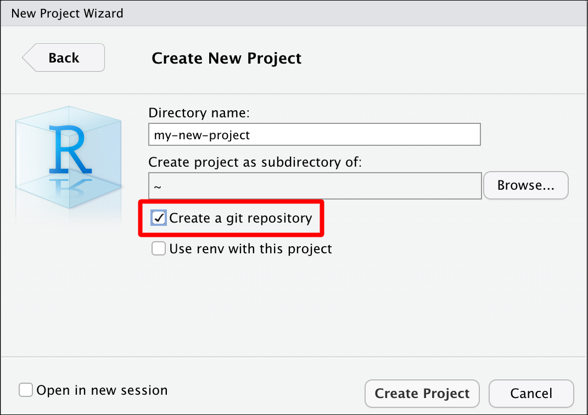

```{r meta, echo=FALSE}
library(metathis)
meta() %>%
  meta_general(
    description = "The RStudio IDE",
    generator = "xaringan and remark.js"
  ) %>%
  meta_name("github-repo" = "mjfrigaard/CSUC-JOUR301-FA22") %>%
  meta_social(
    title = "The RStudio IDE",
    url = "https://mjfrigaard.github.io/CSUC-JOUR301-FA22/",
    og_type = "website",
    og_author = "Martin Frigaard",
    twitter_card_type = "summary",
    twitter_creator = "@mjfrigaard"
  )
```

```{r setup, include=FALSE}
dateWritten <- format(as.Date('2021-09-30'), format = "%B %d %Y")
today <- format(Sys.Date(), format = "%B %d %Y")
library(knitr)
library(tidyverse)
library(fontawesome)
options(
    htmltools.dir.version = FALSE,
    knitr.table.format = "html",
    knitr.kable.NA = ''
)
knitr::opts_chunk$set(
    warning = FALSE,
    message = FALSE,
    fig.path = "img/",
    fig.width = 7.252,
    fig.height = 4,
    comment = " ",
    fig.retina = 3 # Better figure resolution
)
# Enables the ability to show all slides in a tile overview by pressing "o"
xaringanExtra::use_tile_view()
xaringanExtra::use_panelset()
xaringanExtra::use_clipboard()
xaringanExtra::use_share_again()
xaringanExtra::style_share_again(share_buttons = "all")
xaringanExtra::use_extra_styles(
  hover_code_line = TRUE,
  mute_unhighlighted_code = FALSE
)
```

layout: true

<!-- this adds the link footer to all slides, depends on footer-small class in css-->

<div class="footer-small"><span>https://mjfrigaard.github.io/CSUC-JOUR301-FA22/</div>

---
name: title-slide
class: title-slide, center, middle, inverse

# `r rmarkdown::metadata$title`
#.fancy[`r rmarkdown::metadata$subtitle`]

<br>

.large[by Martin Frigaard]

Written: `r dateWritten`

Updated: `r today`

.footer-large[.right[.fira[
<br><br><br><br><br>[Created using the "λέξις" theme](https://jhelvy.github.io/lexis/index.html#what-does-%CE%BB%CE%AD%CE%BE%CE%B9%CF%82-mean)
]]]


---
class: center, middle

# The RStudio IDE

### Managing your code, data, and files with RStudio

---
class: left, top

# Outline 

.leftcol[

- RStudio IDE Settings 

- RStudio Projects

- Folder Structure

]

.rightcol[

- Naming things 

- File Paths 

- The Terminal

- Reproducible Examples 

- Getting help

]


---
class: left, top

## Change RStudio's Default Restore & Saving Settings 

.leftcol[

#### Click on **Tools** > **Global Options...**

#### - We want to uncheck "*Restore .RData into work space at start up*"  

#### - We also want to make sure we change "*Save work space to .Rdata on exit*" to "*Never*"

]

.rightcol[

```{r img-settings, echo=FALSE, out.width='200%', out.height='200%', fig.align='center'}
knitr::include_graphics(path = "img/settings.png")
```


]

---
class: inverse, center, middle

# Customize RStudio 

.leftcol[
### Code
### Console
### Appearance
### Pane Layout
### R Markdown
]

.rightcol[

```{r setting-options, echo=FALSE, out.width='40%', out.height='40%', fig.align='center'}
knitr::include_graphics(path = "img/setting-options.png")
```

]

---
class: left, top

# Code Editing

.leftcol[

## - Auto indent?

## - Continue comment lines?

## - Save R scripts before sourcing?

]

.rightcol[.border[

```{r code-settings, echo=FALSE, out.width='64%', out.height='64%', fig.align='center'}
knitr::include_graphics(path = "img/code-settings.png")
```

]
]

---
class: left, top

# Code Display

.leftcol[

## - Margins?

## - Scrolling?

## - Rainbow parentheses?

]


.rightcol[.border[

```{r code-display, echo=FALSE, out.width='70%', out.height='70%', fig.align='center'}
knitr::include_graphics(path = "img/code-display.png")
```

]
]

---
class: left, top

# Code Saving

.leftcol[

## - Cursor position?

## - Line endings?

## - Text encoding?

]

.rightcol[.border[

```{r code-savings, echo=FALSE, out.width='80%', out.height='80%', fig.align='center'}
knitr::include_graphics(path = "img/code-savings.png")
```

]]

---
class: left, top

# Code Completion

.leftcol[

## - Insert parentheses?

## - Insert spaces?

## - Completion delay setting?

]


.rightcol[.border[

```{r code-completion, echo=FALSE, out.width='70%', out.height='70%', fig.align='center'}
knitr::include_graphics(path = "img/code-completion.png")
```

]]

---
class: left, top

# Code Diagnostics

.leftcol[

## - Check your R Code?

## - Check other languages?

## - How long?

]


.rightcol[.border[

```{r code-diagnostics, echo=FALSE, out.width='70%', out.height='70%', fig.align='center'}
# copy_slide_images("code-diagnostics.png")
knitr::include_graphics(path = "img/code-diagnostics.png")
```

]]

---
class: left, top

# Console

.leftcol[

## - Display?

## - Debugging?

## - Other?

]

.rightcol[.border[

```{r console, echo=FALSE, out.width='70%', out.height='70%', fig.align='center'}
# copy_slide_images("console.png")
knitr::include_graphics(path = "img/console.png")
```

]]

---
class: left, top

# Appearance

.leftcol[

#### - RStudio theme?

#### - Zoom?

##### - Also hold `⌘` and press `+` on macOS

##### - Also hold `ctrl` and press `+` on Windows

#### - Font?

#### - Editor theme?

]

.rightcol[.border[

```{r appearance, echo=FALSE, out.width='70%', out.height='70%', fig.align='center'}
# copy_slide_images("appearance.png")
knitr::include_graphics(path = "img/appearance.png")
```

]]

---
class: left, top


## Pane layout

.leftcol[

#### - Source?

#### - Console?

#### Combining pane elements?

##### - Plots, Connections, Build, VCS, Presentation 

##### - Files, Packages, Help, Tutorial, Viewer

]

.rightcol[.border[

```{r default-layout, echo=FALSE, out.width="75%", out.height="75%"}
# copy_slide_images("default-layout.png")
knitr::include_graphics("img/default-layout.png")
```

]]

---

# Pane layout view

Standard layout options 

.border[

```{r default-layout-view, echo=FALSE, out.width="65%", out.height="65%", fig.align='center'}
# copy_slide_images("default-layout-view.png")

```

]


---
class: left, top

# Pane layout: add column

#### Two screens? 

--

.small[

*add a Source column and rearrange the panes*

]


--

.leftcol[.border[

```{r add-pane-column, echo=FALSE, out.width="60%", out.height="60%", fig.align='center'}
# copy_slide_images("add-pane-column.png")

```

]]

.rightcol[.border[

```{r add-column-switch-panes, echo=FALSE, out.width="60%", out.height="60%", fig.align='center'}
# copy_slide_images("add-column-switch-panes.png")
knitr::include_graphics("img/add-column-switch-panes.png")
```

]]

---
class: left, top

# Pane layout: add column view

Now you see **Source**, **Tutorial**, and **Console** panes on a single screen!

.border[

```{r three-column-layout, echo=FALSE, out.width="65%", out.height="65%", fig.align='center'}
# copy_slide_images("three-column-layout.png")

```

]


---
class: inverse, center, middle

# RStudio Projects


---
class: left, top

# Why RStudio Projects?

### Keep track of all your files with RStudio project files (`.Rproj`).  

--

####  Self contained

> Using R projects keeps track or your current working directory!

--

#### Project orientated

> .Rproj files make bundling and shipping files and folders easier!


---
class: left, top

# Why RStudio Projects?

### Keep track of all your files with RStudio project files (`.Rproj`). 

--

#### Avoid removing all the files 

--

**Don't do this!**

```{r, eval=FALSE}
rm(list = ls())
```

--

> `.Rproj` files keep all the files associated with a project together — input data, R scripts, analytic results, figures.

---
class: left, top

# Creating RStudio project in existing folder

#### Click on *'Project: (None)'* > *'New Project'* 

--

.border[

```{r proj-existing-dir, echo=FALSE, out.width="50%", out.height="50%", fig.align='center'}
# copy_slide_images("proj-existing-dir.png")
knitr::include_graphics("img/proj-existing-dir.png")
```

]


---
class: left, top

# Creating RStudio project in existing folder

#### Click on *'Browse* > *'Create Project'*

--

.border[

```{r proj-existing-dir-create, echo=FALSE, out.width="50%", out.height="50%", fig.align='center'}
# copy_slide_images("proj-existing-dir-create.png")
knitr::include_graphics("img/proj-existing-dir-create.png")
```

]


---
class: left, top

# Creating RStudio projects in new folder

--

.leftcol[

#### Click on .blue[Project: (None)] > .blue[New Project] 

.border[

```{r proj-new-dir.png, echo=FALSE, out.width="80%", out.height="80%", fig.align='center'}
# copy_slide_images("proj-new-dir.png")
knitr::include_graphics("img/proj-new-dir.png")
```

]]

--

.rightcol[

#### Select project type

.border[

```{r proj-new-project.png, echo=FALSE, out.width="80%", out.height="80%", fig.align='center'}
# copy_slide_images("proj-new-project.png")
knitr::include_graphics("img/proj-new-project.png")
```

]]

---
class: left, top

# Creating RStudio projects in new folder

--

.leftcol[

#### Create new folder name

.border[

```{r proj-new-dir-name.png, echo=FALSE, out.width="90%", out.height="90%", fig.align='center'}
# copy_slide_images("proj-new-dir-name.png")
knitr::include_graphics("img/proj-new-dir-name.png")
```

]]

--

.rightcol[

#### Choose parent folder

.border[

```{r proj-new-parent-dir-name.png, echo=FALSE, out.width="90%", out.height="90%", fig.align='center'}
# copy_slide_images("proj-new-parent-dir-name.png")
knitr::include_graphics("img/proj-new-parent-dir-name.png")
```

]]

---
class: left, top

# Creating RStudio projects in new folder

#### If you have Git installed, select *'Create a git repository'*

.border[

```{r proj-new-dir-version-crtl, echo=FALSE, out.width="50%", out.height="50%", fig.align='center'}
# copy_slide_images("proj-new-dir-version-crtl.png")

```

]


---
class: left, top

# Creating RStudio projects in new folder

#### Check for new project name & *Git* pane

.border[

```{r proj-new-dir-view, echo=FALSE, out.width="60%", out.height="60%", fig.align='center'}
# copy_slide_images("proj-new-dir-view.png")

```

]

---
class: inverse, left, middle

# Folder Structure

- separate raw and cleaned data  

- keep documents and code separate  

- keep figures separate  

- name files appropriately (preferably 2 digit prefix)

- structure is reusable and easy to understand

---
class: left, top

.leftcol[

.small[

```
project-name/
    |-- CITATION
    |-- project-name.Rproj
    |-- README.md
    |-- LICENSE
    |-- requirements.txt
    |--data/
       |--raw/
            |--raw-birds-data.csv
       |--processed/
            |--processed-birds-data.csv
    |--doc/
        |-- notebook.Rmd
        |-- manuscript.Rmd
        |-- changelog.txt
    |--results/
        |-- summarized-results.csv
    |--code/
        |-- 01-sightings-import.R
        |-- 02-sightings-wrangle.R
        |-- 03-sightings-model.R
        |-- runall.R
```

]
]

.rightcol[

# Folder structure 

#### Adapted from from '[Good enough practices in scientific computing](https://journals.plos.org/ploscompbiol/article?id=10.1371/journal.pcbi.1005510)' 

]

---
class: inverse, center, middle

# Naming things 

---
class: left, top

# Naming files

### File names should be: 

.leftcol[

#### 1. human readable -> (makes sense)

#### 2. machine readable -> (regex)

#### 3. sort/order well -> (ISO 8601 date)

]

--

.rightcol[

##### 2020-10-12-270-301-**central-lab-metrics**.csv

##### 2020-10-12-**270-301**-central-lab-metrics.csv

##### **2020-10-12**-270-301-central-lab-metrics.csv

]

---
class: left, top

# Naming files*

We can perform regular expression searches for files like this:

*Find 270-301 files*

```{r grepl}
grepl(pattern = "270-301", 
      x = "2020-10-12-270-301-central-lab-metrics.csv")
```

--


.small[

> *Adapted from [Jenny Byran's slides](https://speakerdeck.com/jennybc/how-to-name-files)

]


---
class: left, top

# Naming files*

### Also acceptable: Logical order and underscores `_`

```{r create-files, echo=FALSE}
files <- c("01.0_import_lab-data.R",
"02.0_wrangle_lab-data.R",
"03.0_eda_lab-data.R")
```

--

```{r files}
files
```


--

```{r files-str_split_fixed, str_split_fixed}
stringr::str_split_fixed(string = files, pattern = "_", 3)
```

.small[

> *Adapted from [Jenny Byran's slides](https://speakerdeck.com/jennybc/how-to-name-files)


]

---
class: inverse, center, middle

# File paths

---
class: left, top

# Use relative rather than absolute file paths

--

### **Absolute paths** are specific to a system  

`/project-name/data` -> absolute path in macOS

`\\project-name\\data` -> absolute path in Windows

--

### **Relative paths** are specific to a folder

`project-name/data` -> relative path in macOS

`project-name\\data` -> relative path in Windows

---
class: left, top

# Or use the `here` package

### The `here::set_here()` function solves a lot of file path problems (*especially if you're not using R projects*)

```{r using-here-list.files, eval=TRUE}
library(here)
here::set_here(".")
list.files(all.files = TRUE, pattern = "here")
```

--

This creates a `.here` file (similar to `.Rproj` files)

```{r unlink, echo=FALSE, results='hide'}
# remove file
unlink(x = ".here")
# list.files(all.files = TRUE, pattern = "here")
```

As long as the `.here` file stays in the referenced folder, you can include simply include `here::here()` in the top of your code files.

---
class: left, top

# Terminal pane

.leftcol[

#### Learn a handful of command-line tools to make life easier 

`cd`, `pwd`, `mkdir`, `rm`, `ls`, etc.

#### RStudio comes with a Terminal pane for quick access to the command-line

]

.rightcol[.border[

```{r terminal-pane.png, echo=FALSE, out.width="100%", out.height="100%", fig.align='center'}
# copy_slide_images("terminal-pane.png")
knitr::include_graphics("img/terminal-pane.png")
```

]]


---
class: left, top

# Asking good questions (reproducible examples)

You'll get better results if you ask a question with a reproducible example. The [`reprex` package](https://github.com/tidyverse/reprex) was designed to help you create one!

```{r reprex, eval=FALSE}
install.packages("reprex")
library(reprex)
```

### *Use the RStudio Addin to create a reproducible example from code you've copied onto your clipboard!* 

---
class: left, top

# Reprex Addin 1

.leftcol40[

1. Copy code
2. Select .blue[Addin] > .blue[Render selection] 

]

.rightcol60[.border[

```{r copy-render-reprex, echo=FALSE, out.width="100%", out.height="100%", fig.align='center'}
# copy_slide_images("copy-render-reprex.png")
knitr::include_graphics("img/copy-render-reprex.png")
```

]]


---
class: left, top

# Reprex Addin 2

.leftcol40[

1. Copy code
2. Select .blue[Addin] > .blue[Render selection] 
3. Wait for console  
4. Paste reprex

]

.rightcol60[.border[

```{r paste-reprex.png, echo=FALSE, out.width="100%", out.height="100%", fig.align='center'}
# copy_slide_images("paste-reprex.png")
knitr::include_graphics("img/paste-reprex.png")
```

]]

---
class: left, top

# Reprex + datapasta

### To copy + paste actual data in a reproducible example, try `datapasta`!

https://reprex.tidyverse.org/articles/articles/datapasta-reprex.html


```{r datapasta_w_reprex_sheet_to_tribble, echo=FALSE, out.width="50%", out.height="50%", fig.align='center'}
knitr::include_graphics("https://raw.githubusercontent.com/tidyverse/reprex/main/img/datapasta_w_reprex_sheet_to_tribble.gif")
```


---
class: left, top

# Getting help

.leftcol[

R comes with a *ton* of accessible help files 

```{r help-files, eval=FALSE}
?read.csv
```

]

.rightcol[.border[

```{r help-pane, echo=FALSE, out.width="100%", out.height="100%", fig.align='center'}
# copy_slide_images("help-pane.png")

```

]]


---
class: left, top

## Getting help online

R also help an incredible community! Click on the links below to see some of the common places for Q & A. 

### 1) [Dedicated forum on RStudio Community](https://community.rstudio.com/)

### 2) [Questions tagged R on StackOverflow](https://stackoverflow.com/questions/tagged/r)

### 3) [Twitter topics with #rstats hashtag](https://twitter.com/hashtag/rstats)

---
class: left, top

## Learn more about R best practices: 

### 1) [R for Data Science](https://r4ds.had.co.nz/) 

### 2) [Tidyverse](https://www.tidyverse.org/)  

### 3) [RViews Community Blog](https://rviews.rstudio.com/)


---
class: center, top

# THANK YOU!

## Feedback

@mjfrigaard on Twitter and Github

mjfrigaard@gmail.com 


```{r chrome_print, echo=FALSE, results='hide', eval=FALSE}
html_slides <- list.files(".", pattern = ".html")
pdf_slides <- str_replace(html_slides, 
  pattern = ".html", 
  replacement = ".pdf")
pdf_slides <- paste0("pdfs/", pdf_slides)
print_files <- tibble("pdfs" = pdf_slides,
  "htmls" = html_slides)
# print_files$pdfs[3]
# print_files$htmls[3]
pagedown::chrome_print(input = print_files$htmls[3], output = print_files$pdfs[3], timeout = 120)
```


