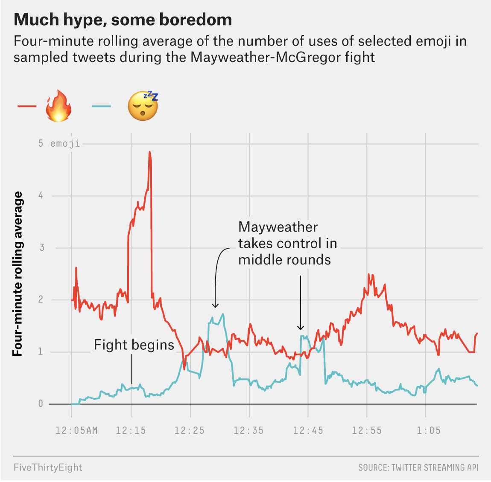

```{r setup, include=FALSE}
library(fs)
library(tidyr)
library(dplyr)
library(ggplot2)
library(tidytuesdayR)
library(zipcodeR)
library(tigris)
library(readr)
library(stringr)
library(lubridate)
library(patchwork)
library(grid)
## Global options
knitr::opts_chunk$set(
  cache = FALSE,
  echo = TRUE,
  collapse = FALSE,
  eval = TRUE,
  message = FALSE,
  warning = FALSE,
  dev = "ragg_png",
  out.width = '85%',
  dpi = 320,
  fig.align = "center",
  fig.width = 7.5,
  fig.height = 5,
  fig.retina = 2
  )
fs::dir_create("data")
knitr::opts_knit$set(root.dir = '/Users/mjfrigaard/Dropbox/@projects/high-priority/@data-journalism/course-website/FA22-JOUR301/drafts/line-graphs')
```

# The Article

These data come from ["The Mayweather-McGregor Fight As Told Through Emojis"](https://fivethirtyeight.com/features/the-mayweather-mcgregor-fight-as-told-through-emojis/)


# The original graph

```{r much-hype-more-boredom, echo=FALSE}

```

# The Data (and packages)

The `mayweather_mcgregor_tweets` data come from the  [`fivethirtyeightdata` package](https://cran.r-project.org/web/packages/fivethirtyeight/vignettes/fivethirtyeight.html). You can install it (and the `fivethirtyeight` package) using the code below.

```{r pkgs}
# install.packages('fivethirtyeightdata', 
#   repos = 'https://fivethirtyeightdata.github.io/drat/', 
#   type = 'source')
library(fivethirtyeight)
library(fivethirtyeightdata)
library(emoji)
mayweather_mcgregor_tweets_raw <- fivethirtyeightdata::mayweather_mcgregor_tweets
# export raw data
write_csv(
  x = mayweather_mcgregor_tweets_raw,
  file = paste0(
    "data/raw/",
    base::noquote(lubridate::today()),
    "-mayweather_mcgregor_tweets_raw.csv"
  )
)
# rename this to something smaller
may_mcg_twts <- mayweather_mcgregor_tweets_raw
glimpse(may_mcg_twts)
```

## `emoji` package

### `emoji_detect()`

```{r}
may_mcg_twts %>% 
  filter(emoji::emoji_detect(string = text)) %>% 
  count(emojis)
```

### `emoji_extract_all()`

```{r may_mcg_all_emojis}
may_mcg_all_emojis <- may_mcg_twts %>% 
  mutate(all_emojis = 
      emoji::emoji_extract_all(string = text))
glimpse(may_mcg_all_emojis)
```


```{r emojis_used}
tidy_may_mcg_emojis <-
  tidyr::unnest_wider(data = may_mcg_all_emojis,
    col = all_emojis,
    names_sep = "_") %>%
  tidyr::unite(
    col = "emojis_used",
    contains("all_emojis_"),
    sep = " ",
    na.rm = TRUE,
    remove = TRUE
  )
glimpse(tidy_may_mcg_emojis)
```

## Find 'Much hype, some boredom' 

```{r emoji_find}
emoji_find("flame") %>% str()
emoji_find("sleep") %>% str()
```

### `stringr::str_detect()`

```{r flame_emoji-sleep_emoji}
tidy_may_mcg_emojis <- tidy_may_mcg_emojis %>% 
  mutate(
    flame_emoji = str_detect(emojis_used, "🔥"),
    sleep_emoji = str_detect(emojis_used, "😴")
    )
```

```{r}
glimpse(tidy_may_mcg_emojis)
```

## Create `hyped_bored`

Narrow these data two flame and sleep emojis:

```{r hyped_bored}
hyped_bored <- tidy_may_mcg_emojis %>% 
  filter(flame_emoji == TRUE | sleep_emoji == TRUE)
glimpse(hyped_bored)
```

### Extract `all_flames` 

Extract all the flames, unnest, and unite all the flames into a single column (`all_flames`)

```{r extract-all_flames}
hyped_bored <- hyped_bored %>% 
  mutate(
    flames = str_extract_all(string = emojis_used, pattern = "🔥")
  ) %>% 
  tidyr::unnest_wider(data = .,
    col = flames,
    names_sep = "_") %>%
  tidyr::unite(
    col = "all_flames",
    contains("flames_"),
    sep = " ",
    na.rm = TRUE,
    remove = TRUE
  )
```

```{r check-all_flames}
hyped_bored %>% 
  filter(flame_emoji == TRUE) %>% 
  select(emojis_used, all_flames)
```

### Extract `all_sleeps` 

Extract all the flames, unnest, and unite all the flames into a single column (`all_sleeps`)

```{r extract-all_sleeps}
hyped_bored <- hyped_bored %>% 
  mutate(
    sleeps = str_extract_all(string = emojis_used, pattern = "😴")
  ) %>% 
  tidyr::unnest_wider(data = .,
    col = sleeps,
    names_sep = "_") %>%
  tidyr::unite(
    col = "all_sleeps",
    contains("sleeps_"),
    sep = " ",
    na.rm = TRUE,
    remove = TRUE
  )
```

```{r check-all_sleeps}
hyped_bored %>% 
  filter(sleep_emoji == TRUE) %>% 
  select(emojis_used, all_sleeps)
```

### Count `all_flames`

```{r flame_count}
hyped_bored <- hyped_bored %>% 
  mutate(
    flame_count = emoji_count(all_flames)
  )
hyped_bored %>% 
  filter(flame_emoji == TRUE) %>% 
  select(all_flames, flame_count)
```


### Count `all_sleeps`

```{r sleep_count}
hyped_bored <- hyped_bored %>% 
  mutate(
    sleep_count = emoji_count(all_sleeps)
  )
hyped_bored %>% 
  filter(sleep_emoji == TRUE) %>% 
  select(all_sleeps, sleep_count)
```


```{r}
glimpse(hyped_bored)
```

## Four minute rolling average

First we need a four-minute interval, which requires some knowledge of how intervals work, which we can get from the `lubridate` package. We have the total number of flame and sleep emojis, 

An interval is a ["*records one or more spans of time...as a sequence of seconds that begin at a specified date."*](https://lubridate.tidyverse.org/reference/Interval-class.html)

```{r}
library(tibbletime)
library(zoo)
library(lubridate)
# get earliest date in hyped_bored
t1 <- sort(hyped_bored$created_at, decreasing = FALSE)[1]
# create 4 min interval
lubridate::interval(start = t1, t1 + (60*4))
roll_4_mean <- tibbletime::rollify(mean, window = 4)
mutate(dt_tbl, mean_4 = roll_4_mean(count_var))
```

We can now see if 

```{r dt_tbl, eval=TRUE, echo=FALSE}
# hyped_bored %>% 
#   arrange(created_at) %>% 
#   select(created_at, flame_count) %>% 
#   slice(1:150) %>% 
#   slice_sample(n = 20, replace = FALSE) %>% 
#   select(datetime_var = created_at, 
#          count_var = flame_count) %>% 
#   arrange(datetime_var)
dt_tbl <- data.frame(
  datetime_var = structure(c(
    1503792380, 1503792423, 1503792457, 1503792501, 
    1503792537, 1503792653, 1503792695, 1503792839,
    1503792843, 1503792990, 1503793013, 1503793094, 
    1503793156, 1503793274, 1503793284, 1503793411, 
    1503793432, 1503793470, 1503793494, 1503793499
  ), tzone = "UTC", class = c("POSIXct", "POSIXt")),
  count_var = c(
    8L, 1L, 2L, 0L, 4L, 4L, 2L, 1L, 2L, 3L, 
    3L, 1L, 2L, 1L, 0L, 1L, 1L, 0L, 1L, 1L
  )
)
per_tbl <- dt_tbl %>% 
  arrange(datetime_var) %>% 
  mutate(
    dt_interval = interval(start = datetime_var, 
                           end = lead(datetime_var)),
    dt_period = as.period(dt_interval, unit = "min"),
    sum_period = dt_period + lead(dt_period),
    sum_period = as.period(sum_period, unit = "min")
  )
# per_tbl
# https://cran.rstudio.com/web/packages/tibbletime/vignettes/TT-03-rollify-for-rolling-analysis.html
# https://bookdown.org/hneth/ds4psy/10-3-time-lubridate.html#intervals
# sum(per_tbl$dt_period[1:6]) > 240
```


# Line graph


