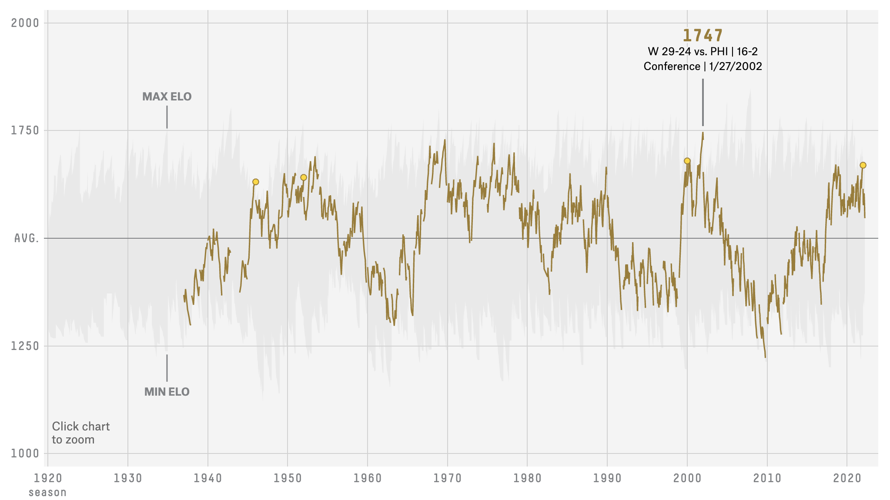
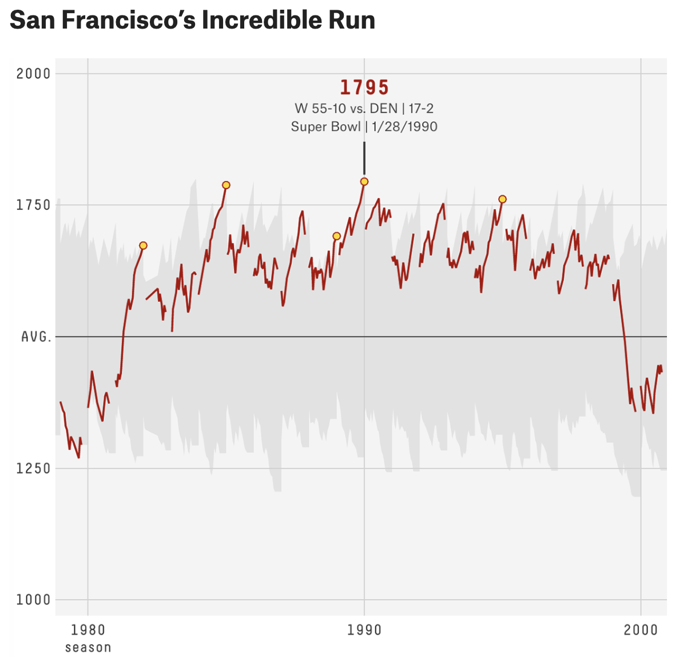
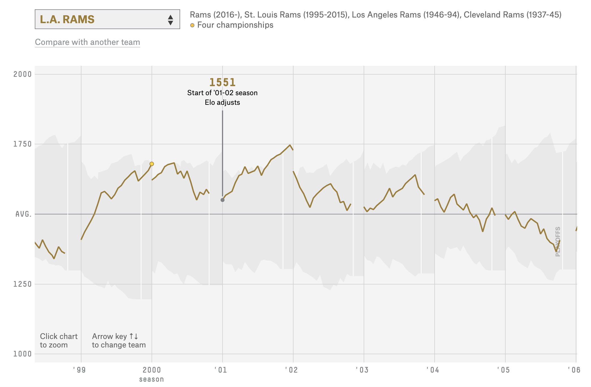

```{r setup, include=FALSE}
library(fs)
library(tidyr)
library(dplyr)
library(ggplot2)
library(tidytuesdayR)
library(zipcodeR)
library(tigris)
library(readr)
library(stringr)
library(lubridate)
library(patchwork)
library(grid)
## Global options
knitr::opts_chunk$set(
  cache = FALSE,
  echo = TRUE,
  collapse = FALSE,
  eval = TRUE,
  message = FALSE,
  warning = FALSE,
  dev = "ragg_png",
  out.width = '85%',
  dpi = 320,
  fig.align = "center",
  fig.width = 7.5,
  fig.height = 5,
  fig.retina = 2
  )
fs::dir_create("data")
knitr::opts_knit$set(root.dir = '/Users/mjfrigaard/Dropbox/@projects/high-priority/@data-journalism/course-website/FA22-JOUR301/drafts/line-graphs')
```

# The Article

These data come from ["The Complete History Of The NFL"](https://projects.fivethirtyeight.com/complete-history-of-the-nfl/)

# Original graphs

Below is the line graph we see when we [land on the article](https://projects.fivethirtyeight.com/complete-history-of-the-nfl/#lar)

```{r elo_landing_png, echo=FALSE, fig.align='center'}

```

We're also going to re-create "**San Francisco’s Incredible Run**"

```{r elp_sf_run_png, echo=FALSE, fig.align='center'}

```

# The Data (and package)

The `nfl_elo` data come from the  [`fivethirtyeightdata` package](https://cran.r-project.org/web/packages/fivethirtyeight/vignettes/fivethirtyeight.html). You can install it (and the `fivethirtyeight` package) using the code below.

```{r pkgs}
# install.packages('fivethirtyeightdata', 
#   repos = 'https://fivethirtyeightdata.github.io/drat/', 
#   type = 'source')
library(fivethirtyeight)
library(fivethirtyeightdata)
```

We'll load and export a copy as a .csv file just to keep extra records for the future!  

```{r nfl_elo_raw, message=FALSE, warning=FALSE}
nfl_elo_raw <- fivethirtyeightdata::nfl_elo
# export raw data
write_csv(
  x = nfl_elo_raw,
  file = paste0(
    "data/raw/",
    base::noquote(lubridate::today()),
    "-nfl_elo_raw.csv"
  )
)
# rename this to something smaller
nfl_elo <- nfl_elo_raw
glimpse(nfl_elo)
```

We can already see these data have more columns than we expected--there appear to be four Elo score variables (`elo1_pre`, `elo2_pre`, `elo1_post`, `elo2_post`), so we'll have to do some reshaping to figure out which numbers ended up in the graph. 

## Tidy Elo scores

First we'll tidy up the Elo scores into `elo` and `elo_cat`. 

```{r tidy_elos}
tidy_elos <- nfl_elo |> 
  select(date, season, team1, team2, elo1_pre, elo2_pre, elo1_post, elo2_post) |> 
  tidyr::pivot_longer(
    cols = c(elo1_pre, elo2_pre, elo1_post, elo2_post), 
    names_to = "elo_cat", values_to = "elo") |> 
  # make this a little cleaner 
  mutate(elo_cat = case_when(
    elo_cat == "elo1_pre" ~ "elo 1 pre",
    elo_cat == "elo2_pre" ~ "elo 2 pre",
    elo_cat == "elo1_post" ~ "elo 1 post",
    elo_cat == "elo2_post" ~ "elo 2 post",
  ))
glimpse(tidy_elos)
```


### LA Rams Elo scores

We can see from the graph that the max Elo score for the LA Rams is `1747`. We can use this as a checkpoint to make sure our calculations are correct. 

If we filter `tidy_elos` by the `team1` and `date` we should be able to find the high score for LA:

```{r check_la_01}
filter(tidy_elos, 
  team1 == "LAR" & date == "2002-01-27") |> 
  arrange(desc(elo)) |> 
  head()
```

Moreover, if we try the same thing for `team2`, we find there are on scores for LA on this `date`:

```{r check_la_02}
filter(tidy_elos, 
  team2 == "LAR" & date == "2002-01-27") 
```

So with this bit of investigative work, we can go and check the `SF` scores.

### SF Elo scores 

We can see from the graph above that the max Elo score for SF is `1795`. We'll use this as a reference for doing some detective work in the `tidy_elos` data. 

If we check `tidy_elos` for SF in `team1`, and the `date` that's listed with their highest score:  

```{r check_sf_01}
filter(tidy_elos, 
  team1 == "SF" & date == "1990-01-28") |> 
  arrange(desc(elo)) 
```

We can see this is the `1795`. And just to double-check the Elo values for `team2` on that same date:

```{r check_sf_02}
filter(tidy_elos, 
  team2 == "SF" & date == "1990-01-28") 
```

## Max Elo score per team and season

It looks like the graph is using the top Elo score of the four possible scores (pre 1, pre 2, post 1, post 2). 

We can create this table using `group_by()` and `summarise()`: 

1. We want to `group_by()` the `date`, `season`, `team1`, and `team2` columns (these rows all contribute to create a unique row for `elo` and `elo_cat`)  
2. The summary we want is the `max()` Elo score per date, season, and teams   
3. Then we'll `ungroup()` the table  

We'll check the sores for `LAR` and `SF` just to be sure before assigning this to an object. 

```{r check-max-elo}
tidy_elos |> 
  group_by(date, season, team1, team2) |> 
  summarise(
    max_elo = max(elo, na.rm = TRUE)
  ) |> 
  ungroup() |> 
  filter(team1 %in% c("LAR", "SF") & 
      date == "2002-01-27" | date == "1990-01-28") 
```

This is returning the correct numbers (`1747` and `1795`), so we'll assign this to `max_elos`:

```{r max_elos}
max_elos <- tidy_elos |> 
  group_by(date, season, team1, team2) |> 
  summarise(
    max_elo = max(elo, na.rm = TRUE)
  ) |> 
  ungroup()
glimpse(max_elos)
```

### Check `team1` and `team2` 

We can see the `team1` and `team2` columns are abbreviations, and include quite a few defunct teams, 

> "*There are over 90 defunct franchises in pro football history, but only those that played at least 40 games can be selected above.*"

```{r max_elos_count_team1}
max_elos |> count(team1, sort = TRUE)
```

### Team name look-up

We want to include the actual team names, so we're going to join to a [look-up table](https://gist.github.com/cnizzardini/13d0a072adb35a0d5817), which we'll load and store in our `data/raw/` folder:

```{r nfl_team_lookup_raw}
nfl_team_lookup_raw <- readr::read_csv("https://bit.ly/3s2ae6x")
# export raw data
write_csv(
  x = nfl_team_lookup_raw,
  file = paste0(
    "data/raw/",
    base::noquote(lubridate::today()),
    "-nfl_team_lookup_raw.csv"
  )
)
glimpse(nfl_team_lookup_raw)
```

We will also clean and reduce the column names:

```{r nfl_team_lookup}
nfl_team_lookup <- janitor::clean_names(nfl_team_lookup_raw) |> 
  select(name, abbreviation)
glimpse(nfl_team_lookup)
```

### Join `mex_elos` & team look-up table

We perform the following steps for joining to the `nfl_team_lookup`:

1. join `nfl_team_lookup` to `max_elos` by `team1` & `abbreviation`,  
2. rename `name` to `name1` 
3. join `nfl_team_lookup` to `max_elos` by `team2` & `abbreviation`,  
4. rename `name` to `name2`   
5. remove missing `name1` and `name2`   
6. reorganize columns    
7. We can see from the graphs that we don't have much data before `1935`, so we'll filter `max_elos` to only data after this date. 

This results in the `team_name_elos` table

```{r team_name_elos}
team_name_elos <- left_join(x = max_elos,
    y = nfl_team_lookup,
    by = c("team1" = "abbreviation")) |>
  rename(name1 = name) |>
  filter(!is.na(name1)) |> 
  left_join(
      y = nfl_team_lookup,
      by = c("team2" = "abbreviation")) |> 
  rename(name2 = name) |>
  filter(!is.na(name2)) |> 
  select(date,
      season,
      ends_with("1"),
      ends_with("2"),
      max_elo) |> 
  filter(date > as_date("1935-01-01"))
glimpse(team_name_elos)
```


## Count `teams` and `names`

Let's count the `team1`/`name1` and `team2`/`name2` combinations in the `team_name_elos` dataset:

```{r mean_team1_elos_teams-names}
team_name_elos |> 
  count(team1, name1)
```

```{r mean_team2_elos-teams-names}
team_name_elos |> 
  count(team2, name2)
```


## Labels 

We're going to iterate through a few line-graphs, but we want to set our expectations as labels first:

### LA Rams graph labels

This is copied from the landing page graph:

```{r labs_lar}
labs_lar <- labs(title = "LA RAMS (Max Elo = 1747)", 
       subtitle = "W 29-24 vs PHI | 16-2",
       caption = "source: https://bit.ly/538-rpkg",
        x = "Season", y = "Max Elo Team 1 Score")
```


### SF 49ers graph labels

This comes from the "**San Francisco’s Incredible Run**" graph

```{r labs_sf49}
labs_sf49 <- labs(title = "SF 49ers (Max Elo = 1795)", 
       subtitle = "W 55-10 vs DEN | 17-2",
       caption = "source: https://bit.ly/538-rpkg",
        x = "Season", y = "Max Elo Team 1 Score")
```

### Labels (overall)

And this is a set of labels we'll use for the entire dataset. 

```{r labs_elo_ovrll}
labs_elo_ovrll <- labs(title = "Elo scores (overall)", 
    subtitle = "Pre/post (Team 1 & 2) Elo scores", 
    caption = "source: https://bit.ly/538-rpkg",
    x = "Season", y = "Max Elo Score")
```

# Graph 1: Overall Elo Scores

First we want to check our line graph for the whole set of Elo scores in the `tidy_elos` table. When we initialize the graph with `ggplot()`, we're going to group the data in the graph on `team1`. 

In the `geom_line()`, we're also going to group on `season`, because Elo scores adjust at the beginning of [a new season](https://fivethirtyeight.com/features/introducing-nfl-elo-ratings/), 

> "*I take their rating from the end of last season and discount it slightly. Specifically, I revert it to the mean by one-third. Remember that the mean Elo rating is 1500. So, if a team finished last season with a rating of 1800, I’ll revert it to 1700 when the new season begins.*"

```{r elo_season_adj_png, echo=FALSE, fig.align='center'}

```

So our line graph is series of lines grouped 1) by the team, and 2) by the season: 

```{r geom_line_team_name_elos_1}
team_name_elos |> 
  ggplot(aes(x = date, y = max_elo, group = season)) + 
  geom_line(size = 0.3, alpha = 1/4) + 
  labs_elo_ovrll
```

Not off to a bad start--the line graph looks similar to the one in the article. But we should address the `y` axis. 

# Graph 2: Y Axis 

We'll add `scale_y_continuous()` to adjust the `y` axis: 

- We want 4 breaks on the `y`  
- The entire axis should extend from `1000` to `2000`  
- We want a custom set of labels that includes (`Avg`) at the center  

First, we know the overall average of Elo scores is 1500, 

> "*Remember that the mean Elo rating is 1500. *"

We'll store the mean Elo score in `avg_elo`

```{r avg_elo}
avg_elo <- 1500
avg_elo
```

Now `avg_elo` becomes the center of the `y` axis breaks. 

```{r add-scale_y_continuous}
ggp_elo_y_axis <- team_name_elos |> 
  ggplot(aes(x = date, y = max_elo, group = season)) + 
  geom_line(size = 0.3, alpha = 1/4) + 
  scale_y_continuous(n.breaks = 4,
    limits = c(1000, 2000),
    # place avg_elo in the middle
    breaks = c(1000, 1250, avg_elo, 1750, 2000),
    # place 'avg' in the middle 
    labels = c('1000', '1250', 'Avg', '1750', '2000')
  ) 
ggp_elo_y_axis + labs_elo_ovrll
```

Ok--now our `y` axis looks more like the one in the original graph. Let's add some reference lines!

# Graph 3: Reference lines 

There is a reference line for the average Elo score--which is we've stored in `avg_elo`--and there are annotations for min and max Elo scores. 

## Graph 3.1: Average Elo score (reference line)

- References lines are added with `geom_hline()` for "*Horizontal line*" and the `avg_elo` we created above   

```{r ggp_elo_avg_hline}
ggp_elo_avg_hline <- ggp_elo_y_axis +
  # add mean
  geom_hline(
    yintercept = avg_elo,
    size = 0.2,
    color = "gray20"
  ) 
ggp_elo_avg_hline + labs_elo_ovrll
```

## Graph 3.2: Annotation (Min and Max)

- Text is added with `annotate(geom = "text")`  
  - we want to make sure the `y` value is `10` Elo points off the `min`/`max` of the Elo score  

```{r ggp_elo_min_max_txt}
ggp_elo_min_max_txt <- ggp_elo_avg_hline + 
  annotate(
    geom = "text",
    label = "Elo Min",
    # this needs an x and y position to tell us where to place the text
    x = min(team_name_elos$date, na.rm = TRUE),
    y = min(team_name_elos$max_elo - 15, na.rm = TRUE),
    hjust = "left"
  ) +
  annotate(
    geom = "text",
    label = "Elo Max",
    # this needs an x and y position to tell us where to place the text
    x = min(team_name_elos$date, na.rm = TRUE),
    y = max(team_name_elos$max_elo + 15, na.rm = TRUE),
    hjust = "left"
  ) 
ggp_elo_min_max_txt + labs_elo_ovrll
```

## Graph 3.3: Minimum line segment

- Line segments are added with `annotate(geom = "segment")`  
  - We manually adjust the `date` value in `x` and `xend` to shift the line directly under the text  
  - `y` is the beginning of the vertical line, and `yend` is the length of the line 
  
First we build the line from the minimum value:

```{r ggp_elo_min_segment}
ggp_elo_min_segment <- ggp_elo_min_max_txt +
  # Elo min segment
  annotate(
    geom = "segment",
    size = 0.7,
    color = "gray50",
    # adjust these slightly (+ 800)
    x = min(team_name_elos$date + 800, na.rm = TRUE),
    xend = min(team_name_elos$date + 800, na.rm = TRUE),
    # this should be touching the minimum value 
    y = min(team_name_elos$max_elo + 15, na.rm = TRUE),
    # the length of the line
    yend = min(team_name_elos$max_elo, na.rm = TRUE)
  ) 
ggp_elo_min_segment + labs_elo_ovrll
```

## Maximum line segment

Next we build the line for the maximum value: 

```{r ggp_elo_ref_layer}
ggp_elo_ref_layer <- ggp_elo_min_segment +
  # Elo max segment
  annotate(
    geom = "segment",
    size = 0.7,
    color = "gray50",
    # adjust these slightly (+ 800)
    x = min(team_name_elos$date + 800, na.rm = TRUE),
    xend = min(team_name_elos$date + 800, na.rm = TRUE),
    # this should be touching the maximum value 
    y = max(team_name_elos$max_elo - 15, na.rm = TRUE),
    # the length of the line (negative)
    yend = max(team_name_elos$max_elo, na.rm = TRUE)
  ) 
ggp_elo_ref_layer + labs_elo_ovrll
```

We'll have to add more labels for the individual team values, but these are a good start. Let's apply some themes! 

## Check `ggthemes::theme_fivethirtyeight()` theme

We'll start by checking the `theme_fivethirtyeight()` from the `ggthemes` package:

```{r add-theme_fivethirtyeight}
ggp_elo_ref_layer + 
  ggthemes::theme_fivethirtyeight() + 
  labs_elo_ovrll
```

This theme looks good, but we've lost our labels, so we'll also build our own theme with `ggplot2`s `theme()` functions. 

## Build our own `theme_538()`

Below we build our own 538 theme as `theme_538()`

```{r theme_538}
theme_538 <- function(base_size = 13, base_family = "") {
  
  theme_grey(base_size = base_size, base_family = base_family) %+replace%
    theme(
      # these affect the style of the rectangle of the graph 
      line =              element_line(colour = '#DADADA', size = 0.75, 
                                       linetype = 1, lineend = "butt"),
      rect =              element_rect(fill = "#F0F0F0", colour = "#F0F0F0", 
                                       size = 0.5, linetype = 1),
      text =              element_text(family = base_family, face = "plain",
                                       colour = "#656565", size = base_size,
                                       hjust = 0.5, vjust = 0.5, angle = 0, 
                                       lineheight = 0.9),
      # plot title elements 
      plot.title =        element_text(size = rel(1.5), family = '' , 
                                       face = 'bold', hjust = -0.05, 
                                       vjust = 1.5, colour = '#3B3B3B'),
      # Modified inheritance structure of rect element
      plot.background =   element_rect(),
      panel.background =  element_rect(),
      legend.key =        element_rect(colour = '#DADADA'),
      # Modifiying legend.position
      legend.position = 'bottom',
      complete = TRUE,
      # panel elements
      axis.ticks =        element_line(),
      panel.grid.major =  element_line(),
      panel.grid.minor =  element_blank()

    )
}


```

```{r test-theme_538}
ggp_elo_ref_layer + 
  theme_538() + 
  labs_elo_ovrll
```

### Compare themes

We'll compare the two themes using the [`patchwork` package](https://patchwork.data-imaginist.com/). 

```{r patchwork-themes, fig.width=9, fig.height=7}
ggp_ggt_elo <- ggp_elo_ref_layer + 
  ggthemes::theme_fivethirtyeight() + 
  labs_elo_ovrll
ggp_538_elo <- ggp_elo_ref_layer + 
  theme_538() + 
  labs_elo_ovrll
ggp_ggt_elo + ggp_538_elo +
  patchwork::plot_layout(nrow = 2)
```

## LA Rams graph

Let's extract the LA Rams data into it's own dataset, `lar_elos`.  

```{r}
lar_elos <- team_name_elos |>
  filter(team1 == "LAR")
lar_elos |> arrange(desc(max_elo))
lar_elos |> 
  ggplot(aes(x = date, y = max_elo, group = season)) + 
  geom_line()
```


```{r lar_01_elos}
lar_01_elos <- filter(lar_elos, season == 2001)
lar_01_elos
```

```{r}
lar_01_elos
```


We'll grab the maximum value from `lar_elos` and store it in `lar_labs_data`

```{r lar_labs_data}
lar_labs_data <- filter(lar_elos, 
  date == "2002-01-27" & max_elo > 1747)
lar_labs_data <- lar_labs_data |> 
  mutate(txt_label = 
      paste0("Elo score: ", max_elo, 
        "\n", name1, " vs. ", name2, 
        "\nOn ", date))
lar_labs_data |> glimpse()
```


```{r}
ggp_elo_ref_layer +
  geom_line(
    data = filter(tidy_elos, team1 == "LAR"),
    mapping = aes(
      x = date,
      y = max_elo,
      group = season
    ),
    color = "goldenrod4",
    size = 0.85
  ) +
  ggrepel::geom_text_repel(
    data = lar_labs_data,
    nudge_y = 100,
    mapping = aes(
      label = txt_label,
      x = date,
      y = max_elo,
      group = team1
    )
  ) +
  geom_point(
    data = lar_labs_data,
    mapping = aes(x = date, y = max_elo),
    size = 3,
    color = "darkgoldenrod3"
  ) +
  theme_538() +
  labs_lar
```

How close did we get?

```{r review-elo_landing_png, echo=FALSE, fig.align='center'}

```


```{r}
tidy_elos |> 
  filter(season > 1989 & season < 1991) |> 
  count(season)
```


