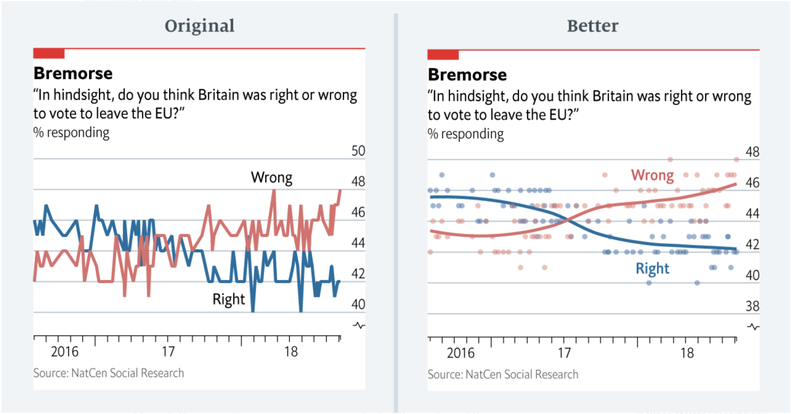
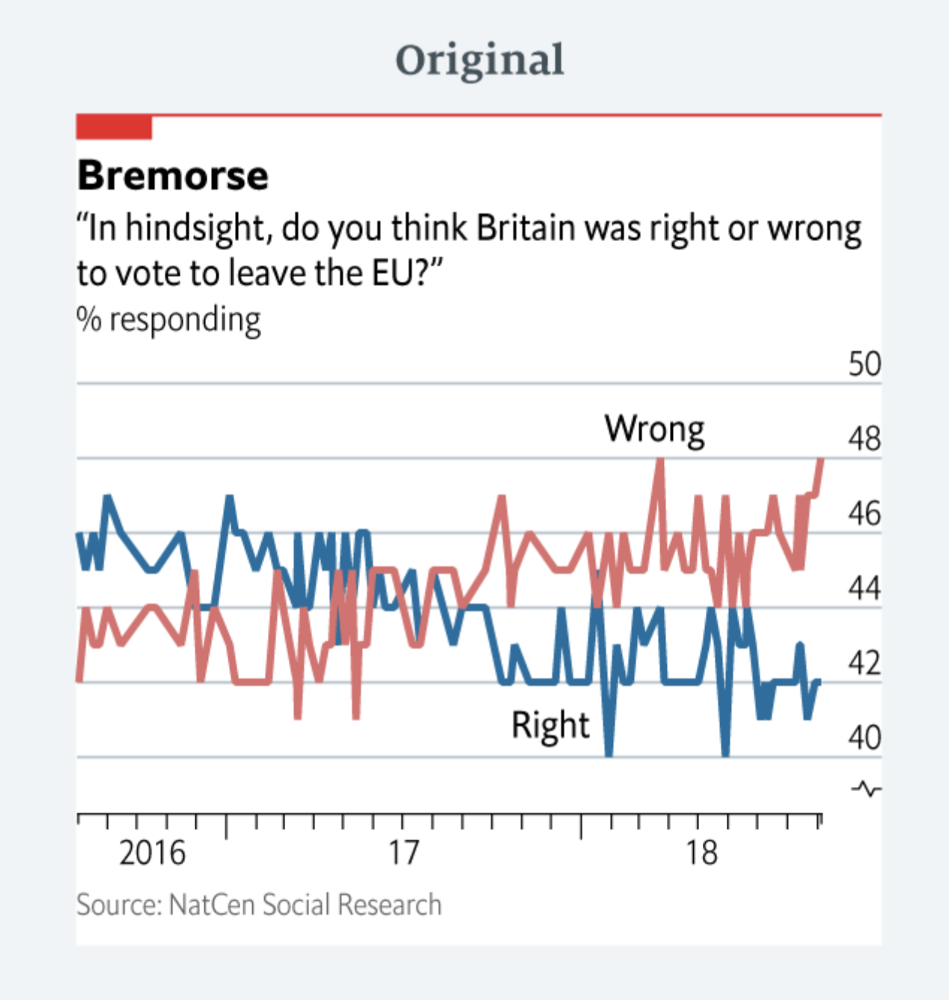
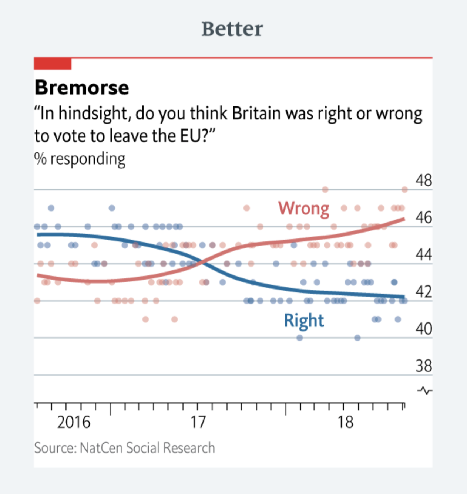
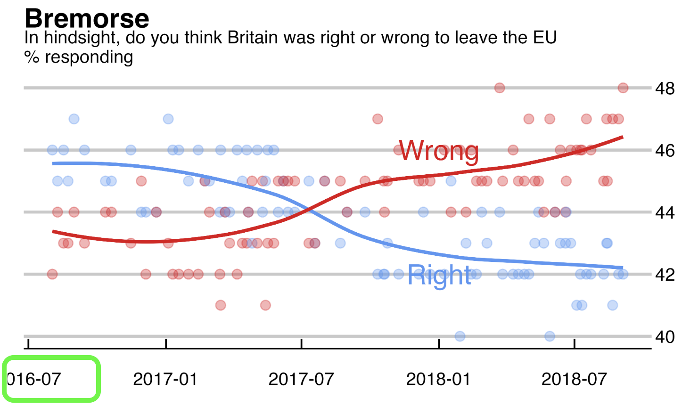

```{r setup, include=FALSE}
library(fs)
library(tidyr)
library(dplyr)
library(ggplot2)
library(readr)
library(stringr)
library(lubridate)
library(patchwork)
library(grid)
library(gt)
## Global options
knitr::opts_chunk$set(
  cache = FALSE,
  echo = TRUE,
  collapse = FALSE,
  eval = TRUE,
  message = FALSE,
  warning = FALSE,
  dev = "ragg_png",
  dpi = 320,
  out.width = "80%",
  fig.width = 6,
  fig.asp = 0.618,
  fig.retina = 2,
  fig.align = "center",
  fig.show = "hold"
  )
```

## Background

We're going to re-create the graphs below from the Medium article, ['Mistakes, we’ve drawn a few'](https://medium.economist.com/mistakes-weve-drawn-a-few-8cdd8a42d368). As the author describes, 

> "*our crimes against data visualisation into three categories: charts that are (1) misleading, (2) confusing and (3) failing to make a point.*"

The author categorizes the mistake with this particular graph as:

> **Mistake: Choosing the wrong visualisation method**

```{r brexit-remorse, eval=TRUE, echo=FALSE, fig.align='center'}

```

Let's take a closer look at the original graph with some comments:

> "*We published this polling chart in Espresso, our daily news app. It shows attitudes to the outcome of the EU referendum, plotted as a line chart. Looking at the data, it appears as if respondents had a rather erratic view of the referendum result — increasing and decreasing by a couple of percentage points from one week to the next.*"

```{r bremorse-original, eval=TRUE, echo=FALSE, fig.align='center'}

```

> "*Looking at the data, it appears as if respondents had a rather erratic view of the referendum result — increasing and decreasing by a couple of percentage points from one week to the next.*"

## Outline

We're going to: 

1. Inspect the data from the article  
2. Build one visualization per dataset  
3. Re-create the original graph  
4. Create a 'better' graph  


## Packages

Below we load the necessary packages:

```{r 00-inst, message=FALSE, warning=FALSE}
# install.packages(c("tidyverse", "janitor", "skimr", "fs", "ggthemes"))
library(tidyverse)
library(janitor)
library(skimr)
library(fs)
library(ggthemes)
```

## Data

There are four data files for this article, which we import from the course GitHub repo below: 

```{r import}
# import data
Balance <- readr::read_csv("https://bit.ly/brexit-balance")
Corbyn <- readr::read_csv("https://bit.ly/brexit-corbyn")
Pensions <- readr::read_csv("https://bit.ly/brexit-pensions")
Brexit <- readr::read_csv("https://bit.ly/brexit-brexit")
```

## `Balance` data

The first dataset we'll investigate is the `Balance` data:

```{r glimpse-Balance}
glimpse(Balance)
```

We can see this data contains `values` per `country` in the EU, grouped by `year` and some kind of `account_type`. These clearly aren't the data from the original and better graphs above, so we won't be diving deeper into each variable.

But we can use the `Balance` dataset to create a column-graph of `value` (on the `x`) and `country` (on the `y`). 

### Create `sign` variable 

Because `value` contains both positive and negative numbers, we'll create an identifier for the `sign`. 

```{r sign}
Balance %>%
  mutate(sign = 
      if_else(condition = value > 0, 
        true = "Positive Balance", 
        false = "Negative Balance"))
```

A great way to check your work when creating new categorical variables is passing the output to `janitor::tabyl()`. In this case, we want to see the countries broken down by our new `sign` variable. 

```{r tabyl-sign}
Balance %>%
  mutate(sign = 
      if_else(condition = value > 0, 
        true = "Positive Balance", 
        false = "Negative Balance")) %>% 
  janitor::tabyl(country, sign)
```

### Initialize graph 

We'll create a canvas (or initialized plot) with `value` on the `x`, `country` on the `y`, grouped and filled by `sign`. 

```{r balance_global_layer}
balance_global_layer <- Balance %>%
  mutate(sign = 
      if_else(condition = value > 0, 
        true = "Positive Balance", 
        false = "Negative Balance")) %>% 
  ggplot2::ggplot(aes(
    x = value,
    y = country,
    group = sign,
    fill = sign
  ))
balance_global_layer
```

Now that we have a blank canvas, we'll build a column-graph using `geom_col()`. We know we won't need a legend, to we'll set this to `FALSE`.

```{r}
balance_global_layer +
  geom_col(show.legend = FALSE)
```

This graph is stacking the columns, which is the default position in `geom_col()`. We can also use `"dodge"` or `"dodge2"`: 

- `"dodge"` [*requires the grouping variable to be be specified in the global*](https://ggplot2.tidyverse.org/reference/position_dodge.html)

```{r dodge}
balance_global_layer +
  geom_col(position = "dodge", show.legend = FALSE)
```

- `"dodge2"`: [*works without a grouping variable in a layer.*](https://ggplot2.tidyverse.org/reference/position_dodge.html)

```{r dodge2}
balance_global_layer +
  geom_col(position = "dodge2", show.legend = FALSE)
```

We'll stick with `position = "dodge"`, and call this `balance_geom_col_layer`

```{r balance_geom_col_layer}
balance_geom_col_layer <- balance_global_layer +
  geom_col(position = "dodge",
    show.legend = FALSE) 
```

We'll add some color to denote the positive (`"green4"`) and negative (`"firebrick"`) values from `sign`, and fix the `x` axis with `scale_x_continuous()` and `scales::comma`.

This layer gets saved as `balance_x_scale_layer`. 

```{r balance_x_scale_layer}
balance_x_scale_layer <- balance_geom_col_layer +
  scale_fill_manual(values = c("firebrick", "green4")) + 
  scale_x_continuous(labels = scales::comma)
balance_x_scale_layer
```

We have to other categorical variables in the `Balance` data, `account_type` and `year`. Let's check how these look with `facet_wrap()`

```{r facet-account_type}
balance_x_scale_layer + 
  facet_wrap(~ account_type) 
```

```{r facet-year}
balance_x_scale_layer + 
  facet_wrap(~ year) 
```

Both of these *would* work--it just depends on which category is best at illustrating our argument. We'll arbitrarily choose the `account_type` for `balance_facet_wrap_layer`.

```{r balance_facet_wrap_layer}
balance_facet_wrap_layer <- balance_x_scale_layer + 
  facet_wrap(~ account_type) 
balance_facet_wrap_layer
```

Finally--we can add a theme and labels. We'll use `ggplot2::theme_minimal()`. 

```{r balance-theme-labs}
balance_facet_wrap_layer +
  ggplot2::theme_minimal() + 
  labs(title = "Balance Data (from EU referendum)", 
    subtitle = "Country values (positive or negative) by account type")
```

## `Corbyn` data

The `Corbyn` is below: 

```{r gt-Corbyn, echo=FALSE}
gt::gt(Corbyn)
```

There isn't much data in `Corbyn`, but we'll look at the distribution of `avg_facebook_likes` by `political_group` using `geom_col()`:

```{r avg_facebook_likes}
Corbyn %>%
  ggplot(aes(x = political_group, y = avg_facebook_likes)) + 
  geom_col(aes(fill = political_group))
```

This is more color categories than we'd like for a graph, but these aren't the data we're trying to correct, so we'll move on. 

## `Pensions`

Below are the `Pensions` data:

```{r gt-Pensions}
glimpse(Pensions)
```

We can see a single categorical variable, `country`, and two percentages (`pop_65_percent` and `gov_spend_percent_gdp`).

We'll use `geom_boxplot()` to graph the `pop_65_percent` and `gov_spend_percent_gdp` variables (note we use `y = ""` in `aes()` and in the `labs()` function to remove the `y`)

```{r pop_65_percent}
Pensions %>%
  # the variable
  ggplot(
    aes(
      x = pop_65_percent,
      y = "")) + 
  geom_boxplot() + 
  labs(y = "")
```

```{r}
Pensions %>%
  # the variable
  ggplot2::ggplot(aes(
    x = gov_spend_percent_gdp,
    y = "")) + 
  geom_boxplot() + 
  labs(y = "")
```

Box-plots are handy if we have a categorical variable we want to view distributions across, too. 

### Re-leveling axes 

If we wanted to show how `pop_65_percent` changes *with* the `gov_spend_percent_gdp`, we could get the top 5 countries with the `gov_spend_percent_gdp`, then order our `y` axis by the `pop_65_percent`, but set the size to `gov_spend_percent_gdp` (I've multiplied it by `10` here just to make the points a little larger):

```{r}
Pensions %>% 
  arrange(desc(gov_spend_percent_gdp)) %>% 
  group_by(country) %>% 
  slice_max(gov_spend_percent_gdp) %>% 
  head(5) %>% 
  ggplot(
    aes(x = pop_65_percent,
        y = fct_reorder(.f = country, .x = pop_65_percent),
        color = country)) + 
  geom_point(aes(size = gov_spend_percent_gdp*10), show.legend = FALSE) + 
  labs(y = "Country", x = "Pop 65 percent")
```

Again--these aren't the data we're trying to fix, so we'll move on.

## `Brexit` data

The `Brexit` data are below: 

```{r Brexit}
glimpse(Brexit)
```

These **are** the data from the graph, so we'll break each step down layer-by-layer. 

### Format `date`

First we need a properly formatted `date`

```{r Brexit-date}
Brexit <- Brexit %>% mutate(date = lubridate::dmy(date))
glimpse(Brexit)
```

### Line-graphs 

We'll start with some line-graphs of `date` vs. `percent_responding_right` and `percent_responding_wrong` 

Place `date` (on the `x`) and `percent_responding_right` (on the `y`)

```{r date-percent_responding_right}
Brexit %>%
  ggplot(aes(x = date,
    y = percent_responding_right)) + 
    geom_line(size = 2.7, color = "cornflowerblue")
```


Plot `date` (on the `x`) and `percent_responding_wrong` (on the `y`)

```{r date-percent_responding_wrong}
Brexit %>%
  ggplot(aes(x = date,
    y = percent_responding_wrong)) + 
    geom_line(size = 2.7, color = "firebrick")
```

We want both `percent` metrics in the same column, indexed on `poll`. The code below will assign the output from `tidyr::pivot_longer()` to `TidyBrexit`: 

```{r TidyBrexit}
TidyBrexit <- Brexit %>%
  pivot_longer(-date,
    names_to = "poll",
    values_to = "percent"
  ) %>% 
  mutate(
    poll = str_replace_all(poll, "_", " ")
  )
glimpse(TidyBrexit)
```

### Original line plot

Now we pass the pivoted data to `geom_line()` and view the results. 

```{r pivot_longer-qplot}
TidyBrexit %>%
  ggplot2::ggplot(aes(
    x = date, y = percent,
    group = poll, color = poll)) + 
  geom_line(size = 2.7) + 
  scale_color_manual(values = c("cornflowerblue", "firebrick3")) + 
  theme_minimal() + 
  labs(title = "Bremorse", 
    subtitle = "In hindsight, do you think Britain was right or wrong to leave the EU\n% responding", 
    x = "", y = "")
```

This is pretty close to the Original (minus the realigned `y` axis, text labels, and reformatted `x` axis).

## Create 'Better' `Brexit` graph

Now we'll create the 'Better' graph, and make some of our own 'improvements.'

I've highlighted the areas we're going to change in green:

```{r bremorse-original-annotated, echo=FALSE}
knitr::include_graphics(path = "img/bremorse-original-annotated.png")
```


### Map variables to aesthetics 

Use `TidyBrexit` to build the `ggp_brexit` plot object layer with `date` on the `x`, `percent` on the `y`, and `group` assigned to `poll`:

```{r ggp_brexit_global_layer}
ggp_brexit_global_layer <- TidyBrexit %>%
  ggplot(mapping = aes(x = date, y = percent, group = poll))
ggp_brexit_global_layer
```

### Add the points with `ggplot2::geom_point()`

Add the points with `ggplot2::geom_point()`, but include the `show.legend = FALSE`, `size = 2.5`, and `alpha = 1/3`. Save this as `ggp_brexit_point_layer`

```{r geom_point}
ggp_brexit_point_layer <- geom_point(aes(color = poll), 
    show.legend = FALSE, size = 2.5, alpha = 1 / 3)
ggp_brexit_global_layer + 
  ggp_brexit_point_layer
```

### Add the lines with `geom_smooth()`

Add the `ggplot2::geom_smooth()` to `ggp_brexit_point_layer`

```{r geom_smooth}
ggp_brexit_global_layer + 
  ggp_brexit_point_layer + 
  ggplot2::geom_smooth()
```

#### Add the `color` aethetic to `poll`

```{r color-poll}
ggp_brexit_global_layer + 
  ggp_brexit_point_layer + 
  ggplot2::geom_smooth(aes(color = poll))
```


#### Remove error with `se = FALSE`

Add the `se = FALSE` to remove the gray area around the lines, and remove the legend with `show.legend = FALSE` and create the `ggp_brexit_smooth_layer` object. 

```{r ggp_brexit_smooth_layer}
ggp_brexit_smooth_layer <- geom_smooth(aes(color = poll), 
                                          se = FALSE, 
                                          show.legend = FALSE)
ggp_brexit_global_layer +
  ggp_brexit_point_layer + 
  ggp_brexit_smooth_layer
```

### Add colors with `scale_color_manual()`

Add the colors `cornflowerblue` and `firebrick3` to the `ggp_brexit_smooth_layer` layer and create a new layer called `ggp_brexit_colors_layer`. 

```{r ggp_brexit_colors_layer}
ggp_brexit_colors_layer <- scale_color_manual(
                              values = c("cornflowerblue", "firebrick3"))
ggp_brexit_global_layer +
  ggp_brexit_point_layer +
  ggp_brexit_smooth_layer + 
  ggp_brexit_colors_layer
```

### Add text 

Use the `ggplot2::geom_text()` layer to add the text to the `ggp_brexit_colors_layer` layer, and name the new plot `ggp_brexit_annotate_text_layer`

```{r ggp_brexit_annotate_text_layer}
ggp_brexit_annotate_wrong_layer <- annotate(
  geom = "text",
  label = "Wrong",
  size = 6,
  color = "firebrick3",
  x = as.Date("2018-01-01"),
  y = 46
)
ggp_brexit_annotate_right_layer <- annotate(
  geom = "text",
  label = "Right",
  size = 6,
  color = "cornflowerblue",
  x = as.Date("2018-01-01"),
  y = 42
)
ggp_brexit_global_layer +
  ggp_brexit_point_layer +
  ggp_brexit_smooth_layer +
  ggp_brexit_colors_layer + 
  ggp_brexit_annotate_wrong_layer + 
  ggp_brexit_annotate_right_layer
```

### Move the `y` axis 

Move the y axis to the right side of the graph with `ggplot2::scale_y_continuous()`

```{r ggp_brexit_y_scale_layer}
ggp_brexit_y_scale_layer <- ggplot2::scale_y_continuous(position = "right")
ggp_brexit_global_layer +
  ggp_brexit_point_layer +
  ggp_brexit_smooth_layer +
  ggp_brexit_colors_layer +
  ggp_brexit_annotate_wrong_layer +
  ggp_brexit_annotate_right_layer + 
  ggp_brexit_y_scale_layer
```

### Add labels 

Use the `ggplot2::labs()` function to create the labels layer. 

```{r labels}
ggp_brexit_labs_layer <- labs(
  title = "Bremorse", 
  subtitle = "In hindsight, do you think Britain was right or wrong to leave the EU\n% responding", 
  x = "", y = "", caption = "Source: NatCen Social Research")
```

Add the `ggp_brexit_labs_layer` layer our plot layers: 

```{r ggp_brexit_labs_layer}
ggp_brexit_global_layer +
  ggp_brexit_point_layer +
  ggp_brexit_smooth_layer +
  ggp_brexit_colors_layer +
  ggp_brexit_annotate_wrong_layer +
  ggp_brexit_annotate_right_layer + 
  ggp_brexit_y_scale_layer + 
  ggp_brexit_labs_layer
```


### Add theme 

```{r install-ggthemes}
# install.packages("ggthemes")
library(ggthemes)
```

Add the `ggthemes::theme_economist_white()` layer and set the following arguments: 

- `gray_bg = FALSE`  
- `base_size = 12`  
- `base_family = "Verdana"`  

```{r theme_economist_white}
ggp_brexit_global_layer +
  ggp_brexit_point_layer +
  ggp_brexit_smooth_layer +
  ggp_brexit_colors_layer +
  ggp_brexit_annotate_wrong_layer +
  ggp_brexit_annotate_right_layer + 
  ggp_brexit_y_scale_layer + 
  ggp_brexit_labs_layer +
  ggthemes::theme_economist_white(
    gray_bg = FALSE,
    base_size = 11,
    base_family = "Verdana"
  )
```


```{r bremorse-better, eval=TRUE, echo=FALSE, fig.align='center'}

```

## What else can we improve? 

How does it look? Can we make some improvements? How about the `x` axis and text labels? 

### Improved `x` axis 

The `x` axis is slightly cut off: 

```{r bremorse-better-dates, eval=TRUE, echo=FALSE, fig.align='center'}

```

We can manually set this with `scale_x_date()`: 

```{r scale_x_date}
ggp_brexit_global_layer +
  ggp_brexit_point_layer +
  ggp_brexit_smooth_layer +
  ggp_brexit_colors_layer +
  ggp_brexit_annotate_wrong_layer +
  ggp_brexit_annotate_right_layer + 
  ggp_brexit_y_scale_layer + 
  ggp_brexit_labs_layer + 
  scale_x_date(
    date_breaks = "6 months",
    date_labels = "%Y %m")
```

We'll add this layer as `ggp_brexit_x_scale_layer` and check it with the `theme_economist_white()`

```{r ggp_brexit_x_scale_layer}
ggp_brexit_x_scale_layer <- scale_x_date(
    date_breaks = "6 months",
    date_labels = "%Y %m")

ggp_brexit_global_layer +
  ggp_brexit_point_layer +
  ggp_brexit_smooth_layer +
  ggp_brexit_colors_layer +
  ggp_brexit_annotate_wrong_layer +
  ggp_brexit_annotate_right_layer + 
  ggp_brexit_y_scale_layer + 
  ggp_brexit_labs_layer +
  ggp_brexit_x_scale_layer + 
  ggthemes::theme_economist_white(
    gray_bg = FALSE,
    base_size = 11,
    base_family = "Verdana"
  ) 
```


### Improved `text` labels 

We can use the `ggrepel` package to improve the text labels. We'll need to build a label dataset first. 

We can use `filter()`, `head()`, and `dput()` to get a small `data.frame` we can edit. 

```{r dput-brexit_labels, eval=FALSE}
TidyBrexit %>%
  filter(date > as_date("2017-12-01")) %>%
  head(2) %>% dput()
```

Now we build `brexit_labels` and replace `poll` with `label`. The values in the `brexit_labels` are determining the positions for the `'Right'` and `'Wrong'` labels:

```{r brexit_labels}
brexit_labels <- data.frame(
  date = structure(c(17505, 17505), class = "Date"), 
  poll = c("percent responding right", "percent responding wrong"),
  label = c("Right", "Wrong"), 
  percent = c(42.8, 45.5))
gt::gt(data = brexit_labels)
```

Now we remove the `annotate()` layers and add the `geom_label_repel()` layer, using our `brexit_labels` in the `data` argument, and `label` in the `label` argument. 


```{r geom_label_repel}
library(ggrepel)
ggp_brexit_global_layer +
  ggp_brexit_point_layer +
  ggp_brexit_smooth_layer +
  ggp_brexit_colors_layer +
  ggp_brexit_y_scale_layer +
  ggp_brexit_labs_layer +
  ggp_brexit_x_scale_layer +
  ggrepel::geom_label_repel(
    data = brexit_labels,
    mapping = aes(
      x = date,
      y = percent,
      color = poll,
      label = label
    ),
    label.size = 0.2,
    size = 4.5,
    show.legend = FALSE
  ) +
  ggthemes::theme_economist_white(gray_bg = FALSE,
    base_size = 11,
    base_family = "Verdana") 
```

