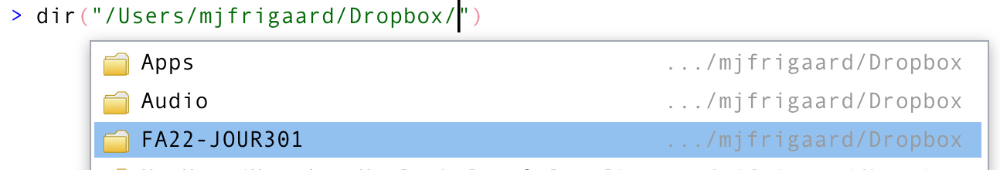
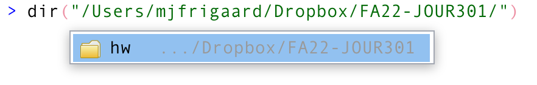
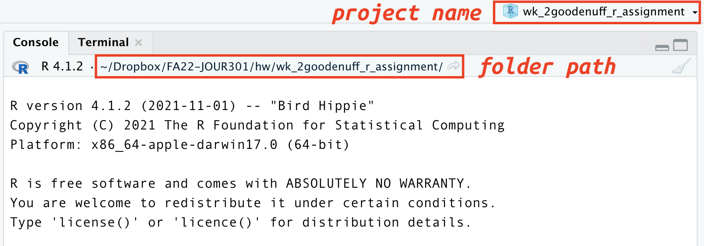
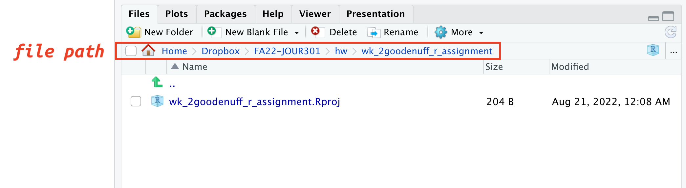
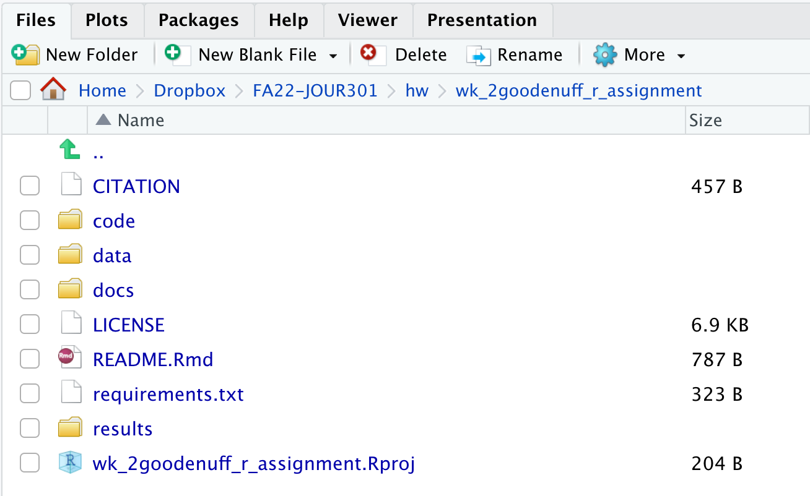
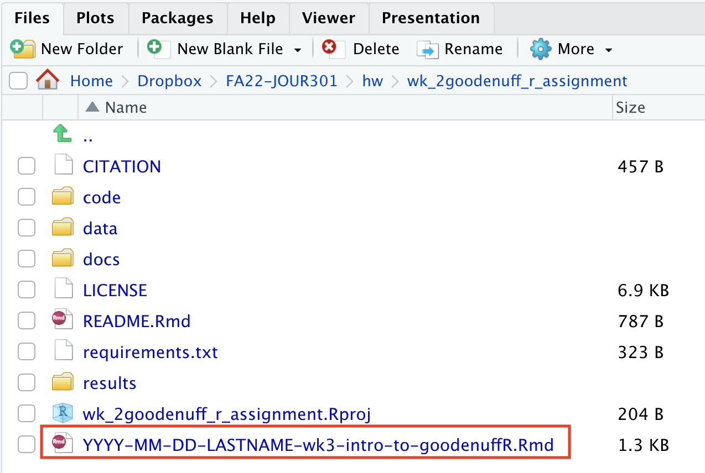
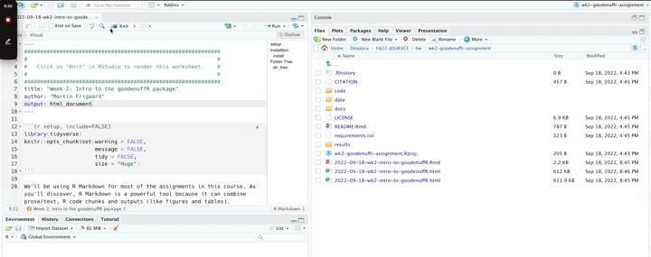
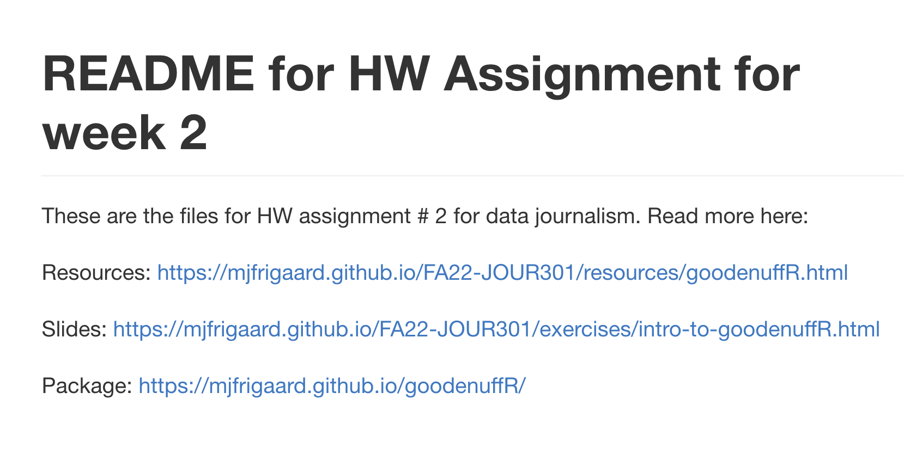

```{r, echo = FALSE}
# don't name this setup!
knitr::opts_chunk$set(collapse = TRUE,
                      comment = "#>",
                      message = FALSE,
                      warning = FALSE)
```


The `goodenuffR` package helps you organize your files and folders. This document is meant to guide you through HW2 and serve as a reference for future use. 

# Video demonstrations

I've also created a set of videos to walk you through this set of exercises, which you can access [here.](https://capture.dropbox.com/collection/SmS6lLsEH8YviiKN) 

# Install `goodenuffR` using the code below: 

[Watch video for Mac](https://capture.dropbox.com/4SzjWK6hAVdhLaFm)

[Watch video for Windows](https://capture.dropbox.com/v9QxdNCtd45MAy0C)

```{r install-goodenuffR, eval=FALSE}
install.packages("devtools")
devtools::install_github("mjfrigaard/goodenuffR")
```

# 1) Create a course folder 

Somewhere on your computer (**not your Downloads/ folder**), create a folder for this course. Follow the naming conventions covered in the [intro slides](https://mjfrigaard.github.io/FA22-JOUR301/slides/intro-to-files-directories.html#1) or [this great lecture.](http://www2.stat.duke.edu/~rcs46/lectures_2015/01-markdown-git/slides/naming-slides/naming-slides.pdf).

Let's assume I've chosen to create my course folder in my `Dropbox/` and I've named it `FA22-JOUR301/`

```{r , eval=FALSE}
└── Dropbox/
      └── FA22-JOUR301/
```

[Watch video for  creating a course folder (Mac)](https://capture.dropbox.com/Z8CIVRlPkST6RuxS)

[Watch video for creating a course folder from RStudio (Mac)](https://capture.dropbox.com/YjqAiH7TkJMb61wc)

[Watch a video for creating a hw folder (Mac)](https://capture.dropbox.com/6vyCXTkXiDMaDIIt)

[Watch video on creating a course and homeowrk folder (Windows)](https://capture.dropbox.com/6vyCXTkXiDMaDIIt)

# 2) Create an homework folder 

Inside your course folder, create a sub-folder for the assignments.

```{r , eval=FALSE}
└── Dropbox/
      └── FA22-JOUR301/
               └── hw/
```

*Before* navigating to the [Assignments menu](https://mjfrigaard.github.io/FA22-JOUR301/) on the course website, I want to create a folder for any homework files.  

[Watch video for Mac](https://capture.dropbox.com/6vyCXTkXiDMaDIIt)

[Watch video on creating a course and homeowrk folder (Windows)](https://capture.dropbox.com/6vyCXTkXiDMaDIIt)

# 3) Get your working directory

I start by getting the current working directory in RStudio: 

```{r , eval=FALSE}
getwd()
```

```
# [1] "/Users/mjfrigaard/R/"
```

This tells me where RStudio is currently 'looking' for files. I know I created the course folder in my `Dropbox/` folder, so I can navigate to the folder using the `dir()` function. 

`dir()` is a handy function because we can take advantage of RStudio's tab-completion by entering the beginning of the path (`"/"`) and hitting the tab key to see what other folders are available. 

```{r dir-tab-completion, echo=FALSE}

```

[Watch video for Mac](https://capture.dropbox.com/dvQ84gitba8hGxan)

[Watch video for Windows](https://capture.dropbox.com/fwN6Fr9NxiVudAxy)

# 4) Create your homework project

Once we have the path to the homework folder, we can use the `goodenuffR::goodenuff_project()` function to create the new project. 

```{r dir-tab-completion-02, echo=FALSE}

```

The **`project_name`** is name of the project, which is a sub-folder in **`folder_path`** argument. 

+ In the `project_name` argument, enter the name of the homework (**`"wk2-goodenuffR-assignment"`**)  

+ In the `folder_path` argument, enter the path from above (**`"/Users/mjfrigaard/Dropbox/FA22-JOUR301/hw/"`**)

See the example below:

```{r goodenuff_project, eval=FALSE}
goodenuffR::goodenuff_project(
  project_name = "wk2-goodenuffR-assignment", 
  folder_path =  "/Users/mjfrigaard/Dropbox/FA22-JOUR301/hw/")
```

This should open a new RStudio session. In the **Console** pane, you should see the name of the new project and the folder path. 

```{r new-goodenuffR-console-pane, echo=FALSE, fig.height=7, fig.width=7, out.width='100%', out.height='100%'}

```

In the **Files** pane, you should see the folder path and your new RStudio project file (with the `.Rproj` extension).

```{r new-goodenuffR-file-pane, echo=FALSE, fig.height=7, fig.width=7, out.width='100%', out.height='100%'}

```

[Watch video for Mac](https://capture.dropbox.com/mZXTVPEIwvGuGTkV)

[Watch video for Windows](https://capture.dropbox.com/Z9EfDN0vpk3xKn2N)

# 5) Create your project folders 

In the R console, run the `goodenuffR::goodenuff_files()` function to create the files and folders. 

```{r goodenuff_files, eval=FALSE}
goodenuffR::goodenuff_files()
```

[Watch video for Mac](https://capture.dropbox.com/9KD5oP6Js54GZ1RR)

[Watch video for Windows](https://capture.dropbox.com/Px9HEXyiIHsu9vgV)

```
trying URL 'https://creativecommons.org/publicdomain/zero/1.0/legalcode.txt'
downloaded 7048 bytes

trying URL 'https://raw.githubusercontent.com/mjfrigaard/goodenuffR/main/inst/
Content type 'text/plain; charset=utf-8' length 787 bytes
==================================================
downloaded 787 bytes
```

This creates the follow files and folder (you can see them in the **Files** pane): 

```{r new-goodenuffR-new-files, echo=FALSE, fig.height=7, fig.width=7, out.width='100%', out.height='100%'}

```

# 6) Download the Assignment 

Now we're ready to head over to the course website and download the Assignment for HW 2. We can save this file the top-level folder as:

`YYYY-MM-DD-LASTNAME-wk3-intro-to-goodenuffR.Rmd`

```{r new-goodenuffR-hw-file, echo=FALSE, fig.height=7, fig.width=7, out.width='100%', out.height='100%'}

```

*Swap out the `YYYY-MM-DD` for today's date and `LASTNAME` with your last name.*

[Watch video for Mac](https://capture.dropbox.com/sehHgZrzMlgNQ0iT)

[Watch video for Windows](https://capture.dropbox.com/uMwwbjcsn7qc2I0Y)

# 7) Knit the homework .Rmd file

**Knit this file.**

```{r knit-hw-wk2, echo=FALSE}

```


[Watch video for Mac](https://capture.dropbox.com/ZcSowva8iT7EDBDj)

[Watch video for Windows](https://capture.dropbox.com/0sXHYH8KZObbjQX0)

# 8) Last but not least--edit the `README.Rmd`

It's always a good practice to write a quick description of what a project folder contains. This way, when you come back to this folder later, you can open the `README` and know what you're looking at! 

Below is an example of some good information to include in the README.Rmd.

```{r new-goodenuffR-edit-readme.png, echo=FALSE, fig.height=7, fig.width=7, out.width='100%', out.height='100%'}

```