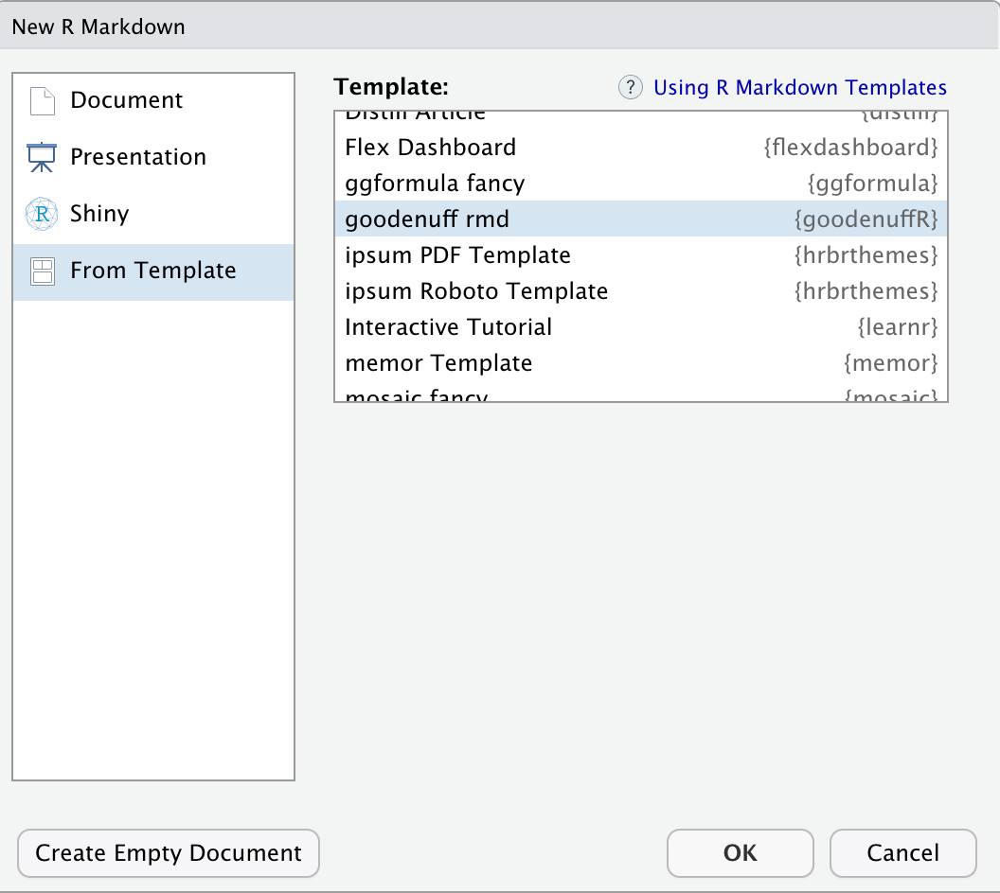

```{r meta, echo=FALSE}
library(metathis)
meta() %>%
  meta_general(
    description = "Using the goodenuffR package",
    generator = "xaringan and remark.js"
  ) %>%
  meta_name("github-repo" = "mjfrigaard/csuc-data-journalism") %>%
  meta_social(
    title = "Using the goodenuffR package",
    url = "https://mjfrigaard.github.io/csuc-data-journalism/",
    og_type = "website",
    og_author = "Martin Frigaard",
    twitter_card_type = "summary",
    twitter_creator = "@mjfrigaard"
  )
```

```{r setup, include=FALSE}
dateWritten <- format(as.Date("2021-10-21"), format = "%B %d %Y")
today <- format(Sys.Date(), format = "%B %d %Y")
library(knitr)
library(tidyverse)
library(fontawesome)
options(
    htmltools.dir.version = FALSE,
    knitr.table.format = "html",
    knitr.kable.NA = ''
)
knitr::opts_chunk$set(
    warning = FALSE,
    message = FALSE,
    fig.path = "img/",
    fig.width = 7.252,
    fig.height = 4,
    comment = " ",
    fig.retina = 3 # Better figure resolution
)
# Enables the ability to show all slides in a tile overview by pressing "o"
xaringanExtra::use_tile_view()
xaringanExtra::use_panelset()
xaringanExtra::use_clipboard()
xaringanExtra::use_share_again()
xaringanExtra::style_share_again(share_buttons = "all")
xaringanExtra::use_extra_styles(
  hover_code_line = TRUE,
  mute_unhighlighted_code = FALSE
)
```

```{r inf_mr, eval=FALSE, include=FALSE}
xaringan::inf_mr()
```

layout: true

<!-- this adds the link footer to all slides, depends on footer-small class in css-->

<div class="footer-small"><span>https://github.com/mjfrigaard/csuc-data-journalism</div>

---
name: title-slide
class: title-slide, center, middle, inverse

# `r rmarkdown::metadata$title`
#.fancy[`r rmarkdown::metadata$subtitle`]

<br>

.large[by Martin Frigaard]

Written: `r dateWritten`

Updated: `r today`

.footer-large[.right[.fira[
<br><br><br><br><br>[Created using the "λέξις" theme](https://jhelvy.github.io/lexis/index.html#what-does-%CE%BB%CE%AD%CE%BE%CE%B9%CF%82-mean)
]]]

---
class: inverse, center, top
background-image: url(img/goodenuffR.png)
background-position: 50% 70%
background-size: 35%

## `goodenuffR` = good enuff practices in R computing 

---
class: left, top
background-image: url(img/goodenuffR.png)
background-position: 93% 8%
background-size: 8%

# Outline 

.leftcol[
### 1) The Problem

### 2) A Solution 

### 3) Installation 

### 4) Quick Start
]

.rightcol[

### 5) Package functions 

+ `goodenuff_code()`  
+ `goodenuff_collab()`  
+ `goodenuff_data()`   
+ `goodenuff_doc()`  
+ `goodenuff_results()`
+ `goodenuff_files()`

### 6) Using `goodenuffR`

]

---
class: left, top
background-image: url(img/goodenuffR.png)
background-position: 93% 8%
background-size: 8%

# The Problem

.leftcol35[

> *Where is my stuff?*

]

.rightcol65[

### [THE VERGE: FILE NOT FOUND](https://www.theverge.com/22684730/students-file-folder-directory-structure-education-gen-z)

```{r verge-file-not-found.png, echo=FALSE, out.height='95%', out.width='95%'}
knitr::include_graphics(path = "img/verge-file-not-found.png")
```

]


---
class: left, top
background-image: url(img/goodenuffR.png)
background-position: 93% 8%
background-size: 8%

# The Problem

.leftcol70[

```{r files-tweet-01, echo=FALSE, out.height='100%', out.width='100%'}
knitr::include_graphics(path = "img/files-tweet-01.png")
```

]

--

.rightcol30[

> *Store stuff in a particular place*

]

---
class: left, top
background-image: url(img/goodenuffR.png)
background-position: 93% 8%
background-size: 8%

# The Problem

.leftcol[

```{r files-tweet-02, echo=FALSE, out.height='100%', out.width='100%'}
knitr::include_graphics(path = "img/files-tweet-02.png")
```

]

--

.rightcol[

> *Most soul-destroying "bug" when trying to learn programming*

]

---
class: left, top
background-image: url(img/goodenuffR.png)
background-position: 93% 8%
background-size: 8%

# A Solution: `goodenuffR`!

### Based on the excellent paper, [*Good enough practices in scientific computing*](https://journals.plos.org/ploscompbiol/article?id=10.1371/journal.pcbi.1005510)

by Greg Wilson, Jennifer Bryan, Karen Cranston, Justin Kitzes, Lex Nederbragt, Tracy K. Teal

--

.border[

```{r plos-gepisc.png, echo=FALSE, fig.align='center', out.height='60%', out.width='60%'}
knitr::include_graphics(path = "img/plos-gepisc.png")
```

]


---
class: left, top
background-image: url(img/goodenuffR.png)
background-position: 93% 8%
background-size: 8%

# A Solution

#### The paper focuses on...

> *"a minimum set of tools and techniques that we believe every researcher can and should consider adopting"*

--

#### Specifically

.leftcol[
.medium[

+ Data management

+ Software

+ Collaboration

]]

.rightcol[
.medium[

+ Project organization

+ Tracking changes

+ Manuscripts

]]


---
class: left, top
background-image: url(img/goodenuffR.png)
background-position: 93% 8%
background-size: 8%

# A Solution


.leftcol[

#### `goodenuffR` focuses on:

+ Data management

+ Project organization

]

--

.rightcol[

#### Specifically

.code70[

```bash
|-- CITATION
|-- README
|-- LICENSE
|-- requirements.txt
|-- data
|  |-- birds_count_table.csv
|-- doc
|  |-- notebook.md
|  |-- manuscript.md
|  |-- changelog.txt
|-- results
|  |-- summarized_results.csv
|-- src
|  |-- sightings_analysis.py
|  |-- runall.py
```

]]


---
class: left, top
background-image: url(img/goodenuffR.png)
background-position: 93% 8%
background-size: 8%

# Installation

<br>

### Available on GitHub here: 

https://github.com/mjfrigaard/goodenuffR

--

<br>

### Install `goodenuffR` using the code below: 

```{r install-goodenuffR, eval=FALSE}
install.packages("devtools")
devtools::install_github("mjfrigaard/goodenuffR")
```

---
class: left, top
background-image: url(img/goodenuffR.png)
background-position: 93% 8%
background-size: 8%

# Quick Start

.leftcol35[

### In a fresh RStudio Session

]

.rightcol65[.border[

```{r goodenuffR-fresh.png, echo=FALSE, fig.align='center', out.height='100%', out.width='100%'}
knitr::include_graphics(path = "img/goodenuffR-fresh.png")
```

]]


---
class: left, top
background-image: url(img/goodenuffR.png)
background-position: 93% 8%
background-size: 8%

# Quick Start

.leftcol35[

### 1) Install `devtools`, then install and load `goodenuffR`

]

.rightcol65[.border[

```{r goodenuffR-install-load.png, echo=FALSE, fig.align='center', out.height='65%', out.width='65%'}
knitr::include_graphics(path = "img/goodenuffR-install-load.png")
```

]]

---
class: left, top
background-image: url(img/goodenuffR.png)
background-position: 93% 8%
background-size: 8%

# Quick Start

.leftcol35[

### 2) Enter a project name

### 3) Enter the folder path for your project

]

.rightcol65[

<br><br><br><br>

```{r , eval=FALSE}
goodenuffR::goodenuff_project(
  project_name = "my awesome project", 
  folder_path = "/Users/mjfrigaard/Projects")
```

#### TIP: *use `getwd()` in the Console or `pwd` in the Terminal to locate current folder*

]

---
class: left, top
background-image: url(img/goodenuffR.png)
background-position: 93% 8%
background-size: 8%

# Quick Start

.leftcol35[

### RStudio will open a new session for your project

]

.leftcol65[.border[

```{r goodenuffR-new.png, echo=FALSE, fig.align='center', out.height='90%', out.width='90%'}
knitr::include_graphics(path = "img/goodenuffR-new.png")
```

]]

---
class: left, top
background-image: url(img/goodenuffR.png)
background-position: 93% 8%
background-size: 8%

# Quick Start

.leftcol35[

### 4) Run 

.code70[

```{r goodenuff_files, eval=FALSE}
goodenuffR::goodenuff_files()
```

]]

.leftcol65[.border[

```{r goodenuffR-run.png, echo=FALSE, fig.align='center', out.height='80%', out.width='80%'}
knitr::include_graphics(path = "img/goodenuffR-run.png")
```

]]


---
class: left, top
background-image: url(img/goodenuffR.png)
background-position: 93% 8%
background-size: 8%

# Quick Start

.leftcol35[

### Now you're good (enuff) to go! 

]

.leftcol65[.border[

```{r goodenuffR-ready.png, echo=FALSE, fig.align='center', out.height='80%', out.width='80%'}
knitr::include_graphics(path = "img/goodenuffR-ready.png")
```

]]


---
class: left, top
background-image: url(img/goodenuffR.png)
background-position: 93% 8%
background-size: 8%

# Package functions 

#### `goodenuff_code()`  

.leftcol[ 

### Paper

- *readable, reusable, and testable* 
- *short, single-purpose functions with clearly-defined inputs and outputs*
- *name all files to reflect their content or function*

]

.rightcol[ 

### `goodenuffR`

```{r goodenuff_code, eval=FALSE}
goodenuffR::goodenuff_code()
# └── code
#    ├── 01-import.R
#    ├── 02-tidy.R
#    ├── 03-wrangle.R
#    ├── 04-visualize.R
#    ├── 05-model.R
#    ├── 06-communicate.R
#    └── runall.R
```

]

---
class: left, top
background-image: url(img/goodenuffR.png)
background-position: 93% 8%
background-size: 8%

# Package functions 

#### `goodenuff_code()` 

.leftcol[ 

### Paper

- *Place a brief explanatory comment at the start of every program*

]

.rightcol[ 

### `goodenuffR`

Each `code` file has a header: 

```{r, eval=FALSE}
#=======================
# This is code to create:
# Authored by and feedback to:
# MIT License
# Version:
#=======================
```

]


---
class: left, top
background-image: url(img/goodenuffR.png)
background-position: 93% 8%
background-size: 8%

# Package functions 

#### `goodenuff_collab()` 

.leftcol[ 

### Paper

- *Make the project citable* 
- *Make the license explicit*
- *Create an overview of your project*
- *Make dependencies and requirements explicit*

]

.rightcol[ 

### `goodenuffR`

```{r goodenuff_collab, eval=FALSE}
goodenuffR::goodenuff_collab()
# └── CITATION
# └── LICENSE
# └── README.Rmd
# └── requirements.txt
```

]


---
class: left, top
background-image: url(img/goodenuffR.png)
background-position: 93% 8%
background-size: 8%

# Package functions 

#### `goodenuff_data()`   

.leftcol[ 

### Paper

- *Save the raw data*
- *Record all the steps used to process data*

]

.rightcol[ 

### `goodenuffR`

```{r data-tree, eval=FALSE}
goodenuffR::goodenuff_data()
# data
# ├── README.md
# └── raw
```

*Folder for keeping `raw/` data separate from other data files*  

*Document in `README.md`*

]

---
class: left, top
background-image: url(img/goodenuffR.png)
background-position: 93% 8%
background-size: 8%

# Package functions 

### `goodenuff_data()` (BONUS!)

`data/README.md` provides some guidance on storing and documenting data. 

.code60[

```
# Project Data  

For guidance please see:
https://help.osf.io/hc/en-us/articles/360019739054-How-to-Make-a-Data-Dictionary

## Additional Resources

1. Sharing data
http://bit.ly/data-4-sharing  
2. Data in spreadsheets
http://bit.ly/data-in-sheets  
3. External data (https://r-pkgs.org/)
https://r-pkgs.org/data.html

source: 
https://swcarpentry.github.io/good-enough-practices-in-scientific-computing/
```

]


---
class: left, top
background-image: url(img/goodenuffR.png)
background-position: 93% 8%
background-size: 8%

# Package functions 

   
#### `goodenuff_doc()`  

.leftcol[ 

### Paper

- *Put text documents associated with the project in the `doc` directory*
- *Add a file called `CHANGELOG.txt` to the project's docs subfolder*
- *a running lab notebook describing various ideas for the project and how these were implemented*

]

.rightcol[ 

### `goodenuffR`

```{r docs-tree, eval=FALSE}
goodenuffR::goodenuff_doc() 
# docs
# ├── changelog.txt
# ├── manuscript.Rmd
# └── notebook.Rmd
```

]

---
class: left, top
background-image: url(img/goodenuffR.png)
background-position: 93% 8%
background-size: 8%

# Package functions 

#### `goodenuff_results()`


.leftcol[ 

### Paper

- *Put raw data and metadata in a `data/` directory and files generated during cleanup and analysis in a `results/` directory*

]

.rightcol[ 

### `goodenuffR`

```{r results-tree, eval=FALSE}
goodenuffR::goodenuff_results()
# results
# ├── figures
# ├── manuscript
# └── tables
```

]

---
class: left, top
background-image: url(img/goodenuffR.png)
background-position: 93% 8%
background-size: 8%

# Package functions 

.leftcol[

#### `goodenuff_files()`

]

.rightcol[ 
.border[

```{r goodenuffR-files.png, echo=FALSE, out.height='65%', out.width='65%', fig.align='center'}
knitr::include_graphics(path = "img/goodenuffR-files.png")
```

]]


---
class: left, top
background-image: url(img/goodenuffR.png)
background-position: 93% 8%
background-size: 8%

## BONUS: RMarkdown Template

.leftcol[

### `goodenuffR` also comes with a `rmarkdown` template: 

]

.rightcol[ 

<br>

.border[

```{r new-rmd.png, echo=FALSE, out.height='75%', out.width='75%', fig.align='center'}

```

]]

---
class: left, top
background-image: url(img/goodenuffR.png)
background-position: 93% 8%
background-size: 8%

# Thank you! 

## Feedback to

### - `@mjfrigaard` on Github and Twitter 

### - `mjfrigaard(at)pm.me` email

```{r chrome_print, echo=FALSE, results='hide', eval=FALSE}
html_slides <- list.files(".", pattern = ".html")
pdf_slides <- str_replace(html_slides, 
  pattern = ".html", 
  replacement = ".pdf")
pdf_slides <- paste0("pdfs/", pdf_slides)
print_files <- tibble("pdfs" = pdf_slides,
  "htmls" = html_slides)

pagedown::chrome_print(input = print_files$htmls[4], output = print_files$pdfs[4], timeout = 120)
```
