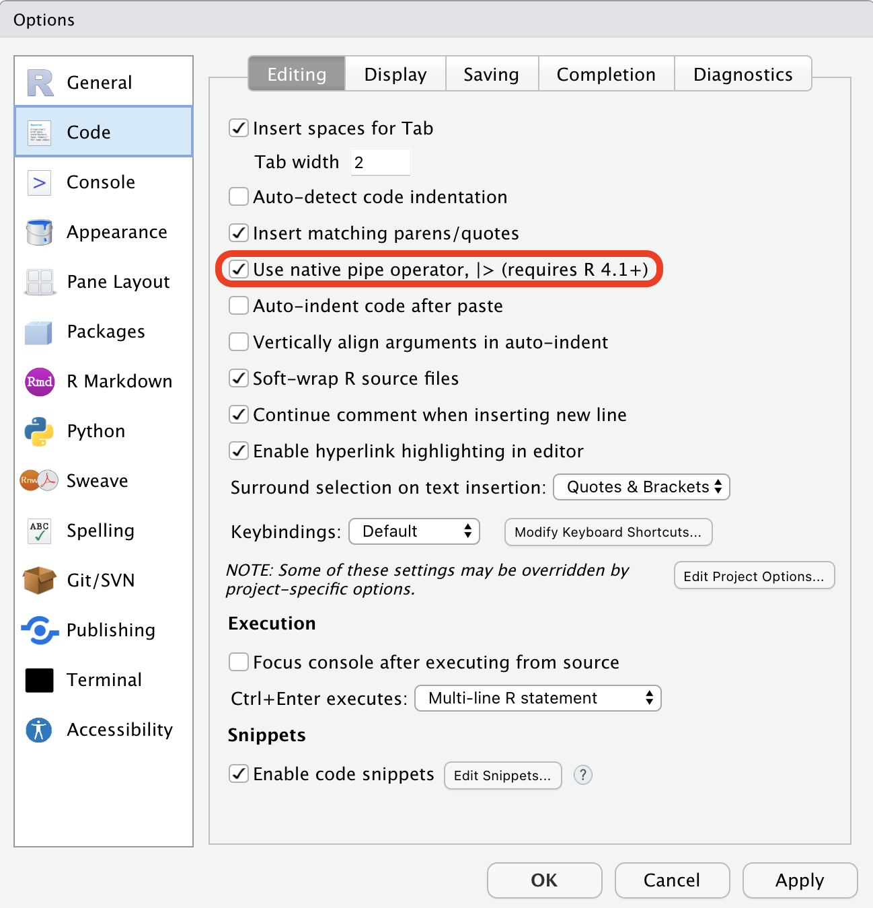

```{r meta, echo=FALSE}
library(metathis)
meta() %>%
  meta_general(
    description = "Data Manipulation with R",
    generator = "xaringan and remark.js"
  ) %>%
  meta_name("github-repo" = "mjfrigaard/CSUC-JOUR301-FA22") %>%
  meta_social(
    title = "Data Manipulation with R",
    url = "https://mjfrigaard.github.io/CSUC-JOUR301-FA22/",
    og_type = "website",
    og_author = "Martin Frigaard",
    twitter_card_type = "summary",
    twitter_creator = "@mjfrigaard"
  )
```

```{r setup, include=FALSE}
dateWritten <- format(as.Date("2021-09-21"), format = "%B %d %Y")
today <- format(Sys.Date(), format = "%B %d %Y")
library(knitr)
library(tidyverse)
library(fontawesome)
options(
    htmltools.dir.version = FALSE,
    knitr.table.format = "html",
    knitr.kable.NA = ''
)
knitr::opts_chunk$set(
    warning = FALSE,
    message = FALSE,
    fig.path = "img/",
    fig.width = 7.252,
    fig.height = 4,
    comment = " ",
    fig.retina = 3 # Better figure resolution
)
# Enables the ability to show all slides in a tile overview by pressing "o"
xaringanExtra::use_tile_view()
xaringanExtra::use_panelset()
xaringanExtra::use_clipboard()
xaringanExtra::use_share_again()
xaringanExtra::style_share_again(share_buttons = "all")
xaringanExtra::use_extra_styles(
  hover_code_line = TRUE,
  mute_unhighlighted_code = FALSE
)
```

```{r inf_mr, eval=FALSE, include=FALSE}
xaringan::inf_mr()
```

layout: true

<!-- this adds the link footer to all slides, depends on footer-small class in css-->

<div class="footer-small"><span>https://mjfrigaard.github.io/CSUC-JOUR301-FA22/</div>

---
name: title-slide
class: title-slide, center, middle, inverse

# `r rmarkdown::metadata$title`
#.fancy[`r rmarkdown::metadata$subtitle`]

<br>

.large[by Martin Frigaard]

Written: `r dateWritten`

Updated: `r today`

.footer-large[.right[.fira[
<br><br><br><br><br>[Created using the "λέξις" theme](https://jhelvy.github.io/lexis/index.html#what-does-%CE%BB%CE%AD%CE%BE%CE%B9%CF%82-mean)
]]]

---

class: left, top
background-image: url(img/dplyr.png)
background-position: 95% 10%
background-size: 6%

# Objectives 

## 1) the pipes `%>%` and `|>`

## 2) Common data manipulation tasks

## 3) `dplyr`'s verbs 

---
class: left, top
background-image: url(img/dplyr.png)
background-position: 95% 10%
background-size: 6%

# Materials 

### Follow along with the exercises:

View the exercises on the [course website.](https://mjfrigaard.github.io/FA22-JOUR301/exercises/intro-to-dplyr.html) 

Or create a project for *notes*: 

```{r follow-along, eval=FALSE}
remotes::install_github("mjfrigaard/goodenuffR")
library(goodenuffR)
goodenuffR::goodenuff_project(project_name = "dplyr-notes", 
                              folder_path = "path/to/course/notes/folder")
# after new project opens 
goodenuffR::goodenuff_files()
# open README and get started 
```


---
class: left, top
background-image: url(img/dplyr.png)
background-position: 95% 10%
background-size: 6%

# What are common data manipulation tasks?

.leftcol[

### 1. Viewing the dataset

### 2. Choosing columns/rows 

### 3. Ordering rows

]

--

.rightcol[

### 4. Changing existing columns  

### 5. Creating or calculating new columns 

]

---
class: inverse, center, bottom
background-image: url(img/dplyr.png)
background-position: 50% 10%
background-size: 35%

# `dplyr` = a grammar for data manipulation

---
class: left, top
background-image: url(img/dplyr.png)
background-position: 95% 10%
background-size: 6%

# `dplyr` = "dee + ply + ARRRR"

.leftcol[

#### *Pliers* are tools for grasping or manipulating common objects 
.border[

```{r pliers, fig.align='center', out.height='55%', out.width='55%', echo=FALSE}
knitr::include_graphics(path = "img/pliers.png")
```

]

]

--

.rightcol[


#### The `dplyr` package has a variety of verbs for performing common data manipulations

]


---
class: left, top
background-image: url(img/dplyr.png)
background-position: 90% 10%
background-size: 6%

# The `big_starwars` dataset  

### These data come from the Star Wars API: 

```{r star-wars-jpeg, fig.align='center', out.height='40%', out.width='40%', echo=FALSE}
# copy_slide_images("star-wars.jpeg")
knitr::include_graphics(path = "img/star-wars.jpeg")
```

--

`big_starwars` is similar to the `starwars` data in the `dplyr` package:

https://dplyr.tidyverse.org/reference/starwars.html


---
class: left, top
background-image: url(img/dplyr.png)
background-position: 93% 7%
background-size: 7%

# Import `big_starwars` 

--

#### Import the data using the url and `readr`

```{r big_starwars}
library(readr)
big_starwars <- read_csv("https://bit.ly/big-sw")
```

--

#### This loads the dataset into our ***Environment*** pane

.border[

```{r starwars-env, fig.align='center', out.height='90%', out.width='90%', echo=FALSE}
# copy_slide_images("starwars-env.png")
knitr::include_graphics(path = "img/starwars-env.png")
```

]

---
class: inverse, center, middle
background-image: url(img/pipe.png)
background-position: 50% 15%
background-size: 20%

<br><br><br><br><br><br>

# Writing code with pipes 

##  .orange[|>] and .blue[%>%]

---
class: left, top
background-image: url(img/pipe.png)
background-position: 93% 10%
background-size: 6%

# Background on pipes

***.purple[What is a 'pipe'?]***

--

> A pipe is an operator for making code "*easier to read or to express*" and "*'sweeter' for human use*" (which is why it's also known as ['*syntactic sugar*')](https://en.wikipedia.org/wiki/Syntactic_sugar)

> The original pipe in R (.blue[%>%]) comes from [the `magrittr` package](https://magrittr.tidyverse.org/), R released a 'native' pipe ( .orange[|>] ) as of version 4.1

--

***.purple[What do pipes do?]***

--

> Pipes combine ["*a set of processes chained together ... so that the output text of each process ... is passed directly as input to the next one*"](https://en.wikipedia.org/wiki/Pipeline_(Unix)

---
class: left, top
background-image: url(img/pipe.png)
background-position: 93% 10%
background-size: 6%

# Background on pipes

***.purple[How can I use them?]***

--

> Create pipes easily with keyboard shortcuts

--

.leftcol[.center[


### ***Mac***

### `Cmd` + `Shift` + `M` = .blue[%>%] or .orange[|>]

]]


--

.rightcol[.center[

### ***Windows***

### `Crtl` + `Shift` + `M` = .blue[%>%] or .orange[|>]

]]

---
class: left, top
background-image: url(img/pipe.png)
background-position: 93% 10%
background-size: 6%

# Pipe settings 

.leftcol40[

<br><br><br>

Set which pipe to use in **Tools** > **Global Options** > **Code**

]

--

.rightcol60[

```{r use-native-pipe-png, echo=FALSE, out.height='70%', out.width='70%', fig.align='center'}

```

]


---
class: left, top
background-image: url(img/dplyr.png)
background-position: 93% 10%
background-size: 6%

# How pipes work 

--

#### *Without the pipe, we have to constantly assign the output to new object:*

--

```{r pipe-00, fig.align='center', out.height='70%', out.width='70%', echo=FALSE}
# copy_slide_images("pipe-00.png")
knitr::include_graphics(path = "img/pipe-00.png")
```

--

#### *Or use nested functions:*

--

```{r pipe-01, fig.align='center', out.height='90%', out.width='90%', echo=FALSE}
# copy_slide_images("pipe-01.png")
knitr::include_graphics(path = "img/pipe-01.png")
```
 

---
class: left, top
background-image: url(img/dplyr.png)
background-position: 93% 10%
background-size: 6%

# How pipes work

#### *Pipes allow us to pass inputs/outputs from functions left-to-right*

--

```{r pipe-03, fig.align='center', out.height='48%', out.width='48%', echo=FALSE}
# copy_slide_images("pipe-03.png")
knitr::include_graphics(path = "img/pipe-03.png")
```

.center[

***`%>%` can be read as "then"***

]


---
class: inverse, center, middle
background-image: url(img/dplyr.png)
background-position: 50% 15%
background-size: 20%

<br><br><br><br><br>

# `dplyr` 

### *See the exercises for more examples!*


---
class: left, top
background-image: url(img/dplyr.png)
background-position: 90% 10%
background-size: 6%

# `dplyr` verbs

### The primary verbs for data manipulation in `dplyr`:

#### `glimpse()`

#### `select()` 

#### `filter()`  

#### `arrange()` 

#### `mutate()`


---
class: inverse, center, middle
background-image: url(img/dplyr.png)
background-position: 50% 10%
background-size: 25%

<br><br><br><br><br><br><br><br>

# Viewing .red[all] the data = `glimpse()`


---
class: left, top
background-image: url(img/dplyr.png)
background-position: 93% 7%
background-size: 7%

# View with `glimpse()`

### `glimpse()` transposes the data and prints as much of it to the screen as possible

--

.code50[

```{r big_starwars-glimpse}
big_starwars |> glimpse()
```

]

---
class: left, top
background-image: url(img/dplyr.png)
background-position: 93% 7%
background-size: 7%

# View in the ***Console***

If you view the dataset in the Console, you'll see a plain-text `tibble`

```{r show-console-big_starwars, eval=FALSE}
big_starwars
```

--

.code50[

```{r console_big_starwars, echo=FALSE}
big_starwars
```

]


---
class: left, top
background-image: url(img/dplyr.png)
background-position: 93% 7%
background-size: 7%

# View in ***R Markdown ***

If you're using R Markdown, you'll see a `paged_table()`

--

```{r paged_table_big_starwars, echo=FALSE, fig.align='center', out.width='75%', out.height='75%'}
knitr::include_graphics(path = "img/rmd-paged-table.gif")
```


---
class: left, top
background-image: url(img/dplyr.png)
background-position: 93% 7%
background-size: 7%

# View in ***Data Viewer***

View the `big_starwars` dataset using RStudio's data editor

--

```{r starwars-dataviewer, fig.align='center', out.height='52%', out.width='52%', echo=FALSE}
knitr::include_graphics(path = "img/starwars-dataviewer.png")
```

---
class: inverse, center, middle
background-image: url(img/dplyr.png)
background-position: 50% 10%
background-size: 25%

<br><br><br><br><br><br>

# **Selecting** columns = `select()`

---
class: left, top
background-image: url(img/dplyr.png)
background-position: 95% 15%
background-size: 6%

## **Select** columns with `select()`

#### `select()` allows us to pick specific columns out of a dataset

.code60[

```{r select-no-show-01, eval=FALSE}
big_starwars |> select(name, homeworld, species)
```

]

--

.code60[

```{r select-01, echo=FALSE}
big_starwars |> select(name, homeworld, species)
```

]


---
class: left, top
background-image: url(img/dplyr.png)
background-position: 95% 15%
background-size: 6%

## **Select** columns with `select()`

#### We can use negation (`-`) to remove columns

.code60[

```{r select-no-show-02, eval=FALSE}
big_starwars |> select(-c(mass, height, hair_color))
```

]

--

.code60[

```{r select-02, echo=FALSE}
big_starwars |> select(-c(mass, height, hair_color))
```

]

---
class: left, top
background-image: url(img/dplyr.png)
background-position: 95% 9%
background-size: 6%

# `select()` helpers

#### `select()` comes with 'helpers' to make chosing columns easier (and reduces typing!)

.small[

Helper                | Outputs
:-------------------  | :--------------------------------------
`starts_with()`       | choose columns starting with...
`ends_with()`         | choose columns ending with...
`contains`            | choose columns with names containing...
`matches()`           | choose columns matching regex...
`one_of()`            | choose columns from a set of names...
`num_range()`         | choose columns from a numerical index...
`where()`             | choose columns where the function returns `TRUE`

]


---
class: left, top
background-image: url(img/dplyr.png)
background-position: 95% 15%
background-size: 6%

## **Select** columns with `select()` 

### Select columns using `starts_with()` 

.code60[

```{r starts_with-not-run, eval=FALSE}
big_starwars |> select(name, starts_with("h"))
```

]

--

.code60[

```{r starts_with, echo=FALSE}
big_starwars |> select(name, starts_with("h"))
```

]

---
class: left, top
background-image: url(img/dplyr.png)
background-position: 95% 15%
background-size: 6%

## **Select** columns with `select()` 

### Select columns using `matches()` 

.code60[

```{r matches-not-run, eval=FALSE}
big_starwars |> select(name, matches("_"))
```

]

--

.code60[

```{r matches, echo=FALSE}
big_starwars |> select(name, matches("_"))
```

]

---
class: left, top
background-image: url(img/dplyr.png)
background-position: 95% 15%
background-size: 6%

## **Select** columns with `select()` 

### Select columns using `where()` 

.code60[

```{r where-not-run, eval=FALSE}
big_starwars |> select(name, where(is.character))
```

]

--

.code60[

```{r where, echo=FALSE}
big_starwars |> select(name, where(is.character))
```

]


---
class: inverse, center, middle
background-image: url(img/dplyr.png)
background-position: 50% 10%
background-size: 25%

<br><br><br><br><br><br>

# Choosing rows with `filter()`

---
class: left, top
background-image: url(img/dplyr.png)
background-position: 95% 7%
background-size: 7%

# Choose rows with `filter()` 

### `filter()` lets us pull out rows based on logical conditions

.code60[

```{r filter-01-no-show, eval=FALSE}
big_starwars |> filter(species == "Human")
```

]

--

.code60[

```{r filter-01, echo=FALSE}
big_starwars |> filter(species == "Human")
```

]

---
class: left top
background-image: url(img/dplyr.png)
background-position: 95% 7%
background-size: 6%

# Choose rows with `filter()` 

#### `filter()` logical conditions include: 

.small[

Logical Test        | Outputs
:--------------:    | :--------------------------:
`<`                 | Less than
`>`                 | Greater than
`==`                | Equal to
`<=`                | Less than or equal to
`>=`                | Greater than or equal to
`!=`                | Not equal to
`%in%`              | Group membership
`is.na()`           | is NA (missing)
`!is.na()`          | is not NA (non-missing)

]


---
class: left, top
background-image: url(img/dplyr.png)
background-position: 95% 7%
background-size: 6%

# Choose rows with `filter()` 

### Combine logical condtions with `&` or `,` 

.code60[

```{r filter-02-no-how, eval=FALSE}
# this gets the same results...
big_starwars |> filter(species == "Human" & !is.na(hair_color))
```

]

--

.code60[

```{r filter-02, echo=FALSE}
big_starwars |> filter(species == "Human" & !is.na(hair_color))
```

]

---
class: left, top
background-image: url(img/dplyr.png)
background-position: 95% 7%
background-size: 6%

# Choose rows with `filter()` 

### Combine logical condtions with `&` or `,` 

.code60[

```{r filter-03-no-show, eval=FALSE}
# ...as this
big_starwars |> filter(species == "Human" , !is.na(hair_color))
```

]

--

.code60[

```{r filter-03,  echo=FALSE}
big_starwars |> filter(species == "Human" , !is.na(hair_color))
```

]


---
class: left, top
background-image: url(img/dplyr.png)
background-position: 95% 7%
background-size: 6%

# Choose rows with `filter()` 

Remember that **.red[any logical condition works]** with `filter()`, so we can borrow functions from other packages to help us (like `stringr::str_detect()`)]

--

.code60[

```{r filter-04-no-show, eval=FALSE}

big_starwars |> filter(# look for names containing a number
                    str_detect(string = name, pattern = "[:digit:]")
                      )
```

]

--

.code60[

```{r filter-04, echo=FALSE}
big_starwars |> filter(# look for names containing a number
                    str_detect(string = name, pattern = "[:digit:]")
                      )
```

]

---
class: inverse, center, middle
background-image: url(img/dplyr.png)
background-position: 50% 10%
background-size: 25%

<br><br><br><br><br><br>

# Sorting rows with `arrange()`


---
class: left, top
background-image: url(img/dplyr.png)
background-position: 95% 7%
background-size: 6%

# Sort rows with `arrange()`

### `arrange()` sorts the contents of a dataset (ascending or descending)

```{r arrange-01-no-run, eval=FALSE}
arrange(big_starwars, height)
```

--

```{r arrange-01, echo=FALSE}
rmarkdown::paged_table(
arrange(big_starwars, height))
```

---
class: left, top
background-image: url(img/dplyr.png)
background-position: 95% 7%
background-size: 6%

# Sort rows with `arrange()`

### `arrange()`'s default is to sort ascending--include `desc()` to sort descending

```{r arrange-02-no-show, eval=FALSE}
arrange(big_starwars, desc(height))
```

--

```{r arrange-02, echo=FALSE}
rmarkdown::paged_table(
arrange(big_starwars, desc(height)))
```


---
class: inverse, center, middle
background-image: url(img/dplyr.png)
background-position: 50% 10%
background-size: 25%

<br><br><br><br><br><br>

# Creating columns with `mutate()`

---
class: left, top
background-image: url(img/dplyr.png)
background-position: 93% 7%
background-size: 6%

# Create columns with `mutate()`

```{r mutate-01-no-run, eval=FALSE}
mutate(big_starwars, 
            # create new bmi variable
            bmi = mass / ((height / 100) ^ 2))
```

--

```{r mutate-01, echo=FALSE}
rmarkdown::paged_table(
mutate(big_starwars, 
            bmi = mass / ((height / 100)  ^ 2)))
```


---
class: left, top
background-image: url(img/dplyr.png)
background-position: 93% 7%
background-size: 6%

# Change existing columns with `mutate()` 

```{r mutate-02-no-run, eval=FALSE}
mutate(big_starwars, 
            # create bmi
            bmi = mass / ((height / 100) ^ 2),
            # change bmi
            bmi = round(bmi, digits = 0))
```

--

```{r mutate-02, echo=FALSE}
rmarkdown::paged_table(
mutate(big_starwars, 
            # create bmi
            bmi = mass / ((height / 100) ^ 2),
            # change bmi
            bmi = round(bmi, digits = 0)))
```


---
class: left, top
background-image: url(img/dplyr.png)
background-position: 97% 8%
background-size: 6%

# Creating pipelines of functions

### Review the code below and think about what each object contains:

1. Filter `big_starwars` to only brown-haired characters over 100 cm tall  
2. Create a `bmi` column using:  `mass / ((height / 100) ^ 2)`    
3. Select `name`, `bmi`, and `homeworld`   
4. Arrange the data by `bmi`, descending  

```{r separate-objects-no-run, eval=FALSE}
object_01 <- filter(big_starwars, 
                    hair_color == "brown" & height > 100) 
object_02 <- mutate(object_01, bmi = mass / ((height / 100) ^ 2))
object_03 <- select(object_02, name, bmi, homeworld)
object_04 <- arrange(object_03, desc(bmi))
```


---
class: left, top
background-image: url(img/dplyr.png)
background-position: 97% 8%
background-size: 6%

# Creating pipelines of functions

### Re-write these functions into a pipeline, ending with a single output (`new_big_starwars`)

1. Filter `big_starwars` to only brown-haired characters over 100 cm tall  
2. Create a `bmi` column using:  `mass / ((height / 100) ^ 2)`    
3. Select `name`, `bmi`, and `homeworld`   
4. Arrange the data by `bmi`, descending 

--

```{r pipi-00-no-run, eval=FALSE}
big_starwars %>% 
  filter(hair_color == "_____" & height > ___) %>% 
  mutate(___ = mass / ((height / 100) ^ 2)) %>% 
  select(____, bmi, _________) %>% 
  arrange(____(bmi)) -> new_big_starwars
```

---
class: left, top
background-image: url(img/dplyr.png)
background-position: 97% 8%
background-size: 6%

# Creating pipelines of functions

The answer is below:

```{r pipe-01-no-run, eval=FALSE}
big_starwars %>% 
  filter(hair_color == "brown" & height > 100) %>% 
  mutate(bmi = mass / ((height / 100) ^ 2)) %>% 
  select(name, bmi, homeworld) %>% 
  arrange(desc(bmi)) -> new_big_starwars
new_big_starwars
```

--

```{r pipe-01-table, echo=FALSE}
rmarkdown::paged_table(big_starwars %>% 
  filter(hair_color == "brown" & height > 100) %>% 
  mutate(bmi = mass / ((height / 100) ^ 2)) %>% 
  select(name, bmi, homeworld) %>% 
  arrange(desc(bmi)))
```

---
class: left, top
background-image: url(img/dplyr.png)
background-position: 10% 95%
background-size: 6%

# Resources for Data Manipluation 

### 1. [R for Data Science](https://r4ds.had.co.nz/transform.html) 

### 2. [Data Wrangling with R](https://cengel.github.io/R-data-wrangling/) 

### 3. [Stack Overflow questions tagged with `dplyr`](https://stackoverflow.com/questions/tagged/dplyr)

### 4. [RStudio Community posts tagged `dplyr`](https://community.rstudio.com/tag/dplyr)


```{r chrome_print, echo=FALSE, results='hide', eval=FALSE}
html_slides <- list.files(".", pattern = ".html")
pdf_slides <- str_replace(html_slides, 
  pattern = ".html", 
  replacement = ".pdf")
pdf_slides <- paste0("pdfs/", pdf_slides)
print_files <- tibble("pdfs" = pdf_slides,
  "htmls" = html_slides)
# print_files$pdfs[9]
# print_files$htmls[9]
pagedown::chrome_print(input = print_files$htmls[9], output = print_files$pdfs[9], timeout = 120)
```

