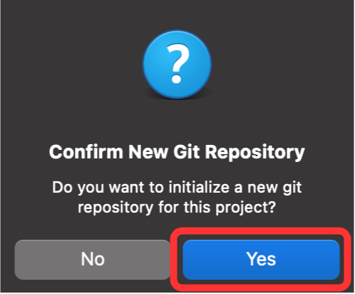
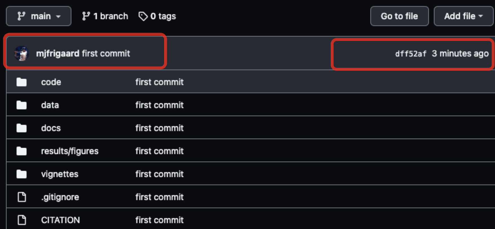

```{r meta, echo=FALSE}
library(metathis)
meta() %>%
  meta_general(
    description = "Git and GitHub",
    generator = "xaringan and remark.js"
  ) %>%
  meta_name("github-repo" = "mjfrigaard/CSUC-JOUR301-FA22") %>%
  meta_social(
    title = "Git and GitHub",
    url = "https://mjfrigaard.github.io/CSUC-JOUR301-FA22/",
    og_type = "website",
    og_author = "Martin Frigaard",
    twitter_card_type = "summary",
    twitter_creator = "@mjfrigaard"
  )
```

```{r setup, include=FALSE}
dateWritten <- format(as.Date("2022-09-21"), format = "%B %d %Y")
today <- format(Sys.Date(), format = "%B %d %Y")
library(knitr)
library(tidyverse)
library(fontawesome)
library(emoji)
options(
    htmltools.dir.version = FALSE,
    knitr.table.format = "html",
    knitr.kable.NA = ''
)
knitr::opts_chunk$set(
    warning = FALSE,
    message = FALSE,
    fig.path = "img/",
    fig.width = 7.252,
    fig.height = 4,
    comment = " ",
    fig.retina = 3 # Better figure resolution
)
# Enables the ability to show all slides in a tile overview by pressing "o"
xaringanExtra::use_tile_view()
xaringanExtra::use_panelset()
xaringanExtra::use_clipboard()
xaringanExtra::use_share_again()
xaringanExtra::style_share_again(share_buttons = "all")
xaringanExtra::use_extra_styles(
  hover_code_line = TRUE,
  mute_unhighlighted_code = FALSE
)
```

```{r inf_mr, eval=FALSE, include=FALSE}
xaringan::inf_mr()
```

layout: true

<!-- this adds the link footer to all slides, depends on footer-small class in css -->

<div class="footer-small"><span>https://mjfrigaard.github.io/CSUC-JOUR301-FA22/</div>

---
name: title-slide
class: title-slide, center, middle, inverse

# `r rmarkdown::metadata$title`
#.fancy[`r rmarkdown::metadata$subtitle`]

<br>

.large[by Martin Frigaard]

Written: `r dateWritten`

Updated: `r today`

.footer-large[.right[.fira[
<br><br><br><br><br>[Created using the "λέξις" theme](https://jhelvy.github.io/lexis/index.html#what-does-%CE%BB%CE%AD%CE%BE%CE%B9%CF%82-mean)
]]]


---
class: left, top
background-image: url(img/RStudio.png)
background-position: 95% 8%
background-size: 7%

## .large[Outline]


.leftcol[

- **File changes**  
  - How can we track them?  
  - How can we revert to previous versions?  

- **Git**  
  - What is Git?
  - Installation
  - Configuring Git  
  - HTTPS/SSH keys 
]

--

.rightcol[

- **RStudio & Git** 
  - Project Options  
  - Git Pane   
  - Committing Changes  

- **RStudio & GitHub**  
  - Create new repo  
  - Push from local 
  - GitHub pages

]


---
class: inverse, center, middle
background-image: url(img/RStudio.png)
background-position: 95% 8%
background-size: 7%

# .font200[.fancy[Cha-cha-changes]]

---
class: left, top
background-image: url(img/RStudio.png)
background-position: 95% 8%
background-size: 7%

# Work is captured in changes 

--

.leftcol60[

#### Example workflow: 

1. .font90[Create file:]  
 - .font80[`Untitled.docx`]  
2. .font90[Add content, save file:]  
 - .font80[`file.docx` (.red[*"Text"*])]     
3. .font90[Make edits, save to file:] 
  - .font80[`file-2.docx` (.red[*"& text"*])]      
4. .font90[Get feedback, revise and save:]  
  - .font80[`file-2-edits.docx` (.red[*"and more text"*])]      

]

--

.rightcol40[

.border[

```{r git-changes, echo=FALSE, out.width='70%', out.height='10%'}

```

]
]

---
class: left, top
background-image: url(img/RStudio.png)
background-position: 95% 8%
background-size: 7%

# How do we keep track of changes?

#### Track changes (or something similar) 

.border[

```{r git-track-changes, echo=FALSE, out.width='100%', fig.align='center'}
knitr::include_graphics("img/git-track-changes.png")
```

]

---
class: left, top
background-image: url(img/RStudio.png)
background-position: 95% 8%
background-size: 7%

# How do we keep track of versions?

#### 1. Manually (with file names)   

  - `file.docx`, `file-2.docx`, `file-2-edits.docx`
  
--

#### 2. Using a cloud service  

.border[

```{r git-clouds, echo=FALSE, out.width='80%', fig.align='center'}

```

]


---
class: left, top
background-image: url(img/RStudio.png)
background-position: 95% 8%
background-size: 7%

# How can we revert to previous versions?

.leftcol40[

<br>

#### 1. We open a previous version 

]

--

.rightcol60[

.border[
```{r git-revert, echo=FALSE, out.width='80%', fig.align='center'}

```
]

]


---
class: left, top
background-image: url(img/RStudio.png)
background-position: 95% 8%
background-size: 7%

# How can we revert to previous versions?

.leftcol45[

<br>

#### 2. We use 'Version History' (or some equivalent) 

]

--

.rightcol55[

<br><br>

.border[
```{r git-cloud-revert, echo=FALSE, out.width='100%', fig.align='center'}
knitr::include_graphics("img/git-cloud-revert.png")
```
]

]

---
class: left, top
background-image: url(img/git-version-history-drive.png)
background-position: 50% 74%
background-size: 83%

# How can we revert to previous versions?


.border[
```{r git-version-history-drive, eval=FALSE, echo=FALSE, out.width='85%', fig.align='center'}

```
]

---
class: left, top
background-image: url(img/RStudio.png)
background-position: 95% 8%
background-size: 7%

# Changes recap

<br>


.leftcol[

.font150[**Work is captured in a series of .red[*changes*]**]

]


--

.rightcol[

.font110[We need a system for:]
  
  a) .red[Tracking] changes
  
  b) .red[Tracking] file versions
  
  c) .red[Reverting] to previous versions
  

]


---
class: inverse, center, middle
background-image: url(img/RStudio.png)
background-position: 95% 8%
background-size: 7%

# .font200[.fancy[Git]]

---
class: left, top
background-image: url(img/RStudio.png)
background-position: 95% 8%
background-size: 7%

# What is Git?

.leftcol40[

#### Git is a version control system

> Git keeps track of all changes and file versions

]

--

.rightcol60[

#### Git's terminology for managing changes

> **.font80[`repository`**]: .font80[a local database of all file changes  (in a hidden `.git` folder)]  
> **.font80[`commit`**]: .font80[a 'snapshot' collection of changes added to the local database (saved in the `.git` repository).]    
> **.font80[`remote`**:] .font80[a link to a copy of the files on GitHub.]     
> **.font80[`branch`**:] .font80[multiple, simultaneous versions of the files (and changes)]      

]

---
class: left, top
background-image: url(img/RStudio.png)
background-position: 95% 8%
background-size: 7%

# Why is Git difficult?

.leftcol[

#### Managing change is .red[complex]

> We're usually making multiple changes across multiple files

]

--

.rightcol[

#### Git is .red[difficult]

> **.red[Everything in Git is explicit]** (we normally don't have to think about documenting changes)

]

---
class: left, top
background-image: url(img/RStudio.png)
background-position: 95% 8%
background-size: 7%

# Why (else) is Git difficult?

### 1. Leaky abstraction 

.font90[

> *"Abstractions are there to protect us from complexity. A leaky abstraction fails at its job by letting some of the underlying complexity peek through, the same way a leaky umbrella fails at its job of keeping you dry."* - [Git For Humans](https://abookapart.com/products/git-for-humans)

]


### 2. Powerful = potentially dangerous

.font90[

> *"Git’s challenging conceptual model is a feature, not a bug. Using Git feels like running with scissors because it’s a powerful tool that will let you bend time and space to your will, which sounds like—and is—a lot of responsibility to put in the hands of mere humans."* - [Git For Humans](https://abookapart.com/products/git-for-humans)

]


---
class: left, top
background-image: url(img/RStudio.png)
background-position: 95% 8%
background-size: 7%

# Fortunately, we have great resources! 


.leftcol[

## [Happy Git and GitHub for the useR](https://happygitwithr.com/) 

]

.rightcol[

.border[
```{r git-happy-git, echo=FALSE, out.width='100%', fig.align='center'}

```
]

]


--

Bookmark this resource! 

--

You'll come back to it often...


---
class: left, top
background-image: url(img/RStudio.png)
background-position: 95% 8%
background-size: 7%

# Installing Git 

<br>

#### 1. Download Git from the [website](https://git-scm.com/downloads) based on your operating system:

.leftcol[
.border[
```{r git-download-mac, echo=FALSE}

```
]
]

.rightcol[

<br>

.border[
```{r git-download-win, echo=FALSE}

```
]
]


---
class: left, top
background-image: url(img/RStudio.png)
background-position: 95% 8%
background-size: 7%

# Installing Git 

#### 2. Follow the installation instructions 

--

#### 3. Verify that Git was installed on your machine using `which git` or `git --version`

--

```bash
$ which git
/usr/bin/git
$  git --version
git version 2.37.1 (Apple Git-137.1)
```

--

#### 4. Problems?

If you run into issues, check out the [Install git chapter from happygitwithr](https://happygitwithr.com/install-git.html)

---
class: left, top
background-image: url(img/RStudio.png)
background-position: 95% 8%
background-size: 7%

# Configuring Git 

After you've installed Git, you need to configure Git with a `user.name` and `user.email`

--

You can do this with the following commands in your Terminal pane:

```bash
$ git config --global user.name 'Martin Frigaard'
$ git config --global user.email 'mjfrigaard@gmail.com'
```

--

You can verify your global settings with `git config --global --list`

--

```bash
$ git config --global --list
user.name=Martin Frigaard
user.email=mjfrigaard@gmail.com
```

---
class: left, top
background-image: url(img/RStudio.png)
background-position: 95% 8%
background-size: 7%

# Configuring Git (NOTES)

--

#### What email should you use with `user.email`? 

--

> ["*This email **must** be the email you used to create your GitHub account.*"](https://happygitwithr.com/hello-git.html#more-about-git-config)

--

#### Consider downloading a Git client

--

> ["*No one is giving out Git Nerd merit badges.*"](https://happygitwithr.com/git-client.html#no-one-is-giving-out-git-nerd-merit-badges)

---
class: inverse, center, middle
background-image: url(img/RStudio.png)
background-position: 95% 8%
background-size: 7%

# .font200[.fancy[RStudio & Git]]

---
class: left, top
background-image: url(img/RStudio.png)
background-position: 95% 8%
background-size: 7%

# RStudio & Git (detect Git)

--

#### Make sure you can detect Git From RStudio  

.leftcol[

.border[

```{r git-find-git-mac, echo=FALSE, out.height='100%', out.width='100%', fig.cap="On Mac"}

```

]

]

--

.rightcol[

.border[

```{r git-find-git-win, echo=FALSE, out.height='100%', out.width='100%', fig.align='right', fig.cap="On Windows"}

```

]
]

---
class: left, top
background-image: url(img/RStudio.png)
background-position: 95% 8%
background-size: 7%

# RStudio & Git (Git executable)

#### Make sure RStudio can see the Git executable

.leftcol[

```{r git-global-options-gitsvn, echo=FALSE, out.height='100%', out.width='60%', fig.align='center'}

```

]

--


.rightcol[

.border[

```{r git-exec-mac, echo=FALSE, fig.align='left', out.height='50%', out.width='75%', fig.cap="On Mac"}
knitr::include_graphics("img/git-exec-mac.png")
```

]

.border[
```{r git-exec-win, echo=FALSE, fig.align='left', out.height='50%', out.width='75%', fig.cap="On Windows"}

```

]

]

---
class: left, top
background-image: url(img/RStudio.png)
background-position: 95% 8%
background-size: 7%

# RStudio & GitHub (HTTPS)

#### 1. Personal access token (HTTPS or SSH)

- We communicate with GitHub using one of two methods: **HTTPS** or **SSH**

  - *Differences between **HTTPS** or **SSH** are discussed [here](https://happygitwithr.com/https-pat.html)*  
  
--

- We're going to walk through creating a **Personal Access Token** (PAT) with the [`usethis` package](https://usethis.r-lib.org/) 

--

- Install `usethis` using the code below: 
  
```{r inst-usethis, eval=FALSE}
install.packages("usethis")
library(usethis)
```

---
class: left, top
background-image: url(img/RStudio.png)
background-position: 95% 8%
background-size: 7%

# RStudio & GitHub (PAT in RStudio)

To generate a PAT with `usethis`, we're going to run the `create_github_token()` function: 

```{r create_github_token, eval=FALSE}
usethis::create_github_token()
```

--

This will open your Browser and take you to GitHub, and generate the following in your RStudio console:

```r
• Call `gitcreds::gitcreds_set()` to register this token in the local Git 
  credential store
  It is also a great idea to store this token in any password-management 
  software that you use
✔ Opening URL 'https://github.com/settings/tokens/new?scopes=repo,user,gist,
  workflow&description=DESCRIBE THE TOKEN\'S USE CASE'
```


---
class: inverse, center, middle
background-image: url(img/RStudio.png)
background-position: 95% 8%
background-size: 7%

# .font200[.fancy[GitHub Personal Access Token (PAT)]]


---
class: left, top
background-image: url(img/RStudio.png)
background-position: 95% 8%
background-size: 7%

# RStudio & GitHub (PAT on GitHub)

#### Provide a description in .red[Note] and use the default .red[Expiration] date

--

```{r git-github-pat-create, echo=FALSE, fig.align='center', out.height='80%', out.width='80%'}
knitr::include_graphics("img/git-github-pat-create.png")
```

--

.font80[***.purple[I stick with the default expiration date because I assume GitHub’s security folks have a good reason for this length of time...]***]

---
class: left, top
background-image: url(img/RStudio.png)
background-position: 95% 8%
background-size: 7%

# RStudio & GitHub (PAT on GitHub)

.leftcol30[

Under **.red[scopes]**, the *.red[repo]*, *.red[workflow]*, *.red[gist]*, and *.red[user]* should be selected

]

.rightcol70[

```{r git-github-pat-create-scopes, echo=FALSE, fig.align='center', out.height='71%', out.width='71%'}

```

]

--

<br><br>

After entering a description in **.red[Note]**, click *Generate Token*.

---
class: left, top
background-image: url(img/RStudio.png)
background-position: 95% 8%
background-size: 7%

# RStudio & GitHub (PAT Store)

<br>

#### Copy your PAT to the clipboard! 

```{r git-github-pat-save, echo=FALSE, out.width='100%'}
knitr::include_graphics(path = "img/git-github-pat-save.png")
```

---
class: inverse, center, middle
background-image: url(img/RStudio.png)
background-position: 95% 8%
background-size: 7%

# .font200[.fancy[Back in RStudio]]

---
class: left, top
background-image: url(img/RStudio.png)
background-position: 95% 8%
background-size: 7%

# RStudio & GitHub (PAT Store)

<br>

.leftcol40[

.font90[1) Back in RStudio, store the PAT using `gitcreds::gitcreds_set()`] 
- .font80[*You won't need to install the `gitcreds` package--it's installed with `usethis`*]
  
.code70[

```{r gitcreds_set, eval=FALSE}
gitcreds::gitcreds_set()
```

]
]

--

.rightcol60[
.font90[2) You'll see the following:]
.code60[

```{r gitcreds_set-password, eval=FALSE}
-? Enter password or token: 
```

]

.font90[3) Paste your PAT and hit **enter/return**]

.code60[
```{r gitcreds_set-password-token, eval=FALSE}
-? Enter password or token: ghp_xxxxxxxx
-> Adding new credentials...
-> Removing credentials from cache...
-> Done.
```
]

]


---
class: left, top
background-image: url(img/RStudio.png)
background-position: 95% 8%
background-size: 7%

# RStudio & GitHub (PAT Store check)

<br>

Use `gitcreds::gitcreds_get()` to check your GitHub credentials

--

```r
gitcreds::gitcreds_get()
 <gitcreds>
   protocol: https
   host    : github.com
   username: PersonalAccessToken
   password: <-- hidden -->
```

---
class: left, top
background-image: url(img/RStudio.png)
background-position: 95% 8%
background-size: 7%

# RStudio & GitHub (PAT recap)

#### For Git and GitHub to work in RStudio: 

.leftcol[
.font80[

+ **Git must be installed** 
  - *check this with `which git` or `where git` in Terminal*    
+ **RStudio must be able to locate the Git executable**  
  - *.red[Tools] > .red[Global options] > .red[Git/SVN] > locate executable*  
+ **Connect RStudio to GitHub with a Personal Access Token**  
    - *This uses the HTTPS protocol* 
    - *For SHA protocol follow [these instructions](https://happygitwithr.com/ssh-keys.html)*
  
]
]

--

.rightcol[
.font80[

+ **`usethis::create_github_token()` opens GitHub in browser to create a PAT**   
  - *Add description and use default settings*     
  - *Copy PAT to clipboard and store in password manager*  
+ **`gitcreds::gitcreds_set()` stores the PAT in RStudio** 
  - *Enter your copied PAT to store in RStudio*  
+ **`gitcreds::gitcreds_get()` to check the PAT in RStudio**
  - *Verify your PAT in RStudio*  

]
]

---
class: inverse, center, middle
background-image: url(img/RStudio.png)
background-position: 95% 8%
background-size: 7%

# .font200[.fancy[SSH keys]]

---
class: left, top
background-image: url(img/RStudio.png)
background-position: 95% 8%
background-size: 7%

# SSH keys 

.font80[**.purple[Disclaimer]**: *The following slides follow the [Set up keys for SSH](https://happygitwithr.com/ssh-keys.html) section of Happy Git and GitHub for the useR. If you run into issues, check the online text for updates.*]  

--

#### .font120[*Why use SSH keys?*]

--

[SSH keys are more secure than passwords alone](https://happygitwithr.com/ssh-keys.html#ssh-keys-1) 

--

  > .font90[*"SSH keys provide a more secure way of logging into a server than using a password alone. While a password can eventually be cracked with a brute force attack, SSH keys are nearly impossible to decipher by brute force alone."*]


---
class: left, top
background-image: url(img/RStudio.png)
background-position: 95% 8%
background-size: 7%

# Do I have SSH keys?

.font80[**.purple[Disclaimer]**: *The following slides follow the [Set up keys for SSH](https://happygitwithr.com/ssh-keys.html) section of Happy Git and GitHub for the useR. If you run into issues, check the online text for updates.*]  

--

#### .font120[*How can I check if I have SSH keys?*]

--

Check with `ls -al ~/.ssh/` in the Terminal 

--

.code80[

```
$ ls -al ~/.ssh/
drwxr-xr-x   6 mjfrigaard  staff   192 May  5  2020 .
drwxr-x---+ 80 mjfrigaard  staff  2560 Nov 23 07:34 ..
-rw-r--r--@  1 mjfrigaard  staff    43 Feb 15  2020 config
-rw-------   1 mjfrigaard  staff  1896 Feb 15  2020 id_rsa
-rw-r--r--   1 mjfrigaard  staff   408 Feb 15  2020 id_rsa.pub
```
]

---
class: left, top
background-image: url(img/RStudio.png)
background-position: 95% 8%
background-size: 7%

# Creating new SSH key pair (1 of 5)

.font80[**.purple[Disclaimer]**: *I have an existing SSH key (`id_rsa` and `id_rsa.pub`), but I will create new SSH keys following the Ed25519 algorithm instructions [here](https://happygitwithr.com/ssh-keys.html#from-rstudio). If you don't have existing keys, these instructions still apply.*] 

--

.leftcol[

**In the Terminal**

.code60[

```
$ ssh-keygen -t ed25519 -C "DESCRIPTIVE-COMMENT"
```

]
]

--

.rightcol[

**What goes in `"DESCRIPTIVE-COMMENT"`**?

> I used the name of the laptop I am currently working on, `"macbook-1"`

]

---
class: left, top
background-image: url(img/RStudio.png)
background-position: 95% 8%
background-size: 7%

# Creating new SSH key pair (2 of 5)

.font80[**.purple[Disclaimer]**: *I am setting up SSH key pairs using the [Ed25519 algorithm](https://happygitwithr.com/ssh-keys.html#from-rstudio). To generate the SSH key pair, enter [these commands](https://happygitwithr.com/ssh-keys.html#option-2-set-up-from-the-shell) in the Terminal Pane in RStudio.*] 

--

.font120[**1. Generate SSH Key**]

.code70[
  ```
  $ ssh-keygen -t ed25519 -C "macbook-1"
  Generating public/private ed25519 key pair.
  Enter file in which to save the key (/Users/mjfrigaard/.ssh/id_ed25519):
  <HIT RETURN>
  ```
  ]
  
--

.font120[**2. Enter passphrase**]

.code70[
  ```
  Enter passphrase (empty for no passphrase): 
  <HIT RETURN>
  Enter same passphrase again: 
  <HIT RETURN>
  ```
  ]


---
class: left, top
background-image: url(img/RStudio.png)
background-position: 95% 8%
background-size: 7%

# Creating new SSH key pair (3 of 5)

.font80[**.purple[Disclaimer]**: *I am setting up SSH key pairs using the [Ed25519 algorithm](https://happygitwithr.com/ssh-keys.html#from-rstudio). To generate the SSH key pair, enter [these commands](https://happygitwithr.com/ssh-keys.html#option-2-set-up-from-the-shell) in the Terminal Pane in RStudio.*] 

--

.font120[**3. Key fingerprint**]

.code60[
  ```
  Your identification has been saved in /Users/mjfrigaard/.ssh/id_ed25519
  Your public key has been saved in /Users/mjfrigaard/.ssh/id_ed25519.pub
  The key fingerprint is:
  SHA256:xXxXxXxXxXxXxXxXxXxXxXxXxXxXxXxX macbook-1
  The key's randomart image is:
  +--[ED25519 256]--+
  |@@.  =.o         |
  |oBo* o +         |
  |++@.o o =        |
  |*o.o* + =        |
  |+.o.* o S        |
  |.+ o.+E          |
  |    *o.          |
  |   =++ .         |
  |   .=.=..        |
  +----[SHA256]-----+
  ```
  ]


---
class: left, top
background-image: url(img/RStudio.png)
background-position: 95% 8%
background-size: 7%

# Add key to ssh-agent (4 of 5)

.font80[**.purple[Disclaimer]**: *These steps closely follow the [Add key to ssh-agent](https://happygitwithr.com/ssh-keys.html#add-key-to-ssh-agent) from [Happy Git and GitHub for the useR](https://happygitwithr.com/index.html). If you encounter errors, please check the online book for updates. I'm following the [instructions for Mac OS](https://happygitwithr.com/ssh-keys.html#mac-os)*] 

--

.leftcol30[

.font80[**1. Check ssh-agent**]

.code70[
  ```
  eval "$(ssh-agent -s)"
  Agent pid 40452
  ```
]

]

--

.rightcol70[

.font80[**2. Add key to the ssh agent**]

.code60[
  ```
  $ ssh-add -K ~/.ssh/id_ed25519
  WARNING: The -K and -A flags are deprecated and have been replaced
           by the --apple-use-keychain and --apple-load-keychain
           flags, respectively.  To suppress this warning, set the
           environment variable APPLE_SSH_ADD_BEHAVIOR as described in
           the ssh-add(1) manual page.
  Identity added: /Users/mjfrigaard/.ssh/id_ed25519 (macbook-1)
  ```
]

.font80[.red[The `-K` flag warning doesn't interfere with adding the ssh key]]

]

---
class: left, top
background-image: url(img/RStudio.png)
background-position: 95% 8%
background-size: 7%

# Create `config` file (5 of 5)

.font80[**.purple[Disclaimer]**: *These steps closely follow the ['Add key to ssh-agent'](https://happygitwithr.com/ssh-keys.html#add-key-to-ssh-agent) section from [Happy Git and GitHub for the useR](https://happygitwithr.com/index.html). If you encounter errors, please check the online book for updates. I'm following the [instructions for Mac OS](https://happygitwithr.com/ssh-keys.html#mac-os), and using macOS Sierra 10.12.2 and higher.*] 

--

.cols3[

.font90[**`config` file contents**]

.code60[
  ```
  Host *
    AddKeysToAgent yes
    UseKeychain yes
    IdentityFile ~/.ssh/id_ed25519
  ```
]

]

--

.cols3[

.font90[**In the Terminal**]

.code60[
  ```
  $ open ~/.ssh/config
  or 
  $ touch ~/.ssh/config
  then
  $ open ~/.ssh/config
  ```
]

]

--

.cols3[

.font90[**The `config` file**]

.border[
```{r git-ssh-config, echo=FALSE, out.width='100%'}
knitr::include_graphics(path = "img/git-ssh-config.png")
```
]

]

---
class: left, top
background-image: url(img/RStudio.png)
background-position: 95% 8%
background-size: 7%

# Copy public key

.font80[**.purple[Disclaimer]**: *These steps closely follow the ['Provide public key to GitHub'](https://happygitwithr.com/ssh-keys.html#provide-public-key-to-github) section from [Happy Git and GitHub for the useR](https://happygitwithr.com/index.html). If you encounter errors, please check the online book for updates.*] 

--

**.green[SUCCESS!] We've created our SSH key on our local machine. Now we need to link it with GitHub**

--

.leftcol40[

.font80[We can do this by copying the key using the Terminal:]  

.code70[
  ```
  pbcopy < ~/.ssh/id_ed25519.pub
  ```
]

]

--

.rightcol60[

.font80[Or by using `Command` + `Shift` + `.` to view hidden files and folders, and then manually opening the file with Text edit]

.border[
```{r git-view-copy-ssh-pub, echo=FALSE, out.width='100%'}
knitr::include_graphics(path = "img/git-view-copy-ssh-pub.png")
```
]

]


---
class: left, top
background-image: url(img/RStudio.png)
background-position: 95% 8%
background-size: 7%

# Provide public key to GitHub (1 of 3)

.leftcol[

<br><br>

.font120[Click **Profile > Settings > SSH and GPG keys**]

]

.rightcol[

```{r git-ssh-key-github-01.png, echo=FALSE, out.width='100%'}
knitr::include_graphics(path = "img/git-ssh-key-github-01.png")
```

]


---
class: left, top
background-image: url(img/RStudio.png)
background-position: 95% 8%
background-size: 7%

# Provide public key to GitHub (2 of 3)

.leftcol40[

.font120[Click **New SSH key**]

1. Give your key a title  
2. Paste copied key into Key box  
3. Click Add SSH key

]

.rightcol60[

```{r git-ssh-key-github-02.png, echo=FALSE, out.height='95%', out.width='95%'}
knitr::include_graphics(path = "img/git-ssh-key-github-02.png")
```

]


---
class: left, top
background-image: url(img/RStudio.png)
background-position: 95% 8%
background-size: 7%

# Provide public key to GitHub (3 of 3)

.leftcol40[

<br><br>

.font120[View new key in **SSH key**]

]

.rightcol60[

<br>

```{r git-ssh-key-github-03.png, echo=FALSE, out.height='100%', out.width='100%'}
knitr::include_graphics(path = "img/git-ssh-key-github-03.png")
```

]

---
class: inverse, center, middle
background-image: url(img/RStudio.png)
background-position: 95% 8%
background-size: 7%

# .font200[.fancy[Typical Workflow]]

---
class: left, top
background-image: url(img/RStudio.png)
background-position: 95% 8%
background-size: 7%

# RStudio, Git & GitHub (typical workflow)

#### You've done the following: 

- `r emoji::emoji("white_check_mark")` Created a project (with an `.Rproj` file)  

- `r emoji::emoji("white_check_mark")` You've written code/produced outputs you'd like to share  

- `r emoji::emoji("white_check_mark")` Your RStudio is setup with Git and GitHub  

--

<br>

> This scenario is outlined in [this chapter of `happygitwithr`](https://happygitwithr.com/existing-github-last.html), "*Existing project, GitHub last*"

---
class: left, top
background-image: url(img/RStudio.png)
background-position: 95% 8%
background-size: 7%

# RStudio, Git & GitHub (Project Files)

<br>

.leftcol[

#### The project files

- `.Rproj` file (named for the project)
- Project folders   
- `README.Rmd`


]

.rightcol[
.border[

```{r git-proj-files, echo=FALSE, out.width='77%', fig.align='left'}
knitr::include_graphics(path = "img/git-proj-files.png")
```

]
]

---
class: inverse, center, middle
background-image: url(img/RStudio.png)
background-position: 95% 8%
background-size: 7%

# .font200[.fancy[On GitHub]]

---
class: left, top
background-image: url(img/RStudio.png)
background-position: 95% 8%
background-size: 7%

# RStudio, Git & GitHub (Create GitHub Repo)

#### Head over to GitHub and create a new repository

```{r git-github-new-repo, echo=FALSE, out.width='100%', fig.align='center'}

```


---
class: left, top
background-image: url(img/RStudio.png)
background-position: 95% 8%
background-size: 7%

# RStudio, Git & GitHub (Create GitHub Repo)

#### Give the new repository a name and description

```{r git-github-new-repo-details, echo=FALSE, out.width='100%', fig.align='center'}

```

---
class: left, top
background-image: url(img/RStudio.png)
background-position: 95% 8%
background-size: 7%

# RStudio, Git & GitHub (Copy Code)

#### Copy the code for 'pushing the existing repository from the command line'

.circle[

```{r git-github-push-local-code, echo=FALSE, out.width='90%', fig.align='center'}

```

]

***.red[Save this for later...]***

---
class: inverse, center, middle
background-image: url(img/RStudio.png)
background-position: 95% 8%
background-size: 7%

# .font200[.fancy[In RStudio]]

---
class: left, top
background-image: url(img/RStudio.png)
background-position: 95% 8%
background-size: 7%

# RStudio, Git & GitHub (Project Options)

#### Tools > Project Options > Git/SVN

.font90[Setup this project to use Git]

```{r git-project-options, echo=FALSE, out.width='75%', fig.align='center'}

```


---
class: left, top
background-image: url(img/RStudio.png)
background-position: 95% 8%
background-size: 7%

# RStudio, Git & GitHub (Restart, twice)

#### Click yes (twice!)

.leftcol[

.font80[First we confirm we want to create a new Git repo:]

```{r git-confirm-new-git-repo, echo=FALSE, out.width='60%', fig.align='center'}

```

]

--

.rightcol[

.font80[Then we confirm we want to restart RStudio:]

```{r git-confirm-restart-rstudio, echo=FALSE, out.width='60%', fig.align='center'}

```


]

---
class: left, top
background-image: url(img/RStudio.png)
background-position: 95% 8%
background-size: 7%

# RStudio, Git & GitHub (Adding files)

**.font120[Adding files to Git]**

.cols3[

.font80[Enter the following commands into the RStudio Terminal]

.code70[
```bash
$ git add -A
```
]


]

--

.cols3[

<br>

> .font80[Can be read as, "*Git add 'ALL' my files*"]

]

--

.cols3[

.font80[You'll see the following output in the Terminal]

.code70[
```
$ git add -A
$ 
```
]

.font80[Nothing...]

]

--

<br><br>

***.font90[.red[One of the tricky things about using the command-line is that it doesn't always tell you if something worked (or didn't)]]***


---
class: left, top
background-image: url(img/RStudio.png)
background-position: 95% 8%
background-size: 7%

# RStudio, Git & GitHub (Committing changes)

#### Commit the added changes 

.cols3[

.font90[Now we `commit` our added files with a message (`-m`)]

.code60[
```
$ git commit -m "first commit"
```
]

]

--

.cols3[

> .font90[All changes in Git projects are tracked with **commits**.]


> .font90[**Commits** represent .red[changes] to any files being tracked from the `git add` command]

]

--

.cols3[

.code50[
```
[main (root-commit) 45a7720] first commit
474 files changed, 12040 insertions(+)
create mode 100644 .gitignore
create mode 100644 CITATION
create mode 100644 LICENSE
create mode 100644 README.Rmd
create mode 100644 code/01-import.R
create mode 100644 code/02-tidy.R
create mode 100644 code/03-wrangle.R
create mode 100644 code/04-visualize.R
create mode 100644 code/05-model.R
```
]

]

---
class: left, top
background-image: url(img/RStudio.png)
background-position: 95% 8%
background-size: 7%

# RStudio, Git & GitHub (Remotes)

**.font120[Add the `remote` (on GitHub)]**

--

> .font90[Now that we've added and committed the changes to our local Git repo, we need to add the `remote` location (on GitHub).]

--

> .font90[We can do this with the first line of code we copied when we create our GitHub repository:]

--

```
$ git remote add origin https://github.com/mjfrigaard/texas-djc-data.git
```

--

***.red[.font90[This is another example where the command line doesn't tell us anything when it's entered correctly...]]***

---
class: left, top
background-image: url(img/RStudio.png)
background-position: 95% 8%
background-size: 7%

# RStudio, Git & GitHub (Create branch)

**.font120[Create `main` branch]**

.cols3[

.font90[We name our current branch as `main`]
.code70[
```
$ git branch -M main
```
]
]

.cols3[

<br>

> .font80[With a `-M` option, `<oldbranch>` will be renamed to `<newbranch>`]

]

.cols3[

.font90[Verify with:]
.code70[
```
$ git branch
* main
```
]
]

---
class: left, top
background-image: url(img/RStudio.png)
background-position: 95% 8%
background-size: 7%

# RStudio, Git & GitHub (Push files)

**.font120[Push upstream from origin to main]**

--

.leftcol35[

.font80[Now we need to `push` the changes to GitHub (our remote)]

.code70[

```
$ git push -u origin main
```
]

> .font80[We can watch the changes get counted, compressed, and written to our remote.]

]

--

.rightcol65[

.code60[

```
Enumerating objects: 465, done.
Counting objects: 100% (465/465), done.
Delta compression using up to 12 threads
Compressing objects: 100% (461/461), done.
Writing objects: 100% (465/465), 64.50 MiB | 2.49 MiB/s, done.
Total 465 (delta 15), reused 0 (delta 0), pack-reused 0
remote: Resolving deltas: 100% (15/15), done.
To https://github.com/mjfrigaard/texas-djc-data.git
 * [new branch]      main -> main
branch 'main' set up to track 'origin/main'.
```
]

> .font90[We also see `main` is set to track `origin/main`]

]


---
class: inverse, center, middle
background-image: url(img/RStudio.png)
background-position: 95% 8%
background-size: 7%

# .font200[.fancy[On GitHub]]

---
class: left, top
background-image: url(img/RStudio.png)
background-position: 95% 8%
background-size: 7%

# RStudio, Git & GitHub (Check GitHub)


.leftcol70[

```{r git-first-commit, echo=FALSE, out.width='100%', fig.align='center'}

```

]


.rightcol30[

<br>

> .font80[We see our commit and commit message on GitHub]

]