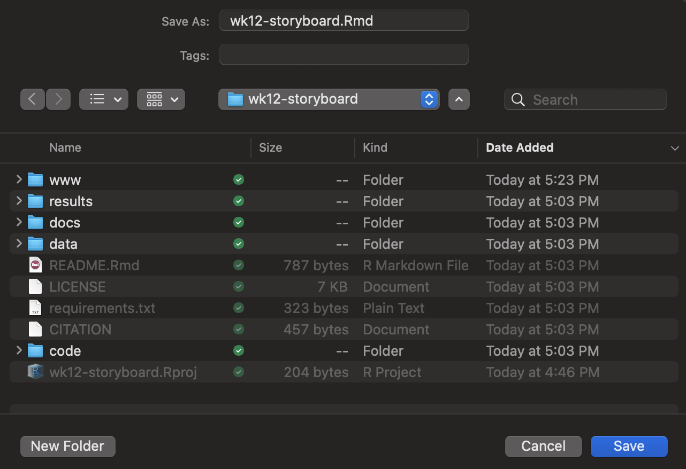
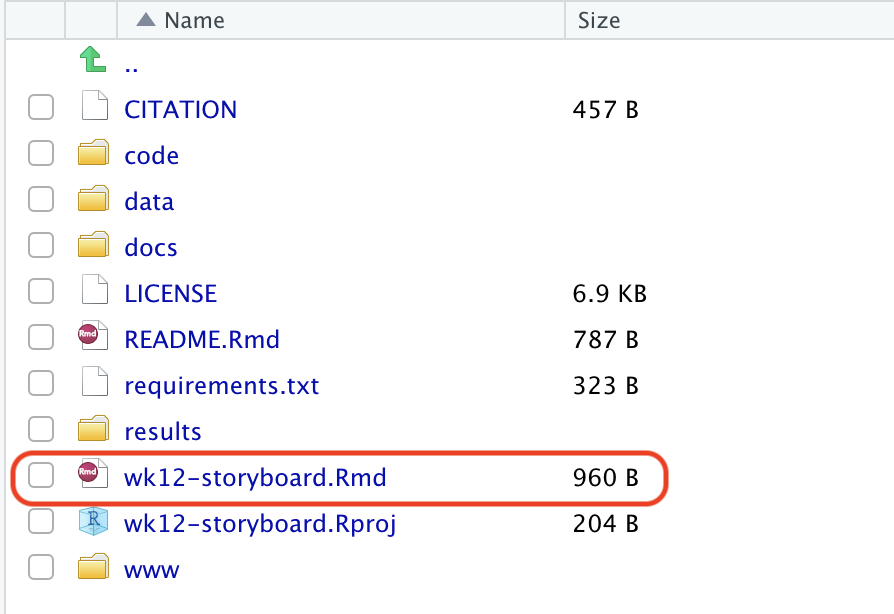
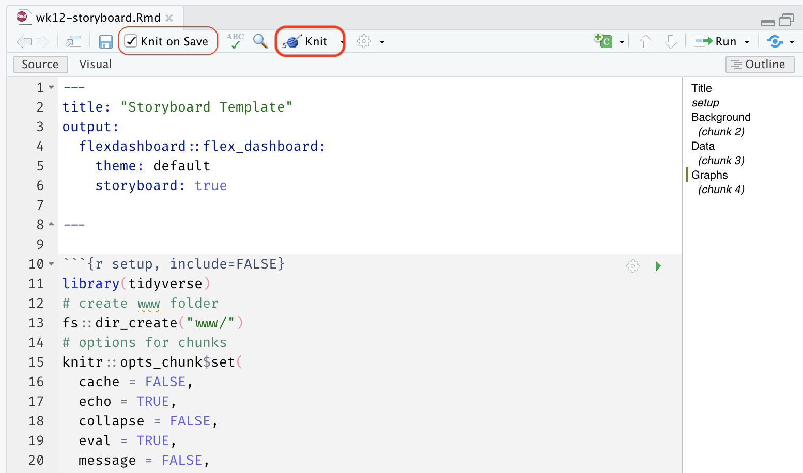
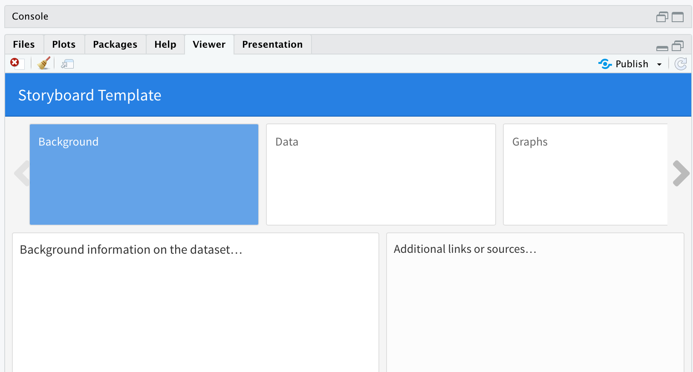
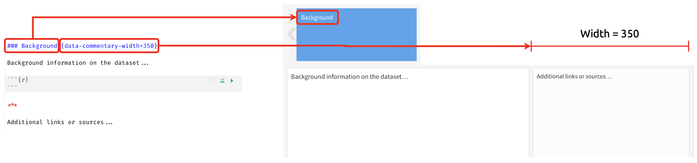
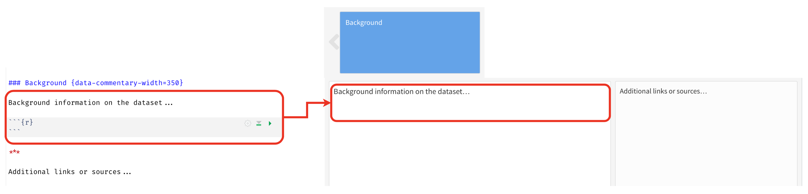
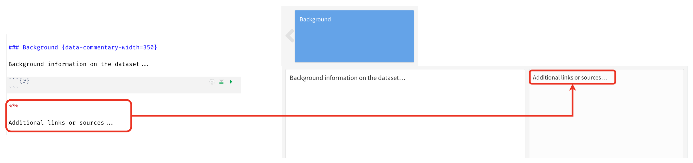
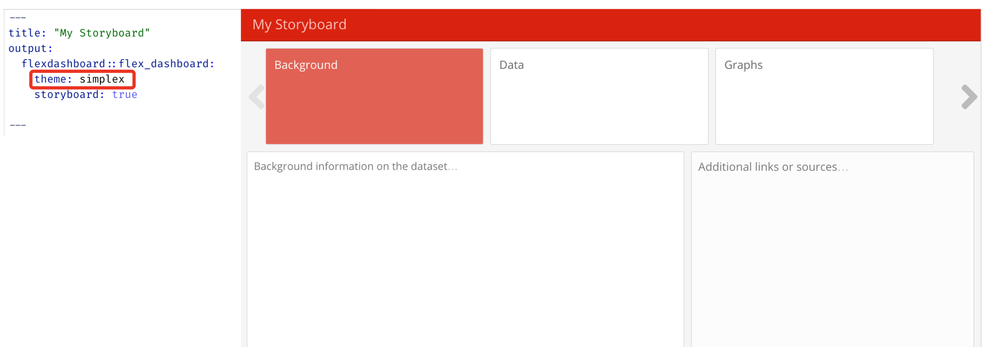
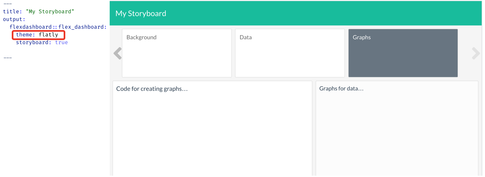

```{r meta, echo=FALSE}
library(metathis)
meta() %>%
  meta_general(
    description = "Introduction to storyboards",
    generator = "xaringan and remark.js"
  ) %>%
  meta_name("github-repo" = "mjfrigaard/CSUC-JOUR301-FA22") %>%
  meta_social(
    title = "Introduction to storyboards",
    url = "https://mjfrigaard.github.io/CSUC-JOUR301-FA22/",
    og_type = "website",
    og_author = "Martin Frigaard",
    twitter_card_type = "summary",
    twitter_creator = "@mjfrigaard"
  )
```

```{r setup, include=FALSE}
dateWritten <- format(as.Date("2022-09-21"), format = "%B %d %Y")
today <- format(Sys.Date(), format = "%B %d %Y")
library(knitr)
library(tidyverse)
library(fontawesome)
library(emoji)
options(
    htmltools.dir.version = FALSE,
    knitr.table.format = "html",
    knitr.kable.NA = ''
)
knitr::opts_chunk$set(
    warning = FALSE,
    message = FALSE,
    fig.path = "img/",
    fig.width = 7.252,
    fig.height = 4,
    comment = " ",
    fig.retina = 3 # Better figure resolution
)
# Enables the ability to show all slides in a tile overview by pressing "o"
xaringanExtra::use_tile_view()
xaringanExtra::use_panelset()
xaringanExtra::use_clipboard()
xaringanExtra::use_share_again()
xaringanExtra::style_share_again(share_buttons = "all")
xaringanExtra::use_extra_styles(
  hover_code_line = TRUE,
  mute_unhighlighted_code = FALSE
)
```

```{r inf_mr, eval=FALSE, include=FALSE}
xaringan::inf_mr()
```

layout: true

<!-- this adds the link footer to all slides, depends on footer-small class in css-->

<div class="footer-small"><span>https://mjfrigaard.github.io/CSUC-JOUR301-FA22/</div>

---
name: title-slide
class: title-slide, center, middle, inverse

# `r rmarkdown::metadata$title`
#.fancy[`r rmarkdown::metadata$subtitle`]

<br>

.large[by Martin Frigaard]

Written: `r dateWritten`

Updated: `r today`

.footer-large[.right[.fira[
<br><br><br><br><br>[Created using the "λέξις" theme](https://jhelvy.github.io/lexis/index.html#what-does-%CE%BB%CE%AD%CE%BE%CE%B9%CF%82-mean)
]]]

---
class: left, top
background-image: url(img/flexdashboard.png)
background-position: 95% 8%
background-size: 6%

## Outline

.leftcol[
.font80[

#### Create your `storyboard` project:

-  Create storyboard project with `goodenuffR` `r emoji::emoji("white_check_mark")`  
  - `goodenuff_project()`  
  - `goodenuff_files()`   

- Install `flexdashboard` `r emoji::emoji("white_check_mark")`   
   - `install.packages("flexdashboard")` 
   - `library(flexdashboard)`
 
- Download storyboard template `r emoji::emoji("white_check_mark")`   
  - [Link](https://mjfrigaard.github.io/FA22-JOUR301/)

]
]

--

.rightcol[
.font80[

#### Customize your `storyboard`:

- Layout `r emoji::emoji("white_check_mark")`

  - `YAML` header  
  - `data-commentary-width=`  
  - `theme` 

- Composition `r emoji::emoji("white_check_mark")` 

  - Markdown syntax  
  - R code chunks  
  - Output options

]
]

---
class: left, top
background-image: url(img/flexdashboard.png)
background-position: 95% 8%
background-size: 6%

# Create Project 

--

<br>

.leftcol[
.font80[
Create the project using `goodenuffR`: 
]
.code70[
```{r wk12-project, eval=FALSE}
goodenuffR::goodenuff_project(
  project_name = "wk12-storyboard", 
  folder_path = "path/to/course/folder"
  )
```
]

.font80[
Create the files for the project:
]
.code70[
```{r wk12-files-command, eval=FALSE}
goodenuffR::goodenuff_files()
```
]
]

--

<br>

.rightcol[
.border[

```{r wk12-files, echo=FALSE, fig.align='center', out.width="80%"}
knitr::include_graphics(path = "img/wk12-files.png")
```

]
]


---
class: left, top
background-image: url(img/flexdashboard.png)
background-position: 95% 8%
background-size: 6%

# Install `flexdashboard`

<br><br>

--

Install the `flexdashboard` package 

```{r , eval=FALSE}
install.packages("flexdashboard")
```

--

Load the `flexdashboard` package 

```{r , eval=FALSE}
library(flexdashboard)
```

---
class: left, top
background-image: url(img/flexdashboard.png)
background-position: 95% 8%
background-size: 6%

# Download Template

.leftcol[

.font80[
Download the storyboard template from [this link](https://mjfrigaard.github.io/FA22-JOUR301/assignments/wk12-storyboard.Rmd) 

Save the `.Rmd` file in the project folder: 
]

.border[
```{r wk12-save-rmd, echo=FALSE, fig.align='center', out.width="80%"}

```
]
]

--

.rightcol[

.font80[
*It should be in this location:*
]

.border[
```{r wk12-save-in-project, echo=FALSE, fig.align='center', out.width="80%"}

```
]
]


---
class: left, top
background-image: url(img/flexdashboard.png)
background-position: 95% 8%
background-size: 6%

# Knit the `storyboard`

.leftcol[
.font80[
Open and knit the `.Rmd` file (and set 'Knit on Save')
]
.border[
```{r wk12-knit-png, echo=FALSE, fig.align='right', out.width="100%"}

```
]
]

--

.rightcol[
.font80[
You'll see the output in the **Viewer** pane: 
]
.border[
```{r wk12-knitted-sb-01-png, echo=FALSE, fig.align='right', out.width="100%"}

```
]
]

---
class: left, top
background-image: url(img/flexdashboard.png)
background-position: 95% 8%
background-size: 6%

# Storyboard layout: `YAML` 

<br>

.leftcol[

.font80[
The `YAML` header in your `.Rmd` file contains the following: 
]

.code70[
```
---
title: "Storyboard Template"
output: 
  flexdashboard::flex_dashboard:
    theme: default
    storyboard: true
---
```
]
]

--

.rightcol[

.font80[
Give your storyboard a new `title:` (in quotes) and re-knit
]

.code70[
```
---
title: "My Storyboard"
output: 
  flexdashboard::flex_dashboard:
    theme: default
    storyboard: true
---
```
]
]

---
class: left, top
background-image: url(img/flexdashboard.png)
background-position: 95% 8%
background-size: 6%

# Storyboard layout: page sections 

.font80[
+ Create a new section in your storyboard layout with a three level header (`###`) 

+ Adjust the width of the commentary box with `data-commentary-width=`
]

--

.border[
```{r wk12-knitted-sb-02-png, echo=FALSE, fig.align='right', out.width="100%"}

```
]

---
class: left, top
background-image: url(img/flexdashboard.png)
background-position: 95% 8%
background-size: 6%

# Storyboard layout: section contents

.font80[
+ The content for each section is placed beneath the three level header (`###`) 
]

--

.border[
```{r wk12-knitted-sb-03-png, echo=FALSE, fig.align='right', out.width="100%"}

```
]


---
class: left, top
background-image: url(img/flexdashboard.png)
background-position: 95% 8%
background-size: 6%

# Storyboard layout: `data-commentary` 

.font80[
+ The content for the `data-commentary` section begins after the horizontal rule separator (`***`) 
]

--

.border[
```{r wk12-knitted-sb-04-png, echo=FALSE, fig.align='right', out.width="100%"}

```
]

---
class: left, top
background-image: url(img/flexdashboard.png)
background-position: 95% 8%
background-size: 6%

# Customize the `theme`

<br>

.leftcol30[
.font70[
Change the `theme:` in the `YAML` header to one of the following: 

  + `“bootstrap”`   
  + `“cerulean”`  
  + `“cosmo”`  
  + `“journal”`  
  + `"flatly"`  
  + `“lumen”`  
  + `“paper”`  
  + `“readable”`  
  + `“sandstone”`  
  + **`“simplex”`**  
  + `“spacelab”`  
  + `“united”`  
  + `“yeti”`
]
]

--

.rightcol70[

.border[

```{r wk12-knitted-sb-05-png, echo=FALSE, fig.align='right', out.width="100%"}

```

]

]

---
class: left, top
background-image: url(img/flexdashboard.png)
background-position: 95% 8%
background-size: 6%

# Customize the `theme`

<br>

.leftcol30[
.font70[
Change the `theme:` in the `YAML` header to one of the following: 

  + `“bootstrap”`   
  + `“cerulean”`  
  + `“cosmo”`  
  + `“journal”`  
  + **`"flatly"`**  
  + `“lumen”`  
  + `“paper”`  
  + `“readable”`  
  + `“sandstone”`  
  + `“simplex”`  
  + `“spacelab”`  
  + `“united”`  
  + `“yeti”`
]
]

--

.rightcol70[

.border[

```{r wk12-knitted-sb-06-png, echo=FALSE, fig.align='right', out.width="100%"}

```

]

]

---
class: left, top
background-image: url(img/flexdashboard.png)
background-position: 95% 8%
background-size: 6%

# Composition

The `Background` section should include: 

--

1. Where the data 